# ChainLinked Admin Dashboard

<div align="center">

**The command center for ChainLinked** — a comprehensive admin dashboard for managing an AI-powered LinkedIn content platform.

Monitor users, AI-generated content, analytics, costs, and system health from a unified panel.

[](https://nextjs.org/)
[](https://www.typescriptlang.org/)
[](https://tailwindcss.com/)
[](https://supabase.com/)

</div>

---

## Table of Contents

- [Overview](#overview)
- [Key Features](#key-features)
- [Tech Stack](#tech-stack)
- [System Architecture](#system-architecture)
- [Project Structure](#project-structure)
- [Getting Started](#getting-started)
- [Environment Variables](#environment-variables)
- [Database](#database)
- [Authentication](#authentication)
- [API Endpoints](#api-endpoints)
- [Dashboard Pages](#dashboard-pages)
- [Workflows](#workflows)
- [Integrations](#integrations)
- [Scripts](#scripts)
- [Deployment](#deployment)
- [Documentation](#documentation)

---

## Overview

ChainLinked Admin is a **Next.js 16** admin dashboard built with the App Router, Server Components, and a modern React 19 stack. It serves as the management interface for the ChainLinked platform — an AI-powered LinkedIn content creation and scheduling tool.

The dashboard provides:
- Real-time monitoring of platform metrics and KPIs
- User and team management with full lifecycle controls
- AI content quality analysis and performance tracking
- Cost and token usage analytics across AI models
- System health monitoring with error tracking integration
- Feature flag and sidebar configuration management

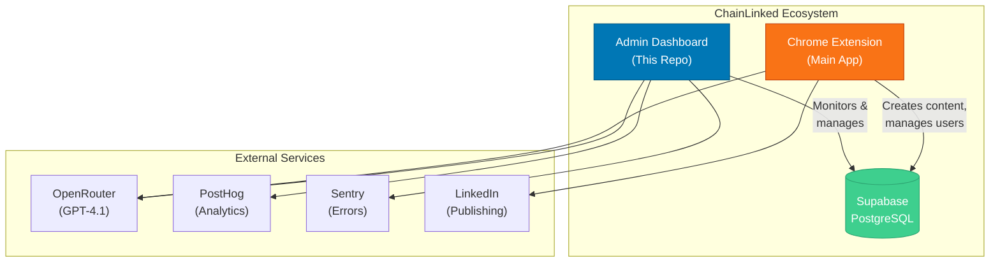

---

## Key Features

### Dashboard & Analytics
| Feature | Description |
|---------|-------------|
| **Overview Dashboard** | 8 KPI cards, activity timeline, system health monitor, onboarding funnel, top users leaderboard |
| **AI Performance** | Model comparison, daily cost/token charts, feature usage heatmap, prompt analytics |
| **Cost Analytics** | Total/MTD/WTD/daily spend, breakdowns by model, feature, and user |
| **Token Usage** | Consumption metrics, cost per token, usage trends |
| **Feature Adoption** | Feature usage metrics and engagement tracking |
| **PostHog Analytics** | Embedded dashboards, session replays, heatmaps |
| **LinkedIn Metrics** | Engagement data and publishing analytics |

### User & Team Management
| Feature | Description |
|---------|-------------|
| **User Management** | Search, filter, sort, CSV export, suspend/delete actions |
| **User Profiles** | Detailed view with posts, templates, tokens, cost breakdown |
| **Onboarding Funnel** | Signup → Onboarded → LinkedIn → Generated → Scheduled |
| **Team Management** | Team listing, member tables, activity breakdown |

### Content Management
| Feature | Description |
|---------|-------------|
| **Generated Posts** | Quality scores, word count, post type, token/cost tracking |
| **Scheduled Posts** | Status tracking (pending/posted/failed), timezone support |
| **Templates** | Categories, public/private, usage counts, copy-to-clipboard |
| **AI Activity** | Request logs, conversation viewer, output inspection |

### System Administration
| Feature | Description |
|---------|-------------|
| **Background Jobs** | Monitor company research, content research, suggestion generation |
| **Error Tracking** | Sentry integration with severity, affected users, timestamps |
| **Sidebar Control** | Drag-and-drop reordering, enable/disable sections |
| **Settings** | Admin profile, password management, environment status |

### Security
| Feature | Description |
|---------|-------------|
| **JWT Authentication** | HTTP-only cookies, 24h expiry, HS256 signing |
| **Rate Limiting** | 5 login attempts per 15 minutes per IP |
| **Audit Logging** | All admin actions logged with timestamps and context |
| **Middleware Protection** | All `/dashboard/*` routes require valid session |
| **Confirmation Dialogs** | Text-input confirmation for destructive actions |

---

## Tech Stack

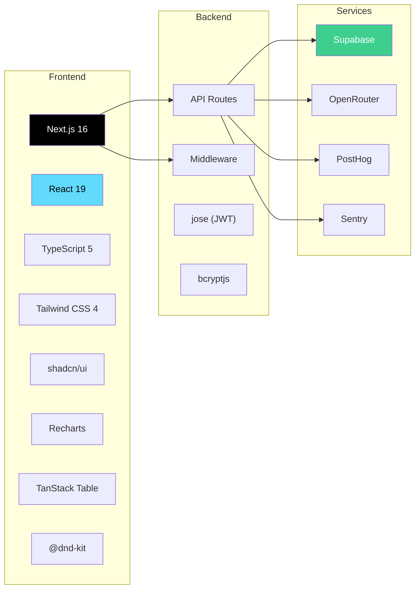

| Category | Technology | Version |
|----------|-----------|---------|
| **Framework** | Next.js (App Router) | 16.2.1 |
| **Language** | TypeScript | 5 |
| **UI Framework** | React | 19.2.4 |
| **Styling** | Tailwind CSS | 4 |
| **Component Library** | shadcn/ui + Radix UI | 4.1.0 / 1.4.3 |
| **Icons** | Lucide React | 0.577.0 |
| **Database** | Supabase (PostgreSQL) | 2.100.0 |
| **Authentication** | jose (JWT) + bcryptjs | 6.2.2 / 3.0.3 |
| **AI Integration** | OpenRouter API | GPT-4.1 |
| **Analytics** | PostHog | 1.363.2 |
| **Error Tracking** | Sentry REST API | - |
| **Charts** | Recharts | 3.8.0 |
| **Data Tables** | TanStack React Table | 8.21.3 |
| **Drag & Drop** | @dnd-kit | 6.3.1 |
| **Validation** | Zod | 4.3.6 |
| **Toast** | Sonner | 2.0.7 |
| **Theme** | next-themes | 0.4.6 |

---

## System Architecture

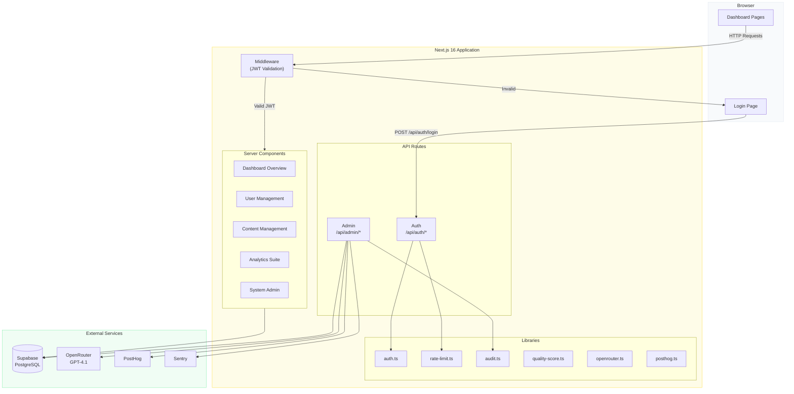

---

## Project Structure

```
chainlinked-admin1/
├── app/                              # Next.js App Router
│   ├── layout.tsx                    # Root layout (ThemeProvider, Toaster)
│   ├── page.tsx                      # Home redirect
│   ├── globals.css                   # Tailwind CSS + design tokens
│   │
│   ├── api/                          # API Route Handlers
│   │   ├── auth/
│   │   │   ├── login/route.ts        # POST - Admin login (JWT + rate limit)
│   │   │   └── logout/route.ts       # POST - Clear session
│   │   └── admin/
│   │       ├── content/
│   │       │   ├── analyze/route.ts  # POST - AI content analysis
│   │       │   └── [id]/route.ts     # DELETE - Remove content
│   │       ├── conversations/
│   │       │   └── [id]/route.ts     # GET - Compose conversations
│   │       ├── posthog/
│   │       │   └── recordings/route.ts # GET - Session recordings
│   │       ├── prompts/
│   │       │   └── [id]/route.ts     # PUT - Update system prompts
│   │       ├── sentry/
│   │       │   └── issues/route.ts   # GET - Error issues
│   │       ├── sidebar-sections/
│   │       │   ├── route.ts          # GET/POST - List/create sections
│   │       │   └── [id]/route.ts     # PUT/DELETE - Update/remove sections
│   │       └── users/
│   │           └── [id]/route.ts     # DELETE/PATCH - Delete/suspend users
│   │
│   ├── login/
│   │   └── page.tsx                  # Admin login form
│   │
│   └── dashboard/                    # Protected admin pages
│       ├── layout.tsx                # Dashboard layout (sidebar + header)
│       ├── page.tsx                  # Overview with KPIs
│       ├── users/                    # User management
│       │   ├── page.tsx              # User list + metrics
│       │   ├── [id]/page.tsx         # User detail
│       │   └── onboarding/page.tsx   # Onboarding funnel
│       ├── teams/                    # Team management
│       │   ├── page.tsx              # Teams list
│       │   └── [id]/page.tsx         # Team detail + members
│       ├── content/                  # Content management
│       │   ├── generated/page.tsx    # AI-generated posts
│       │   ├── scheduled/page.tsx    # Scheduled posts
│       │   ├── templates/page.tsx    # Content templates
│       │   └── ai-activity/page.tsx  # AI activity logs
│       ├── analytics/                # Analytics dashboards
│       │   ├── ai-performance/page.tsx # AI model metrics
│       │   ├── tokens/page.tsx       # Token usage
│       │   ├── costs/page.tsx        # Cost analysis
│       │   ├── features/page.tsx     # Feature adoption
│       │   ├── posthog/page.tsx      # PostHog embeds
│       │   └── linkedin/page.tsx     # LinkedIn metrics
│       ├── system/                   # System administration
│       │   ├── jobs/page.tsx         # Background jobs
│       │   ├── flags/page.tsx        # Sidebar control
│       │   └── errors/page.tsx       # Sentry errors
│       └── settings/page.tsx         # Admin settings
│
├── components/                       # React components
│   ├── app-sidebar.tsx               # Main navigation sidebar
│   ├── site-header.tsx               # Top header bar
│   ├── theme-provider.tsx            # Dark/light theme
│   ├── theme-toggle.tsx              # Animated theme switch
│   ├── login-form.tsx                # Login form
│   ├── metric-card.tsx               # KPI metric card
│   ├── confirmation-dialog.tsx       # Destructive action confirm
│   ├── empty-state.tsx               # Empty list placeholder
│   ├── info-tooltip.tsx              # Info tooltips
│   ├── posthog-provider.tsx          # Analytics provider
│   ├── charts/                       # Data visualizations
│   │   ├── ai-performance-charts.tsx # AI metrics charts
│   │   ├── cost-charts.tsx           # Cost trend charts
│   │   ├── feature-charts.tsx        # Feature heatmaps
│   │   ├── token-charts.tsx          # Token usage charts
│   │   └── heatmap-cell.tsx          # Heatmap cell
│   └── ui/                           # shadcn/ui primitives (25+ components)
│
├── lib/                              # Shared utilities
│   ├── auth.ts                       # JWT + bcrypt authentication
│   ├── audit.ts                      # Audit logging
│   ├── analytics.ts                  # PostHog event tracking
│   ├── rate-limit.ts                 # IP-based rate limiter
│   ├── quality-score.ts              # Content quality scoring
│   ├── openrouter.ts                 # OpenRouter API client
│   ├── posthog.ts                    # PostHog query client
│   ├── utils.ts                      # Utility functions
│   └── supabase/
│       └── client.ts                 # Supabase admin client
│
├── hooks/
│   └── use-mobile.ts                 # Mobile breakpoint hook
│
├── scripts/
│   └── seed-admin.ts                 # Admin user seeder
│
├── middleware.ts                      # Route protection (JWT)
├── next.config.ts                    # Next.js configuration
├── tsconfig.json                     # TypeScript configuration
├── components.json                   # shadcn/ui configuration
├── postcss.config.mjs                # PostCSS + Tailwind
└── package.json                      # Dependencies & scripts
```

---

## Getting Started

### Prerequisites

- **Node.js** 18 or higher
- **npm** (comes with Node.js)
- A **Supabase** project with the required tables
- (Optional) **OpenRouter**, **PostHog**, and **Sentry** accounts

### Installation

```bash
# Clone the repository
git clone <repository-url>
cd chainlinked-admin1

# Install dependencies
npm install

# Set up environment variables
cp .env.local.example .env.local
# Edit .env.local with your credentials

# Create an admin user
npx tsx scripts/seed-admin.ts admin yourpassword

# Start development server
npm run dev
```

Open [http://localhost:3000](http://localhost:3000) and log in with your admin credentials.

### Development Workflow

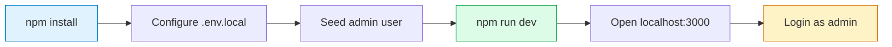

---

## Environment Variables

Create a `.env.local` file in the project root:

```env
# ============================================
# REQUIRED
# ============================================

# Supabase - Database & Auth
NEXT_PUBLIC_SUPABASE_URL=https://your-project.supabase.co
SUPABASE_SERVICE_ROLE_KEY=eyJhbGciOiJIUzI1NiIsInR5cCI6IkpXVCJ9...

# JWT Secret - Used for admin session tokens
# If not set, auth is BYPASSED for local development
ADMIN_JWT_SECRET=your-secret-key-minimum-32-characters

# ============================================
# OPTIONAL - AI Integration
# ============================================

# OpenRouter - AI content analysis (GPT-4.1)
OPENROUTER_API_KEY=sk-or-v1-...

# ============================================
# OPTIONAL - Analytics
# ============================================

# PostHog - Product analytics
NEXT_PUBLIC_POSTHOG_KEY=phc_...
NEXT_PUBLIC_POSTHOG_HOST=https://us.i.posthog.com
POSTHOG_API_KEY=phx_...
POSTHOG_PROJECT_ID=12345

# ============================================
# OPTIONAL - Error Tracking
# ============================================

# Sentry - Error monitoring
SENTRY_API_TOKEN=sntrys_...
SENTRY_ORG=your-organization
SENTRY_PROJECT=your-project
```

| Variable | Required | Description |
|----------|----------|-------------|
| `NEXT_PUBLIC_SUPABASE_URL` | Yes | Supabase project URL |
| `SUPABASE_SERVICE_ROLE_KEY` | Yes | Supabase service role key (admin access) |
| `ADMIN_JWT_SECRET` | Yes* | JWT signing secret (*bypassed in dev if unset) |
| `OPENROUTER_API_KEY` | No | OpenRouter API key for AI analysis |
| `NEXT_PUBLIC_POSTHOG_KEY` | No | PostHog frontend tracking key |
| `NEXT_PUBLIC_POSTHOG_HOST` | No | PostHog API host (defaults to us.i.posthog.com) |
| `POSTHOG_API_KEY` | No | PostHog server-side API key |
| `POSTHOG_PROJECT_ID` | No | PostHog project identifier |
| `SENTRY_API_TOKEN` | No | Sentry API bearer token |
| `SENTRY_ORG` | No | Sentry organization slug |
| `SENTRY_PROJECT` | No | Sentry project slug |

---

## Database

The application uses **Supabase PostgreSQL** as its database. The admin client connects with a service role key that bypasses Row Level Security for full admin access.

### Key Tables

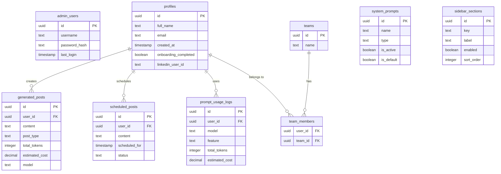

### Database Setup

Tables are managed through the Supabase dashboard. The admin dashboard reads from 23+ tables including:

- **User tables:** `profiles`, `admin_users`, `linkedin_tokens`
- **Content tables:** `generated_posts`, `scheduled_posts`, `my_posts`, `templates`
- **AI tables:** `prompt_usage_logs`, `compose_conversations`, `system_prompts`, `generated_suggestions`
- **Team tables:** `teams`, `team_members`, `companies`
- **Job tables:** `company_context`, `research_sessions`, `suggestion_generation_runs`
- **Analytics tables:** `post_analytics`, `post_analytics_accumulative`, `profile_analytics_accumulative`
- **System tables:** `sidebar_sections`, `swipe_wishlist`

> See [docs/DATABASE.md](./docs/DATABASE.md) for full schema documentation.

---

## Authentication

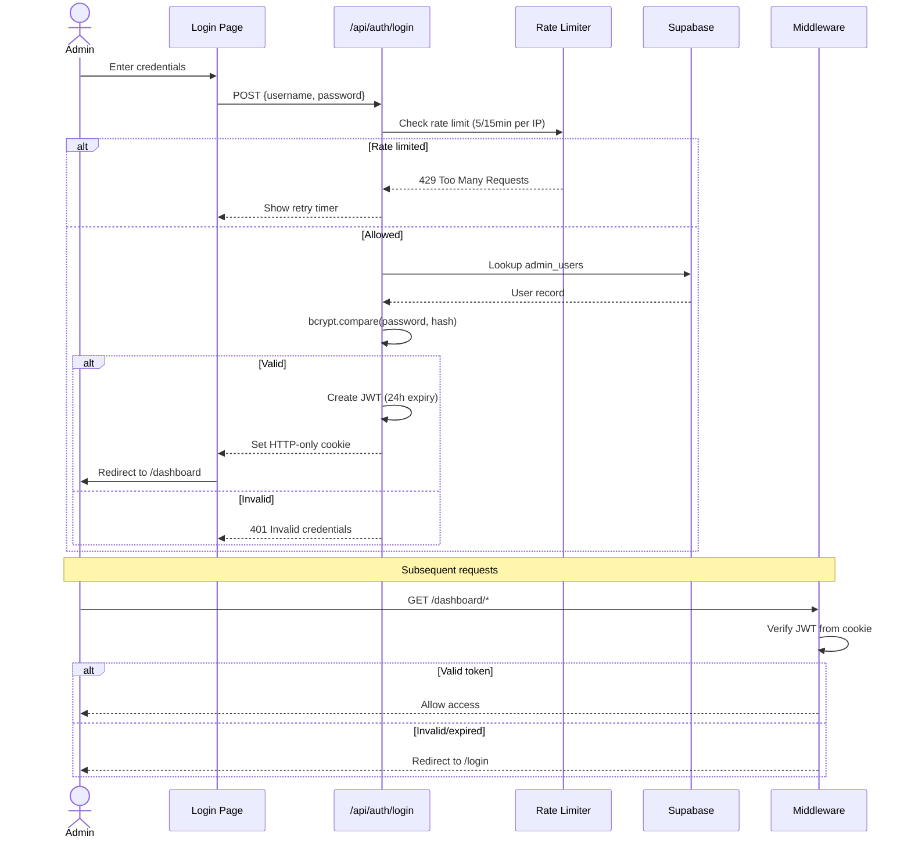

### Key Details
- **Hashing:** bcryptjs with 12 salt rounds
- **Tokens:** JWT (HS256) via jose library, 24-hour expiry
- **Storage:** HTTP-only, Secure, SameSite=Strict cookies
- **Rate Limiting:** 5 attempts per 15 minutes per IP (in-memory)
- **Dev Mode:** Auth bypassed when `ADMIN_JWT_SECRET` is not set
- **Seeding:** `npx tsx scripts/seed-admin.ts <username> <password>`

> See [docs/authentication-flow.md](./docs/authentication-flow.md) for detailed auth documentation.

---

## API Endpoints

| Endpoint | Method | Auth | Description |
|----------|--------|------|-------------|
| `/api/auth/login` | POST | No | Admin login (rate limited) |
| `/api/auth/logout` | POST | No | Clear session |
| `/api/admin/content/analyze` | POST | JWT | AI content quality analysis |
| `/api/admin/content/[id]` | DELETE | JWT | Delete posts/templates |
| `/api/admin/conversations/[id]` | GET | JWT | Get compose conversation |
| `/api/admin/prompts/[id]` | PUT | JWT | Update system prompts |
| `/api/admin/users/[id]` | DELETE | JWT | Delete user permanently |
| `/api/admin/users/[id]` | PATCH | JWT | Suspend/unsuspend user |
| `/api/admin/posthog/recordings` | GET | JWT | PostHog session recordings |
| `/api/admin/sentry/issues` | GET | JWT | Sentry error issues |
| `/api/admin/sidebar-sections` | GET/POST | JWT | List/create sidebar sections |
| `/api/admin/sidebar-sections/[id]` | PUT/DELETE | JWT | Update/delete sections |

> See [docs/api-reference.md](./docs/api-reference.md) for detailed request/response documentation.

---

## Dashboard Pages

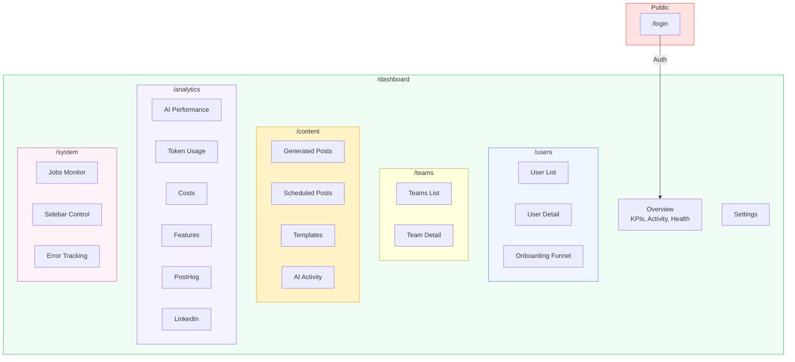

### Page Count: 21 unique dashboard pages

---

## Workflows

### Admin Login Flow

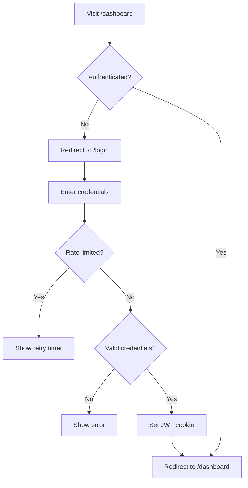

### User Management Workflow

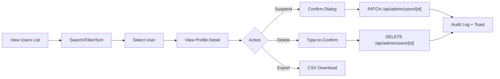

### Content Analysis Workflow

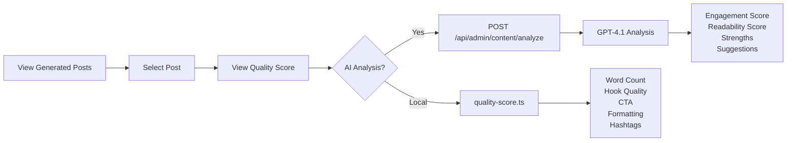

### Audit Logging Pipeline

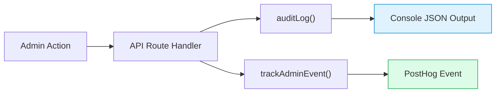

All admin mutations are dual-logged:
1. **Audit Log** (server-side JSON to console) — for compliance
2. **PostHog Event** (analytics) — for behavior tracking

### Tracked Audit Events
| Event | Trigger |
|-------|---------|
| `login` | Admin login with IP |
| `logout` | Admin logout |
| `user.delete` | User permanently deleted |
| `user.suspend` | User suspended |
| `user.unsuspend` | User unsuspended |
| `content.delete` | Post/template deleted |
| `prompt.update` | System prompt modified |
| `flag.create` | Sidebar section created |
| `flag.update` | Sidebar section updated |
| `flag.delete` | Sidebar section deleted |
| `password.change` | Admin password changed |

---

## Integrations

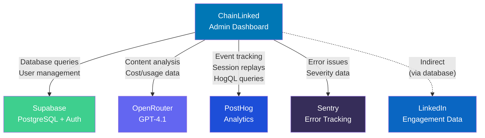

| Integration | Purpose | Configuration |
|-------------|---------|---------------|
| **Supabase** | Database, user auth management | `NEXT_PUBLIC_SUPABASE_URL` + `SUPABASE_SERVICE_ROLE_KEY` |
| **OpenRouter** | AI content analysis (GPT-4.1) | `OPENROUTER_API_KEY` |
| **PostHog** | Analytics, session replays, events | 4 env vars (key, host, API key, project ID) |
| **Sentry** | Error tracking and monitoring | `SENTRY_API_TOKEN` + org + project |
| **LinkedIn** | Engagement data (indirect, via DB) | No direct config needed |

> See [docs/INTEGRATIONS.md](./docs/INTEGRATIONS.md) for detailed integration documentation.

---

## Scripts

| Command | Description |
|---------|-------------|
| `npm run dev` | Start development server (localhost:3000) |
| `npm run build` | Create production build |
| `npm start` | Run production server |
| `npm run lint` | Run ESLint checks |
| `npx tsx scripts/seed-admin.ts <user> <pass>` | Create admin user |

---

## Deployment

### Vercel (Recommended)

1. Push repository to GitHub
2. Connect to Vercel
3. Set all environment variables in Vercel dashboard
4. Deploy

### Manual Deployment

```bash
# Build
npm run build

# Start production server
npm start
```

### Requirements
- Node.js 18+
- All required environment variables set
- Supabase project with tables created
- Admin user seeded

---

## Documentation

Comprehensive documentation (20 docs, 8,400+ lines) is available in the [`docs/`](./docs/) folder:

### Core Architecture & Setup
| Document | Description |
|----------|-------------|
| [ARCHITECTURE.md](./docs/ARCHITECTURE.md) | System architecture, tech stack, project structure |
| [environment-setup.md](./docs/environment-setup.md) | Step-by-step local development setup guide |
| [deployment.md](./docs/deployment.md) | Deployment guide (Vercel, Docker, self-hosted) |
| [SECURITY.md](./docs/SECURITY.md) | Security architecture, OWASP mitigations, production checklist |

### Database & API
| Document | Description |
|----------|-------------|
| [DATABASE.md](./docs/DATABASE.md) | Database overview, ER diagrams, table relationships |
| [database-schema.md](./docs/database-schema.md) | Detailed schema with columns, types, and query examples |
| [API.md](./docs/API.md) | API overview, authentication, error handling |
| [api-reference.md](./docs/api-reference.md) | Detailed endpoint reference with request/response examples |

### Features & Guides
| Document | Description |
|----------|-------------|
| [FEATURES.md](./docs/FEATURES.md) | Complete feature documentation |
| [ADMIN-GUIDE.md](./docs/ADMIN-GUIDE.md) | Operational guide for dashboard administrators |
| [onboarding-flow.md](./docs/onboarding-flow.md) | User onboarding funnel stages and monitoring |
| [ai-features.md](./docs/ai-features.md) | AI capabilities, content analysis, quality scoring |

### Technical Reference
| Document | Description |
|----------|-------------|
| [components.md](./docs/components.md) | React component library and hierarchy |
| [STYLING.md](./docs/STYLING.md) | Design system, color palette, theming, CSS patterns |
| [state-management.md](./docs/state-management.md) | Data fetching patterns, context providers, hooks |
| [authentication-flow.md](./docs/authentication-flow.md) | Auth system, JWT, middleware, rate limiting |

### Integrations & Developer Resources
| Document | Description |
|----------|-------------|
| [INTEGRATIONS.md](./docs/INTEGRATIONS.md) | External services (Supabase, OpenRouter, PostHog, Sentry) |
| [chrome-extension.md](./docs/chrome-extension.md) | Chrome extension integration and shared data |
| [CONTRIBUTING.md](./docs/CONTRIBUTING.md) | Code conventions, patterns, git workflow |
| [TROUBLESHOOTING.md](./docs/TROUBLESHOOTING.md) | Common issues, diagnostic flowchart, error reference |

---

<div align="center">

Built with Next.js 16 + React 19 + Tailwind CSS 4 + shadcn/ui

</div>
