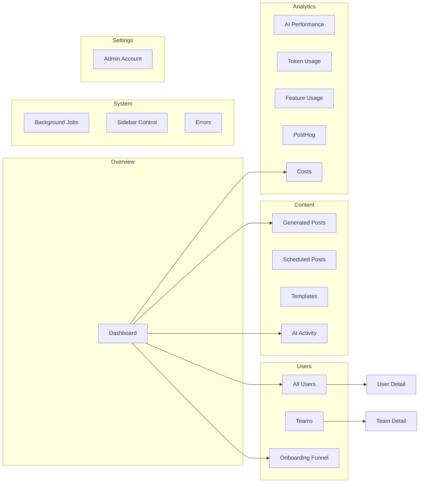
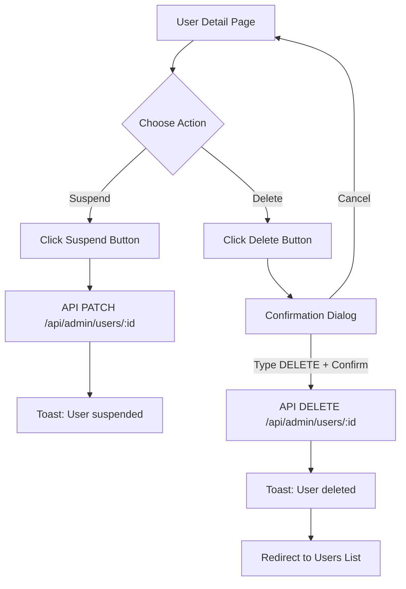
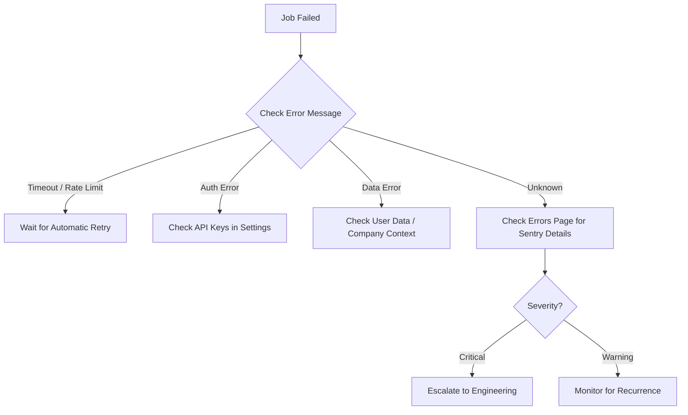
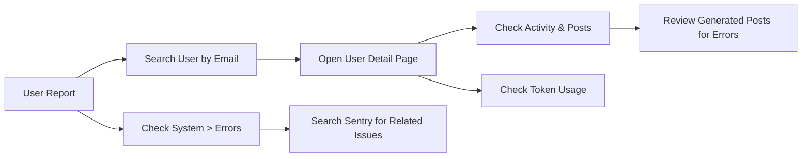
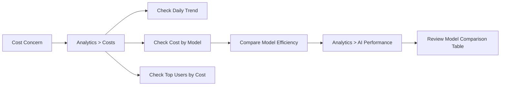
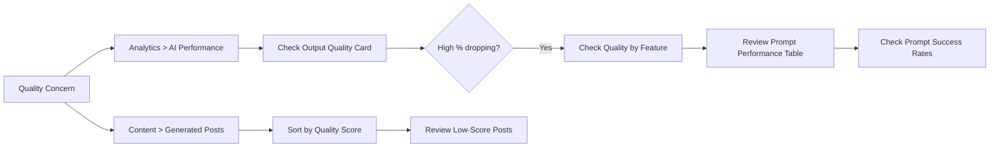
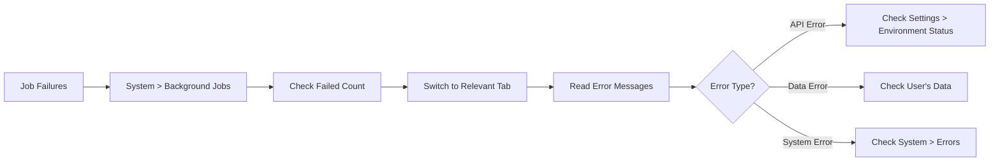

# Admin User Guide

This guide covers every page and feature of the ChainLinked admin dashboard. Use it as a reference when managing users, monitoring AI activity, controlling costs, and keeping the platform healthy.

---

## Getting Started

### How to Log In

1. Navigate to your deployment URL (e.g., `https://admin.chainlinked.app/login`).
2. Enter your admin credentials (username and password).
3. You will be redirected to the main dashboard at `/dashboard`.
4. To log out, click **Sign out** at the bottom of the sidebar.

### Dashboard Overview Tour

After logging in you land on the **Dashboard** overview page. It provides a single-screen snapshot of the entire platform:

- **KPI cards** across the top (users, activity, posts, tokens, costs, retention)
- **Quick navigation links** to the four most common destinations
- **Onboarding funnel** showing user activation drop-off
- **Top users** leaderboard ranked by post count
- **Recent activity** timeline of signups, generated posts, and scheduled posts
- **System health** stacked bar showing background job status

### Navigation Structure

The sidebar is organized into six groups:

| Group | Pages |
|-------|-------|
| **Overview** | Dashboard |
| **Users** | All Users, Teams, Onboarding Funnel |
| **Content** | Generated Posts, Scheduled Posts, Templates, AI Activity |
| **Analytics** | AI Performance, Token Usage, Feature Usage, PostHog, Costs |
| **System** | Background Jobs, Sidebar Control, Errors |
| **Settings** | Admin Account |

The active page is highlighted with a left border accent. The sidebar can be collapsed for more screen space.

---

## Dashboard Navigation Map

---

## Dashboard Overview

### Understanding KPI Cards

The overview page displays eight metric cards in a 4-column grid:

| Card | What It Measures | Notes |
|------|------------------|-------|
| **Total Users** | All registered profiles | Shows week-over-week growth percentage |
| **Active (7d)** | Users who generated content in the last 7 days | - |
| **Posts Generated** | Lifetime generated post count | Subtitle shows "X this week" |
| **Posts Published** | Posts actually posted to LinkedIn | Combines scheduled posts + my posts |
| **Token Usage** | Total AI tokens consumed | Subtitle shows estimated dollar cost |
| **Teams** | Number of teams + companies | - |
| **Save Rate** | Percentage of suggestions saved to wishlist | `saved / total suggestions` |
| **Retention** | Week-over-week returning active users | `users active both weeks / users active last week` |

Each card is clickable and links to the relevant detail page.

### Reading the Activity Timeline

The **Recent Activity** card shows the 10 most recent events across three categories:

- Green dot: **Signup** -- a new user registered
- Primary-colored dot: **Generated** -- a post was created (shows post type)
- Amber dot: **Scheduled** -- a post was scheduled or posted (shows date and status)

Events are sorted by timestamp, most recent first.

### System Health Monitor Interpretation

The **System Health** card aggregates all background jobs (company context, research sessions, suggestion generation) into a stacked bar:

- **Green (Completed)**: Jobs that finished successfully
- **Amber (Running)**: Jobs currently in progress (pending, scraping, researching, analyzing)
- **Red (Failed)**: Jobs that encountered errors

A high ratio of failed jobs warrants investigation on the Background Jobs page.

### Onboarding Funnel Snapshot

The mini funnel on the dashboard shows five stages with bar heights proportional to the percentage of total users:

1. **Signed Up** -- total registered users (always 100%)
2. **Onboarded** -- users who completed onboarding
3. **LinkedIn** -- users who connected their LinkedIn account
4. **Generated** -- users who generated at least one post
5. **Scheduled** -- users who scheduled at least one post

A steep drop between any two stages indicates a friction point. Click the funnel card to go to the detailed onboarding analytics page.

---

## Managing Users

### Viewing Users

Navigate to **Users > All Users** (`/dashboard/users`).

**Signup metric cards** at the top show signups for Today, This Week, This Month, and Total.

**Recently Joined** shows the 4 newest users as cards. A "Done" badge indicates onboarding is complete.

**Users Table** is the main data view with the following features:

- **Search**: Type in the search box to filter by name or email (case-insensitive).
- **Filter by Onboarding**: Use the dropdown to show All, Complete, or Incomplete.
- **Filter by LinkedIn**: Use the dropdown to show All, Connected, or Not Connected.
- **Sort**: Click column headers (Name, Signed Up, Posts) to toggle ascending/descending sort. The active sort column has a highlighted icon.
- **CSV Export**: Click the **Export** button to download a CSV of the currently filtered users. Columns: Name, Email, Signed Up, Onboarding, Posts, LinkedIn, Team.

**Understanding User Status Badges**:

| Badge | Variant | Meaning |
|-------|---------|---------|
| Complete / Incomplete | default / secondary | Onboarding status |
| Connected / Not connected | default / outline | LinkedIn account linked |
| Done | default (on user card) | Onboarding complete |

Click **View** on any row to open the user detail page.

### User Detail Page

Navigate to a user via the table or directly at `/dashboard/users/[id]`.

**Profile Header** shows:
- Avatar with initials
- Full name and email
- Join date (relative and absolute)
- Chrome extension last active date (if available)
- Onboarding status badge
- LinkedIn connection status badge
- Link to PostHog analytics (if configured)

**Activity Stats** -- four metric cards:
- Posts Generated
- Posts Published
- Templates created
- Token Usage (with estimated cost)

**Feature Usage** breakdown card shows two bar charts:
- **By Source**: Where posts came from (compose, carousel, swipe, series, direct, etc.)
- **By Post Type**: Content categories (general, thought-leadership, etc.)

**Recent Generated Posts** table (latest 10) with columns: Content preview, Source, Type, Status, Word count, Created date. Click content to view the full post on the Generated Posts page.

**Recent Scheduled Posts** table (latest 10) with columns: Content preview, Status, Scheduled For, Created date.

### User Actions

Two action buttons appear on the user detail page header:

#### How to Suspend a User

1. Click the **Suspend** button (outline style with ban icon).
2. The button shows "Suspending..." while processing.
3. A success toast confirms "User suspended successfully."
4. The page refreshes to reflect the new status.

Suspension sends a PATCH request with `{ action: "suspend" }` to the admin API.

#### How to Unsuspend a User

The same Suspend button toggles the suspension state. Click it again on a suspended user to restore access.

#### How to Delete a User (Irreversible!)

1. Click the **Delete** button (red destructive style with trash icon).
2. A confirmation dialog appears: _"This will permanently delete [Name] and all associated data. This action cannot be undone."_
3. Type **DELETE** in the confirmation field.
4. Click **Confirm** to proceed.
5. The user and all associated data are permanently removed.
6. You are redirected back to the users list.

**Warning**: Deletion is irreversible. There is no soft-delete or recovery mechanism.

---

## Managing Teams

Navigate to **Users > Teams** (`/dashboard/teams`).

### Viewing Team List

**Metric cards** at the top:
- Total Teams
- Total Members (across all teams)
- Average Team Size
- Most Active Team (by post count)

**Teams Table** shows all teams with sortable columns:
- Team Name
- Member Count
- Total Posts (aggregate of all members)
- Total Tokens used
- Total Cost
- Last Active date
- Created date

### Team Detail and Members

Click a team row to view the team detail page at `/dashboard/teams/[id]`. This shows:
- Team information header
- Members table with individual stats
- Activity breakdown per member

### Sorting and Exporting

The teams table supports column sorting and CSV export similar to the users table.

---

## Content Management

### Viewing Generated Posts

Navigate to **Content > Generated Posts** (`/dashboard/content/generated`).

**Summary Metric Cards**:
- Total Posts (latest 100 shown)
- Post Sources (unique creation sources)
- Avg Quality Score (0-100 scale)
- Conversion Rate (percentage posted or archived)

**Distribution Cards** (three-column layout):
1. **Source Distribution** -- bar chart showing where posts originate (compose, carousel, swipe, series, etc.)
2. **Post Type Distribution** -- bar chart showing content categories
3. **Status Breakdown** -- bar chart plus stacked overview bar

**Per-User Feature Usage Table** shows post creation sources broken down by user: Total, Compose, Carousel, Swipe, Series, Scheduled.

**Post List** shows individual posts with search, filter, and sort capabilities. Click any post to open a detail sheet with the full content, quality analysis, and AI metadata.

#### Understanding Quality Scores

Quality scores range from 0 to 100 and are computed from six criteria:

| Criterion | Max Points | What It Measures |
|-----------|-----------|------------------|
| Word Count | 25 | Optimal range: 150-400 words |
| Hook Quality | 20 | Short, engaging opening line |
| CTA Presence | 15 | Ends with question or call-to-action |
| Formatting | 15 | Line breaks and readability |
| Hashtag Count | 10 | Optimal: 2-5 hashtags |
| Length Fit | 15 | Optimal: 200-3000 characters |

**Grade thresholds**:
- **High** (71-100): Green badge -- strong, well-structured content
- **Medium** (41-70): Amber badge -- acceptable but could improve
- **Low** (0-40): Red badge -- needs attention, may indicate prompt issues

#### AI Analysis Feature

In the post detail sheet, you can view:
- The full post content
- Quality score breakdown showing points per criterion
- Prompt snapshot (system prompt and user messages used to generate the post)
- Token usage (prompt tokens, completion tokens, total)
- Model used and estimated cost
- Conversation ID if the post came from a compose chat

### Scheduled Posts

Navigate to **Content > Scheduled Posts** (`/dashboard/content/scheduled`).

Shows a list of scheduled posts with filtering and search.

**Status meanings**:

| Status | Meaning |
|--------|---------|
| **Pending** | Queued and waiting for the scheduled time |
| **Posted** | Successfully published to LinkedIn |
| **Failed** | Posting failed -- check the error message column |

**Error handling for failed posts**: When a post shows "Failed" status, check the `error_message` field in the table for details. Common causes include expired LinkedIn tokens or content policy violations.

### Templates

Navigate to **Content > Templates** (`/dashboard/content/templates`).

Shows the latest 50 templates with columns for: Name, Content preview, Category, Creator, Public/Private status, Usage Count, AI-generated indicator, Created date.

**Template categories**: Templates are organized by category (e.g., "thought-leadership", "engagement", "educational"). Categories help users find appropriate structures for their posts.

**Usage tracking**: The `usage_count` column shows how many times each template has been used to generate content. High-usage templates indicate popular formats.

### AI Activity

Navigate to **Content > AI Activity** (`/dashboard/content/ai-activity`).

This page provides a comprehensive view of all AI interactions.

**Radial Ring Dashboard** at the top shows three gauges:
- **Cost**: Total estimated cost with ring fill proportional to budget
- **Speed**: Average response time (green = fast, amber = moderate, red = slow at >2s)
- **Health**: Success rate percentage (green >= 95%, amber >= 80%, red < 80%)

**Tabbed Content** with three tabs:

1. **Requests**: Shows prompt usage logs grouped by date with a 28-day heatmap. Each entry shows: user, feature/prompt type, model, token count, cost, response time. Green dot = success, red dot = failure.

2. **Conversations**: Shows compose conversations in a messaging-style list. Each entry shows: user avatar, title, mode, tone, message count, last message preview, creation date. Active conversations have a green indicator. Linked posts have a "View Post" link.

3. **Output**: Horizontal-scrolling card view of generated posts with quality score badges. Click any card to view the full post.

---

## Analytics Dashboards

### AI Performance

Navigate to **Analytics > AI Performance** (`/dashboard/analytics/ai-performance`).

**Cost Summary Cards**: Total AI Spend, Cost This Week, Avg Cost per Request.

**Charts** (four interactive charts):
- **Daily Cost** (line chart, last 30 days)
- **Cost by Model** (bar chart)
- **Daily Token Usage** (stacked bar chart, input vs output tokens)
- **Usage by Feature** (bar chart)

**Feature x Time Heatmap**: An 8-week heatmap showing which features are used most, and when. Darker cells = more usage. Use this to spot trends in feature adoption.

**Model Comparison Table**: Compares all AI models used with columns: Model name, Call count, Avg response time, Avg tokens, Cost per call, Total cost, Features used. The cheapest model gets a green "cheapest" badge.

**Prompt Performance Table**: Shows every system prompt with: Name, Type, Category (Remix/Post Type/Carousel/Foundation/Other), Active status, Call count, Avg input/output tokens, Avg response time, Avg cost per call, Success rate.

**Output Quality Card**: Shows a stacked distribution bar (High/Medium/Low) with counts and percentages. Below that, per-feature quality averages with progress bars.

**Reading the quality breakdown**:
- If High percentage is dominant, content generation is healthy.
- A rising Low percentage suggests prompt degradation or model issues.
- Per-feature quality helps identify which features produce the best content.

### Cost Analysis

Navigate to **Analytics > Costs** (`/dashboard/analytics/costs`).

**Summary Cards**:
- **Total AI Spend**: Lifetime sum of all estimated_cost values
- **This Month**: Month-to-date spend (from 1st of month)
- **This Week**: Last 7 calendar days
- **Today**: Since midnight

**Daily Cost Line Chart**: 30-day trend of daily AI spend.

**Cost by Model / Cost by Feature**: Side-by-side bar charts breaking down spend.

**Top Users by Cost**: Table showing the top 20 users ranked by total cost, with columns: User, Cost, Requests, Avg per Request, and a relative spend bar. Use this to identify unusually high-cost users.

**Monthly Trend Chart + Cards**: 6-month cost trend with month-over-month percentage change. Red percentage = cost increase, green = decrease.

### PostHog Analytics

Navigate to **Analytics > PostHog** (`/dashboard/analytics/posthog`).

This page embeds the PostHog dashboard (when `POSTHOG_DASHBOARD_URL` is configured). Use it for:
- Viewing session replays to understand user behavior
- Analyzing heatmaps to see where users click
- Tracking custom events and conversion funnels
- Reviewing product analytics defined in PostHog

If the PostHog environment variables are not configured, this page will show a "Not configured" state.

---

## System Administration

### Background Jobs

Navigate to **System > Background Jobs** (`/dashboard/system/jobs`).

**Summary Cards**: Running, Completed, Failed, Total job counts.

**Job History** is organized into three tabs:

1. **Company Analysis**: Shows company context processing jobs. Columns: Company name, User, Status, Error message, Created, Completed.

2. **Research Sessions**: Shows content research jobs. Columns: Topics, User, Status, Posts Discovered, Posts Generated, Error message, Created, Completed.

3. **Suggestion Generation**: Shows suggestion generation runs. Columns: User, Status, Requested count, Generated count, Error message, Created, Completed.

**Job status meanings**:

| Status | Badge Color | Meaning |
|--------|-------------|---------|
| pending | secondary (gray) | Queued, waiting to start |
| scraping | secondary | Actively scraping web content |
| researching | secondary | Analyzing research topics |
| analyzing | secondary | Processing collected data |
| completed | default (green) | Finished successfully |
| failed | destructive (red) | Error occurred -- check error_message |

**What to do when jobs fail**:
1. Check the **Error** column for the specific error message.
2. Cross-reference with the **Errors** page for related Sentry issues.
3. If the error is transient (timeout, rate limit), the job may succeed on the next automatic retry.
4. If the error is persistent, investigate the underlying service (OpenRouter availability, Supabase connectivity).

### Sidebar Control

Navigate to **System > Sidebar Control** (`/dashboard/system/flags`).

This page manages the navigation sections shown in the **Chrome extension** sidebar (not the admin sidebar).

**How to reorder sections**:
1. Grab the drag handle (six-dot icon) on any section row.
2. Drag up or down to the desired position.
3. Release -- the new order is saved automatically.
4. A "Order updated" toast confirms the change.

**Enabling/disabling sections**:
1. Find the section you want to toggle.
2. Use the **Visible/Hidden** switch on the right side of the row.
3. The change takes effect immediately for Chrome extension users.

**Creating new sections**:
1. Click the **Add Section** button at the bottom of the list.
2. Fill in:
   - **Key**: A machine-readable identifier (e.g., `saved_drafts`)
   - **Label**: The display name users will see (e.g., "Saved Drafts")
   - **Description** (optional): What the section contains
3. Click **Create**. The section is added at the end, enabled by default.

**Deleting a section**:
1. Click the trash icon on any section row.
2. Confirm in the browser dialog.
3. The section is permanently removed.

**Effect on Chrome extension**: Changes to sidebar sections are reflected in the ChainLinked Chrome extension. Users will see updated navigation options the next time the extension loads.

### Error Tracking

Navigate to **System > Errors** (`/dashboard/system/errors`).

This page displays unresolved Sentry issues from the ChainLinked platform via the `SentryErrorsViewer` component.

**Understanding Sentry issues**:
- Each row represents a unique error that has occurred in the platform.
- Issues show the error title, frequency, and last seen timestamp.

**When to escalate**:
- **Critical/Fatal severity**: Escalate immediately to the engineering team.
- **High frequency errors**: More than 10 occurrences in an hour warrant investigation.
- **New errors after deployment**: Check if a recent release introduced regressions.
- **User-impacting errors**: If errors correlate with user-reported issues, escalate promptly.

### Settings

Navigate to **Settings > Admin Account** (`/dashboard/settings`).

**Admin Profile**: Displays the administrator account with an "Admin" badge.

**Change Password**:
1. Enter your current password.
2. Enter your new password.
3. Click **Change Password**.

> Note: Password change via the admin panel may show "coming soon" -- use the seed script as an alternative method.

**Environment Status** panel shows connection status for four services:

| Service | Description | Green = | Red = |
|---------|-------------|---------|-------|
| **Supabase** | Database & Auth | `NEXT_PUBLIC_SUPABASE_URL` is set | Not configured |
| **PostHog Dashboard** | Analytics dashboard | `POSTHOG_DASHBOARD_URL` is set | Not configured |
| **PostHog API** | Event tracking | `POSTHOG_API_KEY` is set | Not configured |
| **OpenRouter** | AI model routing | `OPENROUTER_API_KEY` is set | Not configured |

A green dot means the environment variable is present and the service should be operational. A gray dot with "Not configured" means the variable is missing.

**System Info** displays: Environment (development/production), Next.js version, and Platform (Vercel).

---

## Common Tasks

Quick reference for frequent admin operations:

### 1. "A user reported an issue"

1. Go to **Users > All Users** and search by the user's email.
2. Open their detail page to review activity, posts, and token usage.
3. Check **System > Errors** for any Sentry issues matching the timeframe.
4. Check **Content > AI Activity** for failed requests from that user.

### 2. "AI costs are too high"

1. Go to **Analytics > Costs** to see current spend (total, MTD, WTD, daily).
2. Check the **Cost by Model** chart to see which models are most expensive.
3. Review **Top Users by Cost** to identify outliers.
4. Go to **Analytics > AI Performance** and compare model cost-per-call in the Model Comparison table.
5. Consider switching to a cheaper model for high-volume features.

### 3. "Content quality is dropping"

1. Go to **Analytics > AI Performance** and check the Output Quality section.
2. Look at the High/Medium/Low distribution -- is the Low percentage increasing?
3. Check **Quality by Feature** to identify which features produce lower-quality content.
4. Review the **Prompt Performance Table** for declining success rates.
5. Go to **Content > Generated Posts** and examine low-scoring posts for patterns.

### 4. "Users aren't completing onboarding"

1. Go to the **Dashboard** and check the Onboarding Funnel snapshot.
2. Identify the biggest drop-off point (e.g., Onboarded to LinkedIn, or LinkedIn to Generated).
3. Click the funnel to go to the detailed **Onboarding Funnel** page.
4. Go to **Users > All Users** and filter by "Incomplete" onboarding to see who is stuck.
5. Check if those users have connected LinkedIn -- the LinkedIn filter helps here.

### 5. "Background jobs are failing"

1. Go to **System > Background Jobs** and note the Failed count.
2. Switch between tabs (Company Analysis, Research Sessions, Suggestion Generation) to find failing jobs.
3. Read the error messages for each failed job.
4. Check **Settings** to verify all environment variables are connected (green dots).
5. Check **System > Errors** for correlated Sentry issues.

---

## Keyboard Shortcuts & Tips

### Theme Toggle

The dashboard supports light and dark themes. Use the theme toggle (typically in the header area) to switch between modes.

### Sidebar Collapse

The sidebar uses `collapsible="offcanvas"` mode. On smaller screens it auto-collapses. Use the sidebar toggle to expand or collapse it for more workspace.

### Quick Navigation

- Click any **KPI card** on the dashboard to jump directly to the relevant page.
- Use the **Quick Links** row (Users, AI Activity, Costs, Onboarding) for the four most common destinations.
- Use the **back arrow** link on detail pages to return to list views.

### Data Export Tips

- The **Users Table** export button downloads a CSV of the currently filtered view -- apply filters first for targeted exports.
- Tables throughout the dashboard support column sorting -- click any sortable column header to toggle direction.

### Toast Notifications

All actions (suspend, delete, reorder, toggle) provide immediate feedback via toast notifications at the bottom of the screen. Green toasts indicate success, red toasts indicate errors with a description of what went wrong.
