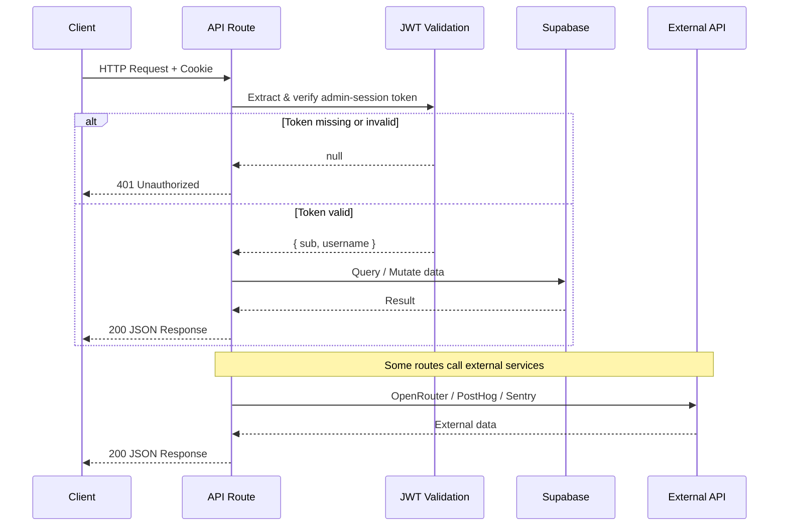

# API Overview

## Architecture

All APIs in the ChainLinked Admin Dashboard are Next.js App Router API routes defined in `route.ts` files under `app/api/`. The API layer follows these conventions:

- **Framework:** Next.js 16 App Router with `route.ts` handlers
- **Authentication:** JWT-based sessions stored in HTTP-only cookies (`admin-session`)
- **Data Layer:** Supabase (Postgres) via the admin client for all database operations
- **External Integrations:** OpenRouter (AI analysis), PostHog (session recordings), Sentry (error tracking)
- **Patterns:** RESTful with JSON request/response bodies

## API Flow Diagram



## Endpoints Summary

| Endpoint | Method | Auth | Description |
|---|---|---|---|
| `/api/auth/login` | POST | No | Admin user authentication |
| `/api/auth/logout` | POST | No | Clear session cookie |
| `/api/admin/content/analyze` | POST | Yes | AI-powered content analysis via OpenRouter |
| `/api/admin/content/[id]` | DELETE | Yes | Delete content by ID and table |
| `/api/admin/conversations/[id]` | GET | Yes | Fetch a compose conversation |
| `/api/admin/prompts/[id]` | PUT | Yes | Update system prompt settings |
| `/api/admin/users/[id]` | DELETE | Yes | Permanently delete a user |
| `/api/admin/users/[id]` | PATCH | Yes | Suspend or unsuspend a user |
| `/api/admin/posthog/recordings` | GET | Yes | List PostHog session recordings |
| `/api/admin/sentry/issues` | GET | Yes | List Sentry project issues |
| `/api/admin/sidebar-sections` | GET | Yes | List all sidebar sections |
| `/api/admin/sidebar-sections` | POST | Yes | Create a new sidebar section |
| `/api/admin/sidebar-sections/[id]` | PUT | Yes | Update a sidebar section |
| `/api/admin/sidebar-sections/[id]` | DELETE | Yes | Delete a sidebar section |

## Authentication

All routes under `/api/admin/*` require a valid JWT session:

1. The token is extracted from the `admin-session` HTTP-only cookie.
2. `verifySessionToken()` validates the JWT signature and expiration.
3. If the token is missing or invalid, the route returns `401 Unauthorized`.
4. The session cookie is set at login with `maxAge: 86400` (24 hours), `httpOnly`, `sameSite: strict`, and `secure` in production.

The `/api/auth/login` and `/api/auth/logout` routes do not require authentication.

## Rate Limiting

| Scope | Limit | Window |
|---|---|---|
| Login (`/api/auth/login`) | 5 attempts | 15 minutes per IP |
| All other endpoints | No rate limiting | -- |

When rate-limited, the response includes a `Retry-After` header (in seconds).

## Error Response Format

All error responses follow a consistent JSON structure:

```json
{
  "error": "Human readable message",
  "details": "optional additional context"
}
```

### Status Codes

| Code | Meaning |
|---|---|
| 400 | Bad Request -- missing or invalid parameters |
| 401 | Unauthorized -- missing or invalid session token |
| 404 | Not Found -- resource does not exist |
| 429 | Too Many Requests -- rate limit exceeded |
| 500 | Internal Server Error -- server-side or configuration failure |
| 502 | Bad Gateway -- external API (OpenRouter, PostHog, Sentry) failure |

## Audit Logging

Most mutating operations are recorded via `auditLog()` with the action type, admin ID, and relevant metadata. Audited actions include: `login`, `logout`, `content.delete`, `prompt.update`, `user.delete`, `user.suspend`, `user.unsuspend`, `sidebar_section.create`, `sidebar_section.update`, `sidebar_section.delete`.
