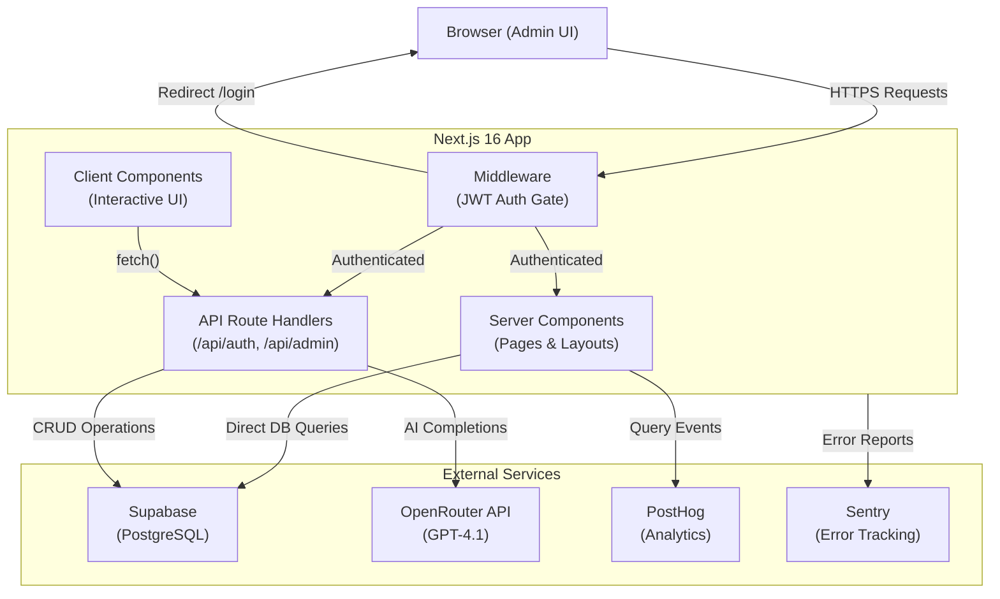
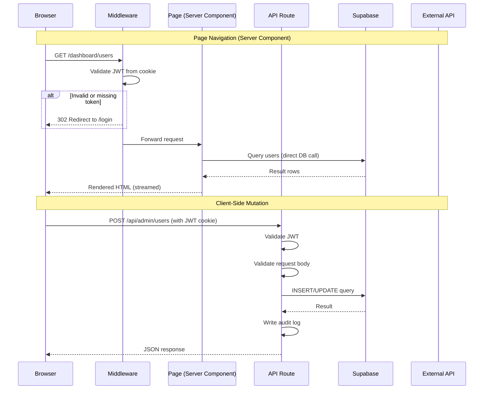
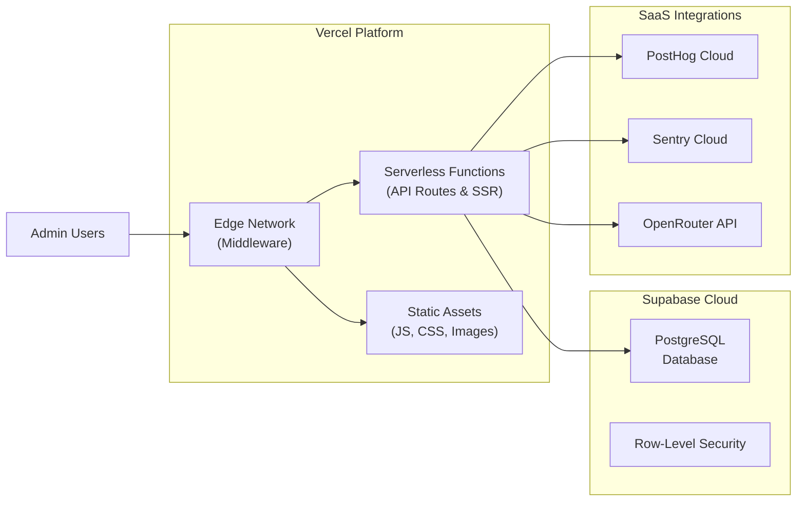

# Architecture

## System Overview

ChainLinked Admin Dashboard is a **Next.js 16 App Router** application that serves as the internal administration panel for the ChainLinked platform -- an AI-powered LinkedIn content generation and management system.

The dashboard enables administrators to:

- **Monitor users** -- view, search, and manage platform users and their activity
- **Manage teams** -- organize users into teams with metrics and activity tracking
- **Review AI-generated content** -- moderate, score, and curate posts created by the AI pipeline
- **Analyze performance** -- track engagement metrics, content quality, and platform health
- **Monitor system health** -- observe error rates, API latency, and infrastructure status
- **Configure settings** -- adjust platform parameters and admin preferences

---

## Architecture Diagram



---

## Tech Stack

| Category           | Technology                                    |
| ------------------ | --------------------------------------------- |
| Framework          | Next.js 16 (App Router, Server Components)    |
| Language           | TypeScript 5                                  |
| UI Library         | React 19                                      |
| Styling            | Tailwind CSS 4                                |
| Component Library  | shadcn/ui (built on Radix UI primitives)      |
| Database           | Supabase (hosted PostgreSQL)                  |
| Authentication     | JWT via `jose` + password hashing via `bcryptjs` |
| AI Integration     | OpenRouter (GPT-4.1)                          |
| Analytics          | PostHog                                       |
| Error Tracking     | Sentry                                        |
| Charts             | Recharts                                      |
| Data Tables        | TanStack React Table                          |
| Drag and Drop      | @dnd-kit                                      |
| Toast Notifications| Sonner                                        |
| Theme Switching    | next-themes                                   |

---

## Project Structure

```
chainlinked-admin1/
├── app/                        # Next.js App Router
│   ├── api/                    # API route handlers
│   │   ├── auth/               #   Login / logout endpoints
│   │   └── admin/              #   Admin CRUD endpoints (users, content, etc.)
│   ├── login/                  # Public login page
│   └── dashboard/              # Protected admin pages
│       ├── users/              #   User management (list, detail, edit)
│       ├── teams/              #   Team management (list, detail, members)
│       ├── content/            #   Content management (posts, moderation)
│       ├── analytics/          #   Analytics dashboards & reports
│       ├── system/             #   System monitoring & health checks
│       └── settings/           #   Admin settings & configuration
│
├── components/                 # React components
│   ├── charts/                 #   Recharts-based visualizations
│   └── ui/                     #   shadcn/ui primitives (Button, Dialog, etc.)
│
├── lib/                        # Shared utilities & service clients
│   ├── auth.ts                 #   JWT token creation/verification + bcrypt
│   ├── supabase/               #   Supabase client initialization & helpers
│   ├── openrouter.ts           #   OpenRouter (AI) API client
│   ├── posthog.ts              #   PostHog server-side query client
│   ├── analytics.ts            #   Event tracking helpers
│   ├── audit.ts                #   Audit log recording for mutations
│   ├── rate-limit.ts           #   In-memory rate limiter
│   └── quality-score.ts        #   Content quality scoring algorithm
│
├── hooks/                      # Custom React hooks
├── scripts/                    # Admin seed & utility scripts
├── middleware.ts               # Global route protection (JWT validation)
├── tailwind.config.ts          # Tailwind CSS configuration
├── next.config.ts              # Next.js configuration
└── tsconfig.json               # TypeScript configuration
```

---

## Request Flow



---

## Data Flow

### Server Components (Read Path)

Server Components fetch data **directly from Supabase** at request time. There is no intermediate API layer for read operations -- the server component calls the Supabase client, receives rows, and renders HTML that is streamed to the browser.

### Client Components (Write Path)

Client-side interactive components use `fetch()` to call the internal API routes under `/api/admin/`. These routes:

1. Extract and validate the JWT from the HTTP-only cookie
2. Parse and validate the request body
3. Execute the query against Supabase (or call an external API like OpenRouter)
4. Record an entry in the audit log for any mutation
5. Return a JSON response

### External API Calls

- **OpenRouter (GPT-4.1)** -- called from API routes when AI content generation, summarization, or quality scoring is needed
- **PostHog** -- queried server-side for analytics data; events are captured for admin actions
- **Sentry** -- error reports are sent automatically from both server and client code

---

## Security Architecture

### Authentication

- **JWT-based sessions** stored in HTTP-only cookies (not accessible to client-side JavaScript)
- Tokens are created and verified using the `jose` library
- Passwords are hashed with **bcrypt (12 salt rounds)** via `bcryptjs`

### Route Protection

- **Middleware** (`middleware.ts`) intercepts every request and validates the JWT before allowing access to any `/dashboard` or `/api/admin` route
- The `/login` page and `/api/auth` endpoints are public
- **Dev bypass mode**: when `ADMIN_JWT_SECRET` is not set, authentication checks are skipped to simplify local development

### Rate Limiting

- Login endpoint is rate-limited to **5 attempts per 15 minutes** per IP address
- Implemented with an in-memory store (resets on server restart)

### Input Validation

- API routes validate request bodies before processing
- Content deletion endpoints use a **whitelist of allowed table names** to prevent injection attacks
- All mutations are recorded in the audit log with the acting admin's identity

---

## Deployment Architecture



### Infrastructure Notes

- **Hosting**: Designed for deployment on Vercel (serverless functions + edge middleware)
- **Database**: Supabase-hosted PostgreSQL with connection pooling
- **External services**: All third-party integrations (PostHog, Sentry, OpenRouter) are cloud-hosted SaaS -- no self-hosted infrastructure required
- **CI/CD**: No automated pipelines are configured yet; deployment is manual via `vercel` CLI or Git-based Vercel integration
- **Environment variables**: All secrets (`ADMIN_JWT_SECRET`, `SUPABASE_SERVICE_ROLE_KEY`, `OPENROUTER_API_KEY`, etc.) are managed through the hosting platform's environment configuration
