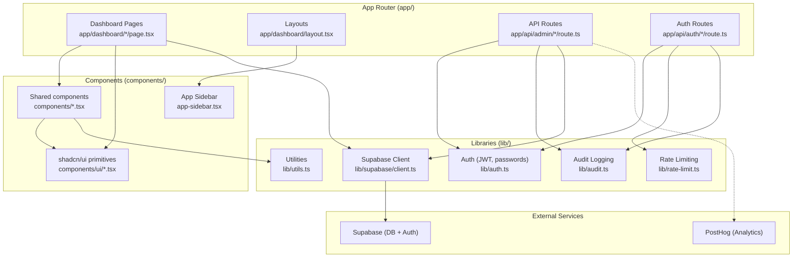

# Contributing Guide

## Development Setup

Quick reference: clone, install, configure environment, seed admin, start dev server.

```bash
# 1. Clone the repo
git clone <repo-url> && cd chainlinked-admin

# 2. Install dependencies
npm install

# 3. Set up environment variables
cp .env.example .env.local
# Fill in SUPABASE_URL, SUPABASE_SERVICE_ROLE_KEY, JWT_SECRET, etc.

# 4. Seed an admin user (see project docs for seed script)

# 5. Start the dev server
npm run dev
```

Available scripts:

| Command         | Description              |
| --------------- | ------------------------ |
| `npm run dev`   | Start development server |
| `npm run build` | Production build         |
| `npm run start` | Start production server  |
| `npm run lint`  | Run ESLint               |

---

## Project Conventions

### File Naming

- **Components**: PascalCase for component names, kebab-case for file names (e.g., `MetricCard` in `metric-card.tsx`)
- **Pages**: `page.tsx` inside route directories under `app/`
- **API routes**: `route.ts` inside route directories under `app/api/`
- **Utilities**: camelCase in `lib/` (e.g., `lib/utils.ts`, `lib/audit.ts`)

### TypeScript Conventions

- Strict mode is enabled (`"strict": true` in `tsconfig.json`)
- Path alias: `@/*` maps to the project root
- Prefer `interface` over `type` for component props
- Use type inference where possible; avoid redundant annotations

```typescript
// Good: interface for props, type inference for return
interface MetricCardProps {
  title: string
  value: number
  icon: React.ComponentType
}

// Good: inferred return type
function formatCurrency(amount: number) {
  return `$${amount.toFixed(2)}`
}
```

### Component Patterns

- **Server Components by default** -- do not add `"use client"` unless the component needs interactivity
- **Client Components**: add the `"use client"` directive at the very top of the file
- Use the `cn()` utility from `@/lib/utils` for conditional class merging
- Destructure props in the function signature

```tsx
// Server Component (default) -- no directive needed
import { cn } from "@/lib/utils"

interface MetricCardProps {
  title: string
  value: string
  className?: string
}

function MetricCard({ title, value, className }: MetricCardProps) {
  return (
    <div className={cn("rounded-lg border p-4", className)}>
      <p className="text-sm text-muted-foreground">{title}</p>
      <p className="text-2xl font-bold">{value}</p>
    </div>
  )
}

export { MetricCard }
```

```tsx
// Client Component -- needs interactivity
"use client"

import { useState } from "react"
import { Button } from "@/components/ui/button"

function Counter() {
  const [count, setCount] = useState(0)
  return <Button onClick={() => setCount(count + 1)}>Count: {count}</Button>
}
```

### API Route Patterns

- Validate JWT at the start of every admin route
- Return consistent error format: `{ error: string }`
- Call `auditLog()` for all mutations
- PostHog event tracking for admin actions

```typescript
import { NextResponse, type NextRequest } from "next/server"
import { supabaseAdmin } from "@/lib/supabase/client"
import { verifySessionToken, COOKIE_NAME } from "@/lib/auth"
import { auditLog } from "@/lib/audit"

async function authenticate(request: NextRequest) {
  const token = request.cookies.get(COOKIE_NAME)?.value
  if (!token) return null
  return verifySessionToken(token)
}

export async function DELETE(
  request: NextRequest,
  { params }: { params: Promise<{ id: string }> }
) {
  const admin = await authenticate(request)
  if (!admin) {
    return NextResponse.json({ error: "Unauthorized" }, { status: 401 })
  }

  const { id } = await params

  const { error } = await supabaseAdmin.auth.admin.deleteUser(id)
  if (error) {
    return NextResponse.json({ error: error.message }, { status: 500 })
  }

  auditLog("user.delete", { adminId: admin.sub, targetUserId: id })

  return NextResponse.json({ success: true })
}
```

### Styling Conventions

- Use Tailwind CSS utility classes; avoid custom CSS unless absolutely necessary
- Reference CSS variables from `app/globals.css` for theme colors (e.g., `text-foreground`, `bg-background`)
- Use `cn()` from `@/lib/utils` for conditional class merging
- Responsive design follows a mobile-first approach

```tsx
import { cn } from "@/lib/utils"

// cn() merges Tailwind classes safely, resolving conflicts
<div className={cn(
  "rounded-lg border bg-card p-4",
  isActive && "border-primary",
  className
)} />
```

---

## Adding a New Dashboard Page

1. **Create the route directory** under `app/dashboard/` (e.g., `app/dashboard/widgets/`)
2. **Add `page.tsx`** as an async Server Component that fetches data from Supabase
3. **Query Supabase** using `supabaseAdmin` for server-side data
4. **Add a navigation item** in `app-sidebar.tsx`
5. **Reuse existing components** like `MetricCard`, data tables, and charts

```tsx
// app/dashboard/widgets/page.tsx
import { supabaseAdmin } from "@/lib/supabase/client"
import { MetricCard } from "@/components/metric-card"
import { BoxIcon } from "lucide-react"

async function getWidgets() {
  const { data } = await supabaseAdmin
    .from("widgets")
    .select("id, name, created_at")
    .order("created_at", { ascending: false })
  return data ?? []
}

export default async function WidgetsPage() {
  const widgets = await getWidgets()

  return (
    <div className="flex flex-col gap-6">
      <h1 className="text-2xl font-bold">Widgets</h1>
      <div className="grid gap-4 sm:grid-cols-2 lg:grid-cols-4">
        <MetricCard title="Total Widgets" value={String(widgets.length)} />
      </div>
      {/* Add a data table here */}
    </div>
  )
}
```

---

## Adding a New API Route

1. **Create the route directory** under `app/api/admin/` (e.g., `app/api/admin/widgets/[id]/`)
2. **Add `route.ts`** with the appropriate HTTP method handler(s)
3. **Add JWT validation** using the `authenticate` helper at the start of every handler
4. **Add audit logging** via `auditLog()` for any mutation
5. **Add PostHog event tracking** for admin actions
6. **Return consistent error format**: `{ error: string }` with appropriate status codes

```typescript
// app/api/admin/widgets/[id]/route.ts
import { NextResponse, type NextRequest } from "next/server"
import { supabaseAdmin } from "@/lib/supabase/client"
import { verifySessionToken, COOKIE_NAME } from "@/lib/auth"
import { auditLog } from "@/lib/audit"

async function authenticate(request: NextRequest) {
  const token = request.cookies.get(COOKIE_NAME)?.value
  if (!token) return null
  return verifySessionToken(token)
}

export async function PATCH(
  request: NextRequest,
  { params }: { params: Promise<{ id: string }> }
) {
  const admin = await authenticate(request)
  if (!admin) {
    return NextResponse.json({ error: "Unauthorized" }, { status: 401 })
  }

  const { id } = await params
  const body = await request.json()

  const { error } = await supabaseAdmin
    .from("widgets")
    .update({ name: body.name })
    .eq("id", id)

  if (error) {
    return NextResponse.json({ error: error.message }, { status: 500 })
  }

  auditLog("widget.update" as any, { adminId: admin.sub, widgetId: id })

  return NextResponse.json({ success: true })
}
```

---

## Adding a New Component

1. **Create the file** in `components/` using kebab-case (e.g., `components/widget-card.tsx`)
2. **Follow shadcn/ui patterns**: use `cn()`, `cva()` for variants, and props destructuring
3. **Keep it server-compatible** unless interactivity is required (then add `"use client"`)

```tsx
// components/widget-card.tsx
import { cn } from "@/lib/utils"

interface WidgetCardProps {
  title: string
  description: string
  className?: string
}

function WidgetCard({ title, description, className }: WidgetCardProps) {
  return (
    <div className={cn("rounded-lg border bg-card p-4 shadow-sm", className)}>
      <h3 className="font-semibold">{title}</h3>
      <p className="text-sm text-muted-foreground">{description}</p>
    </div>
  )
}

export { WidgetCard }
```

---

## Adding a shadcn/ui Component

```bash
npx shadcn@latest add <component-name>
```

This installs the component into `components/ui/` and follows the project's shadcn configuration (Radix Nova style, CSS variables enabled, Lucide icons).

---

## Git Workflow

- Branch from `main`
- Use descriptive branch names: `feature/`, `fix/`, `docs/`
- Keep commits focused and descriptive
- Test locally before pushing

```bash
git checkout -b feature/widget-dashboard
# ... make changes ...
npm run lint
npm run build
git add -A
git commit -m "feat: add widget dashboard page"
git push -u origin feature/widget-dashboard
```

---

## Code Review Checklist

- [ ] TypeScript compiles without errors (`npm run build`)
- [ ] ESLint passes (`npm run lint`)
- [ ] New API routes have JWT validation via `authenticate()`
- [ ] Mutations have audit logging via `auditLog()`
- [ ] No secrets in client-side code
- [ ] Responsive design works on mobile and desktop
- [ ] Dark mode works (uses CSS variables, not hardcoded colors)
- [ ] Error states are handled gracefully

---

## Project Architecture Diagram


