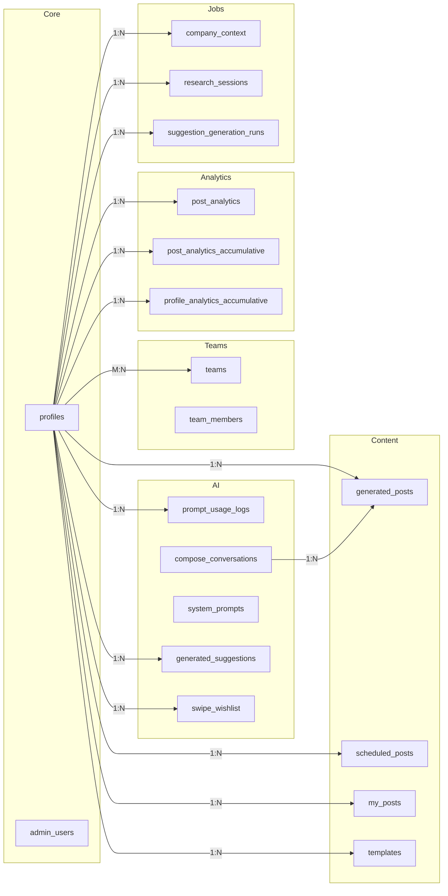

# Database Schema

## Overview

| Property | Value |
|---|---|
| **Platform** | Supabase (PostgreSQL) |
| **Client** | `@supabase/supabase-js` with service role key for admin operations |
| **Schema Management** | Managed via Supabase dashboard (no local migration files) |
| **Auth Model** | Admin client uses service role key, bypassing Row Level Security |

The ChainLinked Admin Dashboard connects to Supabase using a privileged service role key. The client is configured in `lib/supabase/client.ts` with `persistSession: false` and `autoRefreshToken: false` since admin authentication is handled separately from Supabase Auth.

---

## Entity Relationship Diagram

```mermaid
erDiagram
    admin_users {
        uuid id PK
        text username UK
        text password_hash
        timestamp last_login
    }

    profiles {
        uuid id PK
        text full_name
        text email
        timestamp created_at
        boolean onboarding_completed
        text linkedin_user_id
    }

    generated_posts {
        uuid id PK
        uuid user_id FK
        text content
        text post_type
        text source
        text status
        int word_count
        text hook
        text cta
        timestamp created_at
        uuid conversation_id FK
        text prompt_snapshot
        int prompt_tokens
        int completion_tokens
        int total_tokens
        text model
        numeric estimated_cost
    }

    scheduled_posts {
        uuid id PK
        uuid user_id FK
        text content
        timestamp scheduled_for
        text timezone
        text status
        text error_message
        timestamp posted_at
        timestamp created_at
    }

    my_posts {
        uuid id PK
        uuid user_id FK
        timestamp created_at
    }

    templates {
        uuid id PK
        uuid user_id FK
        timestamp created_at
    }

    prompt_usage_logs {
        uuid id PK
        uuid user_id FK
        text prompt_type
        text model
        text feature
        int input_tokens
        int output_tokens
        int total_tokens
        numeric estimated_cost
        int response_time_ms
        boolean success
        timestamp created_at
    }

    compose_conversations {
        uuid id PK
        jsonb messages
        timestamp created_at
        timestamp updated_at
    }

    system_prompts {
        uuid id PK
        text type
        text name
        text description
        boolean is_active
        boolean is_default
    }

    generated_suggestions {
        uuid id PK
        uuid user_id FK
    }

    swipe_wishlist {
        uuid id PK
        uuid user_id FK
    }

    teams {
        uuid id PK
        text name
    }

    team_members {
        uuid user_id FK
        uuid team_id FK
    }

    company_context {
        uuid id PK
        text company_name
        text status
        text error_message
        timestamp created_at
        timestamp completed_at
        uuid user_id FK
    }

    research_sessions {
        uuid id PK
        text[] topics
        text status
        int posts_discovered
        int posts_generated
        text error_message
        timestamp created_at
        timestamp completed_at
        uuid user_id FK
    }

    suggestion_generation_runs {
        uuid id PK
        text status
        int suggestions_requested
        int suggestions_generated
        text error_message
        timestamp created_at
        timestamp completed_at
        uuid user_id FK
    }

    post_analytics {
        uuid id PK
        uuid user_id FK
        int impressions
        int reactions
        int comments
        int reposts
        int saves
        int sends
        numeric engagement_rate
        int followers_gained
        int unique_views
        text post_type
        timestamp posted_at
        timestamp captured_at
    }

    post_analytics_accumulative {
        uuid id PK
        uuid user_id FK
        uuid post_id FK
        int impressions_total
        int reactions_total
        int comments_total
        int reposts_total
        int saves_total
        int sends_total
        int engagements_total
        numeric engagements_rate
        text post_type
        timestamp post_created_at
        date analysis_date
    }

    profile_analytics_accumulative {
        uuid id PK
        uuid user_id FK
        int followers_total
        int profile_views_total
        int search_appearances_total
        int connections_total
        date analysis_date
    }

    sidebar_sections {
        uuid id PK
        text key UK
        text label
        text description
        boolean enabled
        int sort_order
        timestamp created_at
        timestamp updated_at
    }

    linkedin_tokens {
        uuid user_id FK
    }

    companies {
        uuid id PK
    }

    profiles ||--o{ generated_posts : "creates"
    profiles ||--o{ scheduled_posts : "schedules"
    profiles ||--o{ my_posts : "uploads"
    profiles ||--o{ templates : "owns"
    profiles ||--o{ prompt_usage_logs : "tracks"
    profiles ||--o{ generated_suggestions : "receives"
    profiles ||--o{ swipe_wishlist : "saves"
    profiles ||--o{ post_analytics : "measures"
    profiles ||--o{ post_analytics_accumulative : "accumulates"
    profiles ||--o{ profile_analytics_accumulative : "monitors"
    profiles ||--o{ company_context : "initiates"
    profiles ||--o{ research_sessions : "runs"
    profiles ||--o{ suggestion_generation_runs : "triggers"
    profiles ||--o{ linkedin_tokens : "authenticates"
    profiles ||--o{ team_members : "joins"
    teams ||--o{ team_members : "contains"
    compose_conversations ||--o{ generated_posts : "produces"
```



---

## Tables

### Core User Tables

#### `admin_users` -- Admin Authentication

Stores credentials for the admin dashboard itself. Separate from platform users.

| Column | Type | Constraints | Description |
|---|---|---|---|
| `id` | `uuid` | PK, default `gen_random_uuid()` | Primary key |
| `username` | `text` | UNIQUE, NOT NULL | Admin login username |
| `password_hash` | `text` | NOT NULL | Bcrypt hash (12 salt rounds) |
| `last_login` | `timestamp` | | Last successful login |

#### `profiles` -- Platform User Accounts

Linked to Supabase Auth. Represents every user of the ChainLinked platform.

| Column | Type | Constraints | Description |
|---|---|---|---|
| `id` | `uuid` | PK | Linked to Supabase Auth `auth.users.id` |
| `full_name` | `text` | | Display name |
| `email` | `text` | | Email address |
| `created_at` | `timestamp` | | Signup date |
| `onboarding_completed` | `boolean` | default `false` | Whether onboarding flow is complete |
| `linkedin_user_id` | `text` | | LinkedIn profile identifier |

---

### Content Tables

#### `generated_posts` -- AI-Generated LinkedIn Posts

Core content table. Each row is a post produced by the AI writing engine.

| Column | Type | Constraints | Description |
|---|---|---|---|
| `id` | `uuid` | PK | Primary key |
| `user_id` | `uuid` | FK -> `profiles.id` | Owning user |
| `content` | `text` | | Full post body |
| `post_type` | `text` | | Category (e.g., story, listicle, thought leadership) |
| `source` | `text` | | Generation source (compose, research, etc.) |
| `status` | `text` | | Draft, published, archived |
| `word_count` | `int` | | Computed word count |
| `hook` | `text` | | Opening hook line |
| `cta` | `text` | | Call-to-action line |
| `created_at` | `timestamp` | | Creation timestamp |
| `conversation_id` | `uuid` | FK -> `compose_conversations.id` | Linked conversation (nullable) |
| `prompt_snapshot` | `text` | | Frozen copy of the prompt used |
| `prompt_tokens` | `int` | | Input token count |
| `completion_tokens` | `int` | | Output token count |
| `total_tokens` | `int` | | Total token count |
| `model` | `text` | | LLM model identifier |
| `estimated_cost` | `numeric` | | Estimated API cost in USD |

#### `scheduled_posts` -- Posts Queued for Publishing

Posts waiting to be published to LinkedIn at a scheduled time.

| Column | Type | Constraints | Description |
|---|---|---|---|
| `id` | `uuid` | PK | Primary key |
| `user_id` | `uuid` | FK -> `profiles.id` | Owning user |
| `content` | `text` | | Post body |
| `scheduled_for` | `timestamp` | | Target publish time |
| `timezone` | `text` | | User's timezone (e.g., `America/New_York`) |
| `status` | `text` | | pending, posted, failed, cancelled |
| `error_message` | `text` | | Error details if status is failed |
| `posted_at` | `timestamp` | | Actual publish time |
| `created_at` | `timestamp` | | Record creation time |

#### `my_posts` -- User-Uploaded Posts

Posts imported or manually added by users (not AI-generated).

| Column | Type | Constraints | Description |
|---|---|---|---|
| `id` | `uuid` | PK | Primary key |
| `user_id` | `uuid` | FK -> `profiles.id` | Owning user |
| `created_at` | `timestamp` | | Creation timestamp |

#### `templates` -- Post Templates

Reusable post structures and formats.

| Column | Type | Constraints | Description |
|---|---|---|---|
| `id` | `uuid` | PK | Primary key |
| `user_id` | `uuid` | FK -> `profiles.id` | Owning user |
| `created_at` | `timestamp` | | Creation timestamp |

---

### AI and Analytics Tables

#### `prompt_usage_logs` -- AI API Call Tracking

Tracks every LLM API call for cost monitoring and usage analytics.

| Column | Type | Constraints | Description |
|---|---|---|---|
| `id` | `uuid` | PK | Primary key |
| `user_id` | `uuid` | FK -> `profiles.id` | User who triggered the call |
| `prompt_type` | `text` | | Type of prompt (compose, rewrite, etc.) |
| `model` | `text` | | LLM model used |
| `feature` | `text` | | Product feature area |
| `input_tokens` | `int` | | Prompt token count |
| `output_tokens` | `int` | | Completion token count |
| `total_tokens` | `int` | | Combined token count |
| `estimated_cost` | `numeric` | | Estimated cost in USD |
| `response_time_ms` | `int` | | Latency in milliseconds |
| `success` | `boolean` | | Whether the call succeeded |
| `created_at` | `timestamp` | | Call timestamp |

#### `compose_conversations` -- Multi-Turn AI Chat

Stores full conversation threads for the compose feature.

| Column | Type | Constraints | Description |
|---|---|---|---|
| `id` | `uuid` | PK | Primary key |
| `messages` | `jsonb` | | Array of `{role, content}` message objects |
| `created_at` | `timestamp` | | Conversation start time |
| `updated_at` | `timestamp` | | Last message time |

#### `system_prompts` -- LLM System Prompts

Admin-managed system prompts used across AI features.

| Column | Type | Constraints | Description |
|---|---|---|---|
| `id` | `uuid` | PK | Primary key |
| `type` | `text` | | Prompt category |
| `name` | `text` | | Human-readable name |
| `description` | `text` | | Purpose description |
| `is_active` | `boolean` | | Whether currently in use |
| `is_default` | `boolean` | | Whether this is the default for its type |

#### `generated_suggestions` -- AI Suggestions

AI-generated content suggestions surfaced to users.

| Column | Type | Constraints | Description |
|---|---|---|---|
| `id` | `uuid` | PK | Primary key |
| `user_id` | `uuid` | FK -> `profiles.id` | Target user |

#### `swipe_wishlist` -- Saved Suggestions

Suggestions that users have bookmarked or saved.

| Column | Type | Constraints | Description |
|---|---|---|---|
| `id` | `uuid` | PK | Primary key |
| `user_id` | `uuid` | FK -> `profiles.id` | User who saved it |

---

### Team Tables

#### `teams` -- Organization Groups

Top-level team entities.

| Column | Type | Constraints | Description |
|---|---|---|---|
| `id` | `uuid` | PK | Primary key |
| `name` | `text` | | Team name |

#### `team_members` -- Team Membership

Junction table implementing the many-to-many relationship between profiles and teams.

| Column | Type | Constraints | Description |
|---|---|---|---|
| `user_id` | `uuid` | FK -> `profiles.id` | Member user |
| `team_id` | `uuid` | FK -> `teams.id` | Parent team |

---

### Background Job Tables

#### `company_context` -- Company Research Jobs

Tracks background jobs that research company information for contextual content generation.

| Column | Type | Constraints | Description |
|---|---|---|---|
| `id` | `uuid` | PK | Primary key |
| `company_name` | `text` | | Company being researched |
| `status` | `text` | | pending, processing, completed, failed |
| `error_message` | `text` | | Failure details |
| `created_at` | `timestamp` | | Job creation time |
| `completed_at` | `timestamp` | | Job completion time |
| `user_id` | `uuid` | FK -> `profiles.id` | Requesting user |

#### `research_sessions` -- Content Research Jobs

Background jobs that discover and generate posts from topic research.

| Column | Type | Constraints | Description |
|---|---|---|---|
| `id` | `uuid` | PK | Primary key |
| `topics` | `text[]` | | Array of research topics |
| `status` | `text` | | pending, processing, completed, failed |
| `posts_discovered` | `int` | | Number of source posts found |
| `posts_generated` | `int` | | Number of posts created |
| `error_message` | `text` | | Failure details |
| `created_at` | `timestamp` | | Job creation time |
| `completed_at` | `timestamp` | | Job completion time |
| `user_id` | `uuid` | FK -> `profiles.id` | Requesting user |

#### `suggestion_generation_runs` -- AI Suggestion Jobs

Background jobs that batch-generate content suggestions.

| Column | Type | Constraints | Description |
|---|---|---|---|
| `id` | `uuid` | PK | Primary key |
| `status` | `text` | | pending, processing, completed, failed |
| `suggestions_requested` | `int` | | Number requested |
| `suggestions_generated` | `int` | | Number actually produced |
| `error_message` | `text` | | Failure details |
| `created_at` | `timestamp` | | Job creation time |
| `completed_at` | `timestamp` | | Job completion time |
| `user_id` | `uuid` | FK -> `profiles.id` | Requesting user |

---

### LinkedIn Analytics Tables

#### `post_analytics` -- Per-Post Engagement Snapshots

Point-in-time engagement metrics captured for individual LinkedIn posts.

| Column | Type | Constraints | Description |
|---|---|---|---|
| `id` | `uuid` | PK | Primary key |
| `user_id` | `uuid` | FK -> `profiles.id` | Post author |
| `impressions` | `int` | | View count |
| `reactions` | `int` | | Like/celebrate/etc. count |
| `comments` | `int` | | Comment count |
| `reposts` | `int` | | Share count |
| `saves` | `int` | | Save/bookmark count |
| `sends` | `int` | | Direct send count |
| `engagement_rate` | `numeric` | | Computed engagement percentage |
| `followers_gained` | `int` | | New followers from this post |
| `unique_views` | `int` | | Unique viewer count |
| `post_type` | `text` | | Content format |
| `posted_at` | `timestamp` | | Original publish time |
| `captured_at` | `timestamp` | | When metrics were recorded |

#### `post_analytics_accumulative` -- Lifetime Post Statistics

Running totals of engagement metrics per post, updated over time.

| Column | Type | Constraints | Description |
|---|---|---|---|
| `id` | `uuid` | PK | Primary key |
| `user_id` | `uuid` | FK -> `profiles.id` | Post author |
| `post_id` | `uuid` | FK | LinkedIn post identifier |
| `impressions_total` | `int` | | Cumulative impressions |
| `reactions_total` | `int` | | Cumulative reactions |
| `comments_total` | `int` | | Cumulative comments |
| `reposts_total` | `int` | | Cumulative reposts |
| `saves_total` | `int` | | Cumulative saves |
| `sends_total` | `int` | | Cumulative sends |
| `engagements_total` | `int` | | Cumulative total engagements |
| `engagements_rate` | `numeric` | | Lifetime engagement rate |
| `post_type` | `text` | | Content format |
| `post_created_at` | `timestamp` | | Original publish time |
| `analysis_date` | `date` | | Date of this snapshot |

#### `profile_analytics_accumulative` -- User Profile Growth

Tracks profile-level metrics over time for growth analysis.

| Column | Type | Constraints | Description |
|---|---|---|---|
| `id` | `uuid` | PK | Primary key |
| `user_id` | `uuid` | FK -> `profiles.id` | Profile owner |
| `followers_total` | `int` | | Total follower count |
| `profile_views_total` | `int` | | Total profile views |
| `search_appearances_total` | `int` | | Total search appearances |
| `connections_total` | `int` | | Total connection count |
| `analysis_date` | `date` | | Date of this snapshot |

---

### System Tables

#### `sidebar_sections` -- Navigation Feature Flags

Controls which navigation sections are visible in the platform UI.

| Column | Type | Constraints | Description |
|---|---|---|---|
| `id` | `uuid` | PK | Primary key |
| `key` | `text` | UNIQUE | Programmatic identifier |
| `label` | `text` | | Display label |
| `description` | `text` | | Admin description |
| `enabled` | `boolean` | | Feature flag toggle |
| `sort_order` | `int` | | Display ordering |
| `created_at` | `timestamp` | | Record creation time |
| `updated_at` | `timestamp` | | Last modification time |

#### `linkedin_tokens` -- OAuth Tokens

Stores LinkedIn OAuth credentials for API access.

| Column | Type | Constraints | Description |
|---|---|---|---|
| `user_id` | `uuid` | FK -> `profiles.id` | Token owner |

#### `companies` -- Company Profiles

Company entities referenced across the platform.

| Column | Type | Constraints | Description |
|---|---|---|---|
| `id` | `uuid` | PK | Primary key |

---

## Relationships



| Parent | Child | Cardinality | Join Column |
|---|---|---|---|
| `profiles` | `generated_posts` | One-to-many | `user_id` |
| `profiles` | `scheduled_posts` | One-to-many | `user_id` |
| `profiles` | `my_posts` | One-to-many | `user_id` |
| `profiles` | `templates` | One-to-many | `user_id` |
| `profiles` | `prompt_usage_logs` | One-to-many | `user_id` |
| `profiles` | `generated_suggestions` | One-to-many | `user_id` |
| `profiles` | `swipe_wishlist` | One-to-many | `user_id` |
| `profiles` | `post_analytics` | One-to-many | `user_id` |
| `profiles` | `post_analytics_accumulative` | One-to-many | `user_id` |
| `profiles` | `profile_analytics_accumulative` | One-to-many | `user_id` |
| `profiles` | `company_context` | One-to-many | `user_id` |
| `profiles` | `research_sessions` | One-to-many | `user_id` |
| `profiles` | `suggestion_generation_runs` | One-to-many | `user_id` |
| `profiles` | `linkedin_tokens` | One-to-one | `user_id` |
| `profiles` | `team_members` | Many-to-many | `user_id` (via junction) |
| `teams` | `team_members` | Many-to-many | `team_id` (via junction) |
| `compose_conversations` | `generated_posts` | One-to-many | `conversation_id` |

---

## Database Access Patterns

### Admin Client Configuration

```typescript
// lib/supabase/client.ts
import { createClient } from "@supabase/supabase-js"

export const supabaseAdmin = createClient(supabaseUrl, supabaseServiceKey, {
  auth: {
    autoRefreshToken: false,
    persistSession: false,
  },
})
```

- **Service role key** bypasses all Row Level Security policies
- **No session persistence** since admin auth is handled via custom JWT cookies
- **Server-side only** -- the service role key is never exposed to the browser

### Common Query Patterns

| Pattern | Usage | Example |
|---|---|---|
| **Paginated lists** | Dashboard tables | `supabaseAdmin.from('profiles').select('*').range(0, 24).order('created_at', { ascending: false })` |
| **Aggregation** | Metrics cards | `COUNT(*)`, `SUM(total_tokens)`, `AVG(engagement_rate)` |
| **Filtered queries** | Search, date ranges | `.ilike('full_name', '%query%')`, `.gte('created_at', startDate)` |
| **Join-like selects** | Related data | `.select('*, profiles(full_name, email)')` |
| **Single record** | Detail views | `.select('*').eq('id', id).single()` |

### Workload Characteristics

- **Read-heavy**: The admin dashboard primarily reads data for display
- **No direct writes to user tables**: Admin operations are limited to system tables (`admin_users`, `system_prompts`, `sidebar_sections`)
- **Aggregation-intensive**: Dashboard metrics require `COUNT`, `SUM`, and `AVG` across large tables
- **Time-series queries**: Analytics tables are frequently filtered by date ranges

---

## Supabase Configuration

| Setting | Value | Purpose |
|---|---|---|
| `NEXT_PUBLIC_SUPABASE_URL` | Supabase project URL | API endpoint |
| `SUPABASE_SERVICE_ROLE_KEY` | Service role secret | Full database access (bypasses RLS) |
| `persistSession` | `false` | No browser session storage |
| `autoRefreshToken` | `false` | No automatic token refresh |
