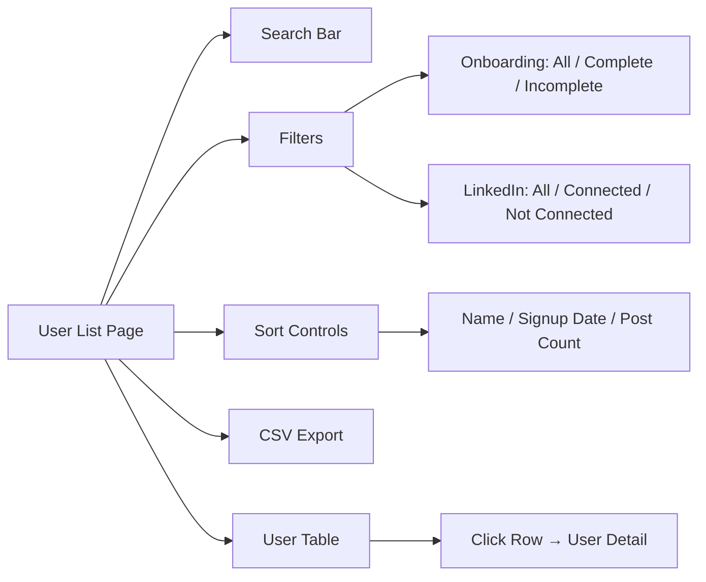
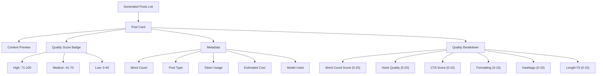
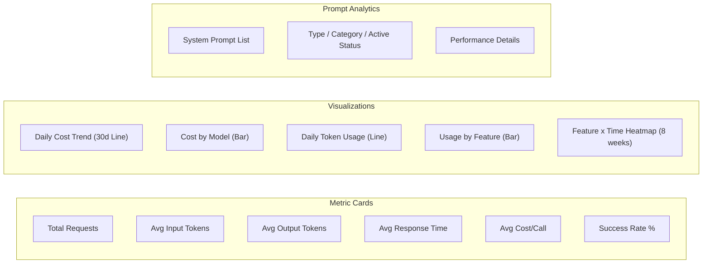
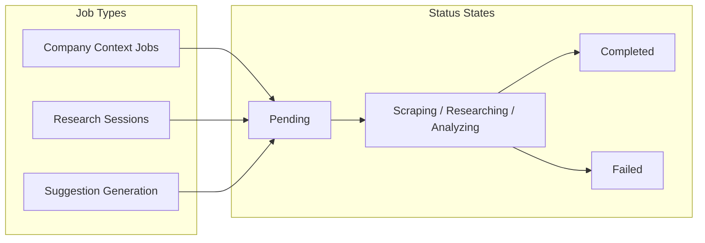

# Features

A comprehensive guide to every feature in the ChainLinked Admin Dashboard.

---

## Feature Hierarchy

```mermaid
flowchart TD
    A["ChainLinked Admin Dashboard"] --> B["Dashboard Overview"]
    A --> C["User Management"]
    A --> D["Team Management"]
    A --> E["Content Management"]
    A --> F["Analytics Suite"]
    A --> G["System Administration"]
    A --> H["Security"]
    A --> I["UI/UX"]

    B --> B1["KPI Metric Cards"]
    B --> B2["Quick Links"]
    B --> B3["Onboarding Funnel Snapshot"]
    B --> B4["Top Users Leaderboard"]
    B --> B5["Recent Activity Timeline"]
    B --> B6["System Health Monitor"]

    C --> C1["User List & Search"]
    C --> C2["User Detail Page"]
    C --> C3["Suspend / Delete Actions"]
    C --> C4["Onboarding Funnel Analytics"]

    D --> D1["Teams List"]
    D --> D2["Team Detail & Members"]
    D --> D3["Activity Breakdown"]
    D --> D4["CSV Export"]

    E --> E1["Generated Posts"]
    E --> E2["Scheduled Posts"]
    E --> E3["Templates"]
    E --> E4["AI Activity Logs"]

    F --> F1["AI Performance"]
    F --> F2["Token Usage"]
    F --> F3["Cost Analysis"]
    F --> F4["Feature Adoption"]
    F --> F5["PostHog Analytics"]
    F --> F6["LinkedIn Metrics"]

    G --> G1["Background Jobs Monitor"]
    G --> G2["Sidebar Control"]
    G --> G3["Sentry Error Tracking"]
    G --> G4["Admin Settings"]

    H --> H1["JWT Authentication"]
    H --> H2["Rate Limiting"]
    H --> H3["Middleware Protection"]
    H --> H4["Audit Logging"]
    H --> H5["Confirmation Dialogs"]

    I --> I1["Dark/Light Theme"]
    I --> I2["Responsive Design"]
    I --> I3["Skeleton Loading"]
    I --> I4["Toast Notifications"]
    I --> I5["CSV Export"]
    I --> I6["Search/Filter/Sort"]
```

---

## Dashboard Overview

**Route:** `/dashboard`

The main dashboard provides a bird's-eye view of the entire ChainLinked platform.

### KPI Metric Cards (8 cards in 4-column grid)

| Metric | Description | Visual |
|--------|-------------|--------|
| **Total Users** | Total registered platform users | Growth percentage indicator |
| **Active Users** | Users active in last 7 days | 7-day window count |
| **Posts Generated** | Total AI-generated posts | Weekly generation count |
| **Posts Published** | Posts published to LinkedIn | Publication count |
| **Token Usage** | Total AI tokens consumed | Associated cost display |
| **Teams** | Number of team/organizations | Team count |
| **Suggestion Save Rate** | % of AI suggestions saved by users | Percentage with trend |
| **User Retention Rate** | % of users returning to platform | Percentage with trend |

Each metric card supports:
- 5 accent colors (primary, blue, emerald, amber, default)
- Trend indicators (up/down/flat arrows with color coding)
- Custom icons
- Gradient hover effects
- Compact mode for dense layouts

### Quick Links (4 navigation cards)
- **Users** - Jump to user management
- **AI Activity** - View AI request logs
- **Cost Analysis** - Check spending dashboards
- **Onboarding** - View conversion funnel

### Onboarding Funnel Snapshot
Mini visualization showing user conversion through stages:
1. **Signed Up** - Total registrations
2. **Onboarded** - Completed onboarding flow
3. **LinkedIn Connected** - Linked their LinkedIn account
4. **Generated Posts** - Created at least one AI post
5. **Scheduled Posts** - Scheduled at least one post

### Top Users Leaderboard
- Displays most active content creators
- Rank badges: Gold (1st), Silver (2nd), Bronze (3rd)
- Horizontal bar chart showing post counts
- Links to user detail pages

### Recent Activity Timeline
- Shows last 10 platform events
- Event types: User signups, post generations, scheduled posts
- Relative timestamps
- Status icons and color coding

### System Health Monitor
- Stacked progress bar visualization
- Segments: Completed (green), Running (amber), Failed (red)
- Detailed breakdown with counts
- Quick indicator of system reliability

---

## User Management

### User List Page
**Route:** `/dashboard/users`

**Features:**
- **Search**: Filter by name or email (real-time)
- **Filter by onboarding status**: All, Complete, Incomplete
- **Filter by LinkedIn connection**: All, Connected, Not Connected
- **Sort**: By name, signup date, or post count (ascending/descending)
- **CSV Export**: Download filtered data as CSV
- **Metric Cards**: User count, active users, onboarding completion rate

### User Detail Page
**Route:** `/dashboard/users/[id]`

Displays comprehensive user profile:
- **Profile Summary**: Name, email, signup date, onboarding status, LinkedIn connection
- **Account Status Badges**: Active/Inactive, Onboarded/Pending, LinkedIn Connected
- **Generated Posts**: List of all AI-created posts with content preview
- **Scheduled Posts**: Posts queued or published
- **My Posts**: User-uploaded content
- **Templates**: Saved post templates
- **Token Usage**: Input/output token breakdown
- **Cost Breakdown**: Estimated cost per model and feature

### User Actions
- **Suspend User**: Sets ban duration to ~100 years, requires confirmation
- **Unsuspend User**: Removes ban, restores access
- **Delete User**: Permanently removes from Supabase Auth, requires type-to-confirm dialog
- All actions are audit-logged and tracked in PostHog

### Onboarding Funnel Analytics
**Route:** `/dashboard/users/onboarding`

Conversion funnel analysis:
- Stage-by-stage drop-off visualization
- Conversion rates between each step
- Identifies bottlenecks in user activation

---

## Team Management

### Teams List Page
**Route:** `/dashboard/teams`

**Features:**
- **Search**: Filter by team name
- **Sort by**: Member count, total posts, token usage, estimated cost, last active
- **Metrics per team**: Members, posts, tokens consumed, cost, last activity
- **CSV Export**: Download team data

### Team Detail Page
**Route:** `/dashboard/teams/[id]`

- **Team Information**: Name, creation date, summary stats
- **Members Table**: All team members with individual stats
- **Activity Breakdown**: Content generation and publishing metrics per member

---

## Content Management

### Generated Posts
**Route:** `/dashboard/content/generated`

**Features:**
- Content preview with expandable full text
- **Quality Score Grades**: High (green), Medium (amber), Low (red)
- Word count tracking
- Post type badges (e.g., thought-leadership, promotional)
- User attribution
- Token and cost per post
- Detailed quality breakdown metrics
- AI-powered analysis available (via OpenRouter GPT-4.1)

### Scheduled Posts
**Route:** `/dashboard/content/scheduled`

- **Schedule time**: Displayed as relative time ("In 5d", "3h ago")
- **Status tracking**: Pending (waiting), Posted (success), Failed (error)
- **Error messages**: Displayed for failed posts with details
- **User assignment**: Who scheduled the post
- **Timezone information**: User's local timezone
- **Posted timestamp**: When actually published (if successful)
- **Content preview**: Full post text

### Templates
**Route:** `/dashboard/content/templates`

- **Category badges**: thought-leadership, engagement, promotional, educational, storytelling
- **Visibility**: Public or Private indicator
- **Usage count**: How many times the template has been used
- **AI-generated flag**: Whether the template was AI-created
- **Content preview**: Template text
- **Copy to clipboard**: One-click copy functionality
- **User ownership**: Who created the template

### AI Activity
**Route:** `/dashboard/content/ai-activity`

Tabbed interface with three views:
1. **Requests Tab**: Individual API calls with model, tokens, cost, response time, success/failure
2. **Conversations Tab**: Multi-turn chat sessions with full message viewer (system prompts, user messages, AI responses)
3. **Output Tab**: Generated content results with quality analysis

---

## Analytics Suite

### AI Performance
**Route:** `/dashboard/analytics/ai-performance`

- **Metric Cards**: Total requests, avg tokens, avg response time, avg cost, success rate
- **Daily Cost Chart**: 30-day line chart trend
- **Cost by Model**: Bar chart comparing model costs
- **Daily Token Chart**: Token usage over time
- **Usage by Feature**: Which features consume most tokens
- **Feature x Time Heatmap**: Hour-by-day grid showing activity patterns over 8 weeks
- **Prompt Table**: All system prompts with type, category, active status, detailed analytics

### Token Usage
**Route:** `/dashboard/analytics/tokens`

- Token consumption metrics by time period
- Cost per token analysis
- Usage trend visualization
- Breakdown by model and feature

### Cost Analysis
**Route:** `/dashboard/analytics/costs`

| Metric Card | Description |
|-------------|-------------|
| **Total Spend** | All-time cumulative cost |
| **Month-to-Date** | Current month spending |
| **Week-to-Date** | Current week spending |
| **Today's Spend** | Today's cost |

**Charts:**
- Daily costs line chart (30 days)
- Spend by AI model (bar chart)
- Spend by feature (bar chart)
- 6-month cost trend (monthly aggregation)
- **Top 20 Users by Cost**: Table with user, request count, total cost

### Feature Adoption
**Route:** `/dashboard/analytics/features`

- Feature usage metrics across the platform
- User engagement rates by feature
- Feature performance analytics
- Adoption trends over time

### PostHog Analytics
**Route:** `/dashboard/analytics/posthog`

Tabbed interface:
1. **Dashboard Tab**: Embedded PostHog analytics dashboard
2. **Session Replays Tab**:
   - Recording list with user ID, viewed status, timestamps
   - Duration and active seconds
   - Click count, keypress count, console error count
   - Start URL for each session
3. **Heatmaps Tab**: Visual heatmap data

### LinkedIn Analytics
**Route:** `/dashboard/analytics/linkedin`

- LinkedIn engagement metrics sourced from database
- Post performance data (impressions, reactions, comments, reposts)
- Profile growth tracking (followers, profile views, search appearances)

---

## System Administration

### Background Jobs Monitor
**Route:** `/dashboard/system/jobs`

Tabbed view monitoring three job types:
- **Company Context Jobs**: Company profile research (status: pending → scraping → completed/failed)
- **Research Sessions**: Content research (topics, posts discovered, posts generated)
- **Suggestion Generation**: AI suggestion runs (requested vs generated counts)

Each shows: Status, error messages, timestamps, user assignment, counts

### Sidebar Control
**Route:** `/dashboard/system/flags`

- **Drag-and-drop reordering**: @dnd-kit powered sortable list
- **Enable/Disable toggle**: Switch to show/hide sections in Chrome extension sidebar
- **Create new sections**: Add with key, label, description
- **Edit descriptions**: Inline editing
- **Delete sections**: With confirmation
- Touch and keyboard accessible

### Error Tracking
**Route:** `/dashboard/system/errors`

- **Sentry integration**: Live error feed from platform
- **Error details**: Issue title, count, affected users, severity level
- **Severity badges**: Error, Fatal, Warning
- **Timestamps**: First seen, last seen
- **Status**: Resolved/unresolved
- **Links**: Direct link to Sentry dashboard for each issue
- **Refresh**: Manual refresh button
- **Pagination**: Cursor-based pagination from Sentry API

### Settings
**Route:** `/dashboard/settings`

- **Admin Profile Card**: Current username and account info
- **Password Change Form**: Current password + new password (UI placeholder)
- **Environment Status**: Visual indicators for service connectivity:
  - Supabase (Database & Auth)
  - PostHog Dashboard
  - PostHog API
  - OpenRouter (AI routing)

---

## Security Features

| Feature | Implementation | Details |
|---------|---------------|---------|
| **JWT Authentication** | jose library (HS256) | HTTP-only, Secure, SameSite=Strict cookies, 24h expiry |
| **Password Hashing** | bcryptjs | 12 salt rounds |
| **Rate Limiting** | In-memory per-IP | 5 login attempts per 15 minutes |
| **Route Protection** | Next.js Middleware | All `/dashboard/*` routes guarded |
| **Audit Logging** | Console JSON + PostHog | Every admin mutation tracked |
| **Confirmation Dialogs** | Custom component | Type-to-confirm for destructive actions |
| **Input Validation** | Whitelist checks | Table names validated against allowed list |
| **Dev Bypass** | Env var check | Auth skipped when `ADMIN_JWT_SECRET` not set |

---

## UI/UX Features

### Theme System
- **Dark/Light mode** with next-themes
- **View Transition API animation**: Circular reveal from toggle button position
- **CSS custom properties**: Full design token system
- **Persistent preference**: Stored in localStorage

### Responsive Design
- **Mobile sidebar**: Collapsible offcanvas navigation
- **Responsive grids**: Adapt from 4-column to 1-column
- **Container queries**: Cards adapt content based on their own width
- **Mobile breakpoint hook**: `use-mobile.ts` for programmatic detection

### Data Loading
- **Skeleton states**: Placeholder UI while data loads
- **Server Components**: Data fetched on server for instant display
- **Caching**: 5-minute and 60-second revalidation on external APIs

### Notifications
- **Sonner toast**: Non-blocking success/error notifications
- **Error messages**: Inline form validation
- **Status badges**: Color-coded status indicators

### Data Tables
- **TanStack React Table**: For complex table features
- **Search**: Real-time filtering by text
- **Multi-filter**: Multiple dropdown filters
- **Sort**: Click column headers, ascending/descending
- **CSV Export**: Download filtered data
- **Pagination**: For large datasets
- **Row actions**: Click to navigate to detail pages

### Design System
- **Color palette**: LinkedIn Blue (#0077B5) + Terracotta accent
- **Typography**: System font stack with monospace code
- **Spacing**: Consistent gap utilities
- **Shadows**: Multi-level shadow system
- **Gradients**: Gradient overlays on cards and backgrounds
- **Icons**: Lucide React (100+ icons used)
