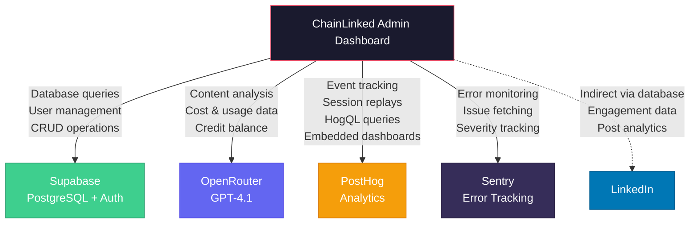
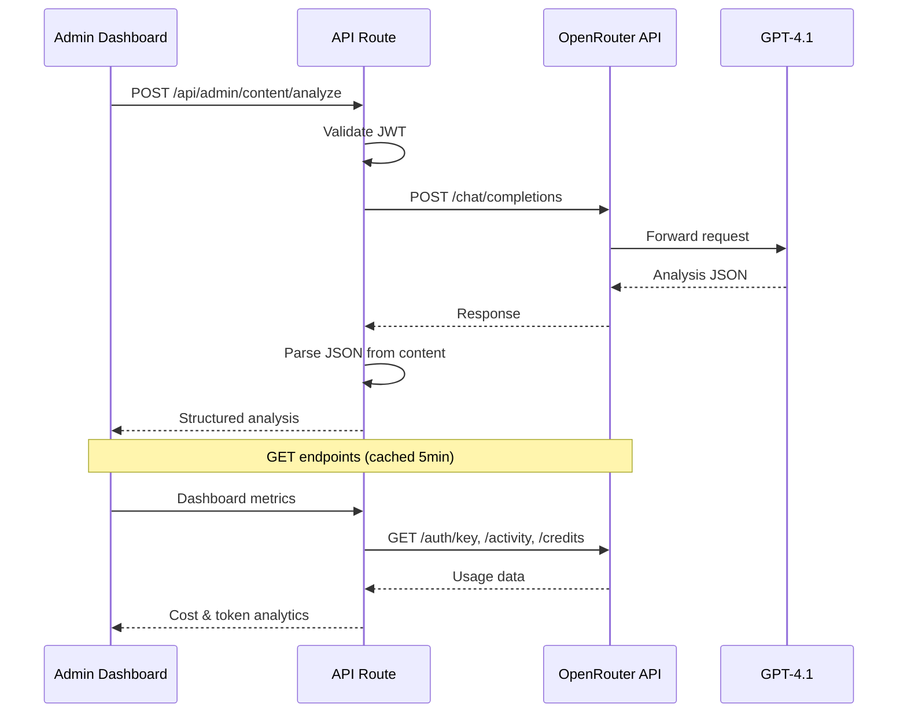
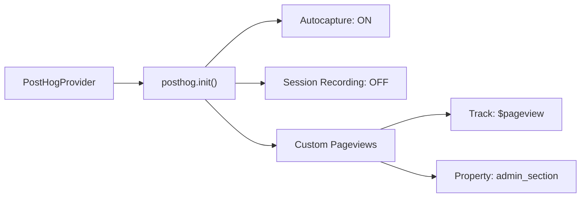
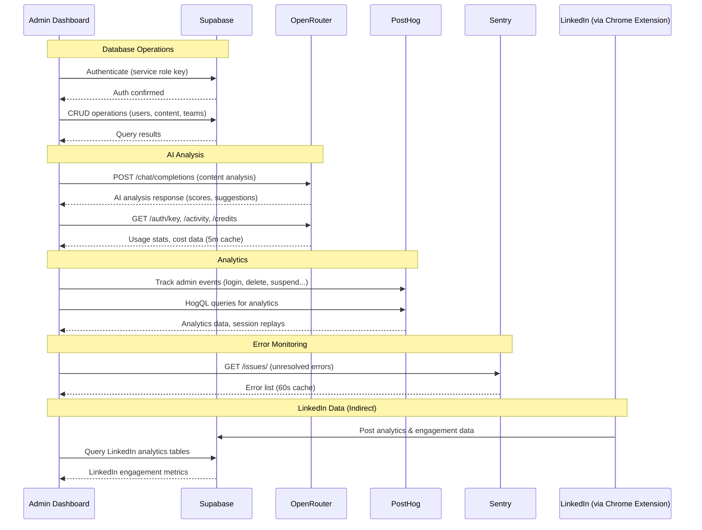

# Integrations

A detailed guide to all external service integrations in the ChainLinked Admin Dashboard.

---

## Integration Architecture



---

## Supabase (Database & Auth)

### Overview

| Property | Value |
|----------|-------|
| **Purpose** | Primary database and user authentication management |
| **Client** | `@supabase/supabase-js` v2.100.0 |
| **File** | `lib/supabase/client.ts` |
| **Connection** | Service role key (bypasses Row Level Security) |

### Configuration

```typescript
// lib/supabase/client.ts
const supabaseAdmin = createClient(
  process.env.NEXT_PUBLIC_SUPABASE_URL,
  process.env.SUPABASE_SERVICE_ROLE_KEY,
  {
    auth: {
      persistSession: false,
      autoRefreshToken: false,
    },
  }
)
```

### Environment Variables

| Variable | Required | Description |
|----------|----------|-------------|
| `NEXT_PUBLIC_SUPABASE_URL` | Yes | Supabase project URL (e.g., `https://xxx.supabase.co`) |
| `SUPABASE_SERVICE_ROLE_KEY` | Yes | Service role key with full admin access |

### Operations

| Operation | Usage |
|-----------|-------|
| **SELECT** | Dashboard metrics, user lists, content listings, analytics queries |
| **INSERT** | Admin user creation (seed script), sidebar section creation |
| **UPDATE** | System prompt toggles, sidebar section updates, last_login timestamps |
| **DELETE** | Content deletion (posts, templates, scheduled posts), sidebar sections |
| **Auth Admin** | `supabaseAdmin.auth.admin.deleteUser()` for permanent user removal |
| **Auth Admin** | `supabaseAdmin.auth.admin.updateUserById()` for suspend/unsuspend |

### Tables Accessed (23 total)

**Core:** `admin_users`, `profiles`, `linkedin_tokens`, `companies`
**Content:** `generated_posts`, `scheduled_posts`, `my_posts`, `templates`
**AI:** `prompt_usage_logs`, `compose_conversations`, `system_prompts`, `generated_suggestions`, `swipe_wishlist`
**Teams:** `teams`, `team_members`
**Jobs:** `company_context`, `research_sessions`, `suggestion_generation_runs`
**Analytics:** `post_analytics`, `post_analytics_accumulative`, `profile_analytics_accumulative`
**System:** `sidebar_sections`

---

## OpenRouter (AI Model Routing)

### Overview

| Property | Value |
|----------|-------|
| **Purpose** | AI-powered content quality analysis and usage tracking |
| **Model** | OpenAI GPT-4.1 (via OpenRouter) |
| **File** | `lib/openrouter.ts` |
| **Base URL** | `https://openrouter.ai/api/v1/` |

### Environment Variables

| Variable | Required | Description |
|----------|----------|-------------|
| `OPENROUTER_API_KEY` | No | OpenRouter API key (`sk-or-v1-...`) |

### Endpoints Used

#### POST `/api/v1/chat/completions` - Content Analysis
- **Purpose:** Analyze LinkedIn post quality using GPT-4.1
- **Model:** `openai/gpt-4.1`
- **Temperature:** 0.3 (deterministic/consistent results)
- **Max Tokens:** 500
- **Custom Headers:**
  - `HTTP-Referer: https://chainlinked.ai`
  - `X-Title: ChainLinked Admin`
- **System Prompt:** Custom LinkedIn content analyst persona
- **Response Format:**
  ```json
  {
    "engagementScore": 8,
    "readabilityScore": 7,
    "strengths": ["Strong hook", "Clear CTA"],
    "suggestions": ["Add more data points"],
    "summary": "Well-structured professional post"
  }
  ```

#### GET `/api/v1/auth/key` - Account Usage Info
- **Purpose:** Fetch API key usage statistics
- **Returns:** `usage`, `usage_daily`, `usage_weekly`, `usage_monthly`, `limit`, `is_free_tier`, `rate_limit`
- **Cache:** 5-minute revalidation

#### GET `/api/v1/activity` - Usage Breakdown
- **Purpose:** Get daily activity metrics by model and provider
- **Returns:** Array of `{ date, model, usage, requests, prompt_tokens, completion_tokens }`
- **Cache:** 5-minute revalidation

#### GET `/api/v1/credits` - Credit Balance
- **Purpose:** Check available credits
- **Returns:** `{ total_credits, total_usage }`
- **Cache:** 5-minute revalidation

### Data Flow



---

## PostHog (Product Analytics)

### Overview

| Property | Value |
|----------|-------|
| **Purpose** | User behavior analytics, session replays, event tracking |
| **Client Library** | `posthog-js` v1.363.2 |
| **Server Queries** | HogQL via REST API |
| **Files** | `lib/posthog.ts`, `lib/analytics.ts`, `components/posthog-provider.tsx` |

### Environment Variables

| Variable | Required | Description |
|----------|----------|-------------|
| `NEXT_PUBLIC_POSTHOG_KEY` | No | PostHog frontend project key (`phc_...`) |
| `NEXT_PUBLIC_POSTHOG_HOST` | No | PostHog API host (default: `https://us.i.posthog.com`) |
| `POSTHOG_API_KEY` | No | Server-side API key for HogQL queries |
| `POSTHOG_PROJECT_ID` | No | PostHog project identifier |

### Client-Side Integration



**Configuration:**
- Autocapture enabled (automatic click/form tracking)
- Session recording disabled (managed server-side)
- Custom pageview tracking with `admin_section` property
- Initialized in `PostHogProvider` component (wraps entire app)

### Server-Side Integration

**HogQL Queries** (`lib/posthog.ts`):
- Execute arbitrary HogQL (PostHog Query Language) queries
- Endpoint: `POST /api/projects/{projectId}/query/`
- Used for advanced analytics queries on the analytics dashboards

**Session Recordings** (`app/api/admin/posthog/recordings/route.ts`):
- Fetch session replay list with metadata
- Endpoint: `GET /api/projects/{projectId}/session_recordings`
- Returns: Recording ID, user, duration, click/keypress counts, errors, URLs

### Events Tracked

| Event | Trigger | Properties |
|-------|---------|------------|
| `admin_login` | Successful login | `admin_id`, `username` |
| `admin_logout` | Logout action | `admin_id` |
| `admin_user_delete` | User deleted | `admin_id`, `target_user_id` |
| `admin_user_suspend` | User suspended | `admin_id`, `target_user_id` |
| `admin_user_unsuspend` | User unsuspended | `admin_id`, `target_user_id` |
| `admin_content_delete` | Content removed | `admin_id`, `content_id`, `table` |
| `admin_flag_toggle` | Section toggled | `admin_id`, `section_key` |
| `admin_flag_create` | Section created | `admin_id`, `section_key` |
| `admin_flag_delete` | Section deleted | `admin_id`, `section_key` |
| `admin_prompt_update` | Prompt modified | `admin_id`, `prompt_id` |

### Dashboard Integration
- **Embedded Dashboard**: Full PostHog dashboard in iframe at `/dashboard/analytics/posthog`
- **Session Replay Viewer**: List recordings with click/keypress/error counts
- **Heatmap Tab**: Visual heatmap data from PostHog

---

## Sentry (Error Tracking)

### Overview

| Property | Value |
|----------|-------|
| **Purpose** | Monitor and display platform errors |
| **File** | `app/api/admin/sentry/issues/route.ts` |
| **API** | `https://sentry.io/api/0/` |
| **Dashboard Page** | `/dashboard/system/errors` |

### Environment Variables

| Variable | Required | Description |
|----------|----------|-------------|
| `SENTRY_API_TOKEN` | No | Sentry API bearer token |
| `SENTRY_ORG` | No | Sentry organization slug |
| `SENTRY_PROJECT` | No | Sentry project slug |

### API Usage

**Endpoint:** `GET /projects/{org}/{project}/issues/`

| Parameter | Default | Description |
|-----------|---------|-------------|
| `query` | `is:unresolved` | Sentry search query |
| `sort` | `date` | Sort order |
| `limit` | `25` | Results per page |
| `cursor` | - | Pagination cursor |

**Response includes:**
- Issue title and error message
- Event count (how many times it occurred)
- Affected user count
- Severity level (error, fatal, warning)
- First seen / last seen timestamps
- Issue status
- Direct link to Sentry dashboard

**Cache:** 60-second revalidation (stale-while-revalidate)

### Error Viewer Features
- Live error feed from Sentry
- Severity badges with color coding
- Affected user counts
- Timestamp display (first/last seen)
- Manual refresh button
- Cursor-based pagination
- Direct links to Sentry for deep investigation

---

## LinkedIn (Indirect Integration)

### Overview

| Property | Value |
|----------|-------|
| **Purpose** | Display LinkedIn engagement data for platform users |
| **Integration Type** | Indirect (via shared database) |
| **Dashboard Page** | `/dashboard/analytics/linkedin` |

### How It Works

The ChainLinked Chrome extension (separate repository) handles direct LinkedIn API interaction:
1. Users authenticate with LinkedIn OAuth via the Chrome extension
2. Extension stores tokens in `linkedin_tokens` table
3. Extension publishes posts and captures analytics
4. Analytics data stored in `post_analytics` and `post_analytics_accumulative` tables
5. Admin dashboard reads this data from Supabase for reporting

### Data Available in Admin

| Table | Metrics |
|-------|---------|
| `post_analytics` | Impressions, reactions, comments, reposts, saves, sends, engagement rate, followers gained |
| `post_analytics_accumulative` | Lifetime totals for all post metrics |
| `profile_analytics_accumulative` | Followers, profile views, search appearances, connections |

### No Direct API Calls
The admin dashboard does **not** make direct calls to LinkedIn APIs. All LinkedIn data flows through:
```
LinkedIn API → Chrome Extension → Supabase DB → Admin Dashboard
```

---

## Integration Data Flow



---

## Integration Health Monitoring

The admin dashboard provides health indicators on the Settings page (`/dashboard/settings`):

| Service | Status Check |
|---------|-------------|
| **Supabase** | Environment variables present |
| **PostHog Dashboard** | `NEXT_PUBLIC_POSTHOG_KEY` configured |
| **PostHog API** | `POSTHOG_API_KEY` configured |
| **OpenRouter** | `OPENROUTER_API_KEY` configured |

Status is displayed as green (configured) or red (missing) indicators, helping admins verify which integrations are active.
