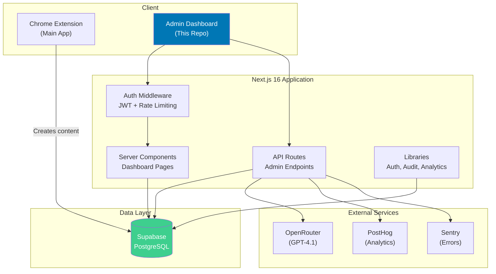

# ChainLinked Admin Dashboard - Documentation

Comprehensive documentation for the ChainLinked Admin Dashboard — a content management and analytics platform for AI-powered LinkedIn content.

---

## Documentation Index

### Core Architecture & Setup

| Document | Description |
|----------|-------------|
| [ARCHITECTURE.md](./ARCHITECTURE.md) | System architecture, tech stack, project structure, request flow |
| [environment-setup.md](./environment-setup.md) | Step-by-step local development setup guide |
| [deployment.md](./deployment.md) | Deployment guide (Vercel, Docker, self-hosted) |
| [SECURITY.md](./SECURITY.md) | Security architecture, OWASP mitigations, production checklist |

### Database & API

| Document | Description |
|----------|-------------|
| [DATABASE.md](./DATABASE.md) | Database overview, table relationships, ER diagrams |
| [database-schema.md](./database-schema.md) | Detailed schema reference with columns, types, and query examples |
| [API.md](./API.md) | API architecture overview, auth, error handling |
| [api-reference.md](./api-reference.md) | Detailed endpoint reference with request/response examples |

### Features & Guides

| Document | Description |
|----------|-------------|
| [FEATURES.md](./FEATURES.md) | Complete feature documentation for all dashboard sections |
| [ADMIN-GUIDE.md](./ADMIN-GUIDE.md) | Operational guide for administrators using the dashboard |
| [onboarding-flow.md](./onboarding-flow.md) | User onboarding funnel stages, metrics, and monitoring |
| [ai-features.md](./ai-features.md) | AI capabilities, content analysis, quality scoring |

### Technical Reference

| Document | Description |
|----------|-------------|
| [components.md](./components.md) | React component library and hierarchy |
| [STYLING.md](./STYLING.md) | Design system, color palette, theming, CSS patterns |
| [state-management.md](./state-management.md) | Data fetching patterns, context providers, hooks |
| [authentication-flow.md](./authentication-flow.md) | JWT auth system, middleware, rate limiting |

### Integrations & Platform

| Document | Description |
|----------|-------------|
| [INTEGRATIONS.md](./INTEGRATIONS.md) | External services (Supabase, OpenRouter, PostHog, Sentry) |
| [chrome-extension.md](./chrome-extension.md) | Chrome extension integration and shared data |

### Developer Resources

| Document | Description |
|----------|-------------|
| [CONTRIBUTING.md](./CONTRIBUTING.md) | Code conventions, patterns, git workflow, review checklist |
| [TROUBLESHOOTING.md](./TROUBLESHOOTING.md) | Common issues, diagnostic flowchart, error reference |

---

## Quick Navigation

### For New Developers
1. [environment-setup.md](./environment-setup.md) - Get the project running locally
2. [ARCHITECTURE.md](./ARCHITECTURE.md) - Understand the system design
3. [CONTRIBUTING.md](./CONTRIBUTING.md) - Learn the code conventions
4. [state-management.md](./state-management.md) - Understand data fetching patterns
5. [TROUBLESHOOTING.md](./TROUBLESHOOTING.md) - When things go wrong

### For Administrators
1. [ADMIN-GUIDE.md](./ADMIN-GUIDE.md) - How to use the dashboard
2. [FEATURES.md](./FEATURES.md) - What the dashboard can do
3. [onboarding-flow.md](./onboarding-flow.md) - Understanding user funnels

### For Frontend Developers
1. [components.md](./components.md) - Component library reference
2. [STYLING.md](./STYLING.md) - Design system and theming
3. [FEATURES.md](./FEATURES.md) - Feature specifications

### For Backend / API Developers
1. [api-reference.md](./api-reference.md) - Endpoint documentation
2. [database-schema.md](./database-schema.md) - Schema reference
3. [authentication-flow.md](./authentication-flow.md) - Auth system details
4. [SECURITY.md](./SECURITY.md) - Security patterns

### For DevOps / Infrastructure
1. [deployment.md](./deployment.md) - Deployment guides
2. [environment-setup.md](./environment-setup.md) - Environment configuration
3. [INTEGRATIONS.md](./INTEGRATIONS.md) - External service dependencies
4. [SECURITY.md](./SECURITY.md) - Production security checklist

---

## System Overview

---

## Documentation Stats

| Metric | Count |
|--------|-------|
| **Total Documents** | 20 |
| **Total Lines** | ~8,400+ |
| **Mermaid Diagrams** | 40+ |
| **Categories** | 5 (Architecture, Database/API, Features, Technical, Developer) |
