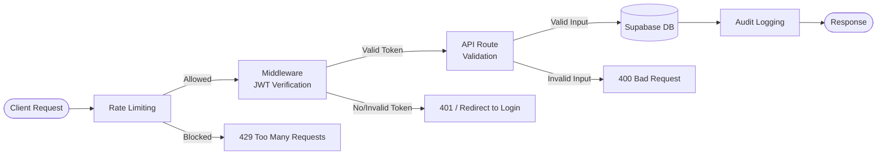
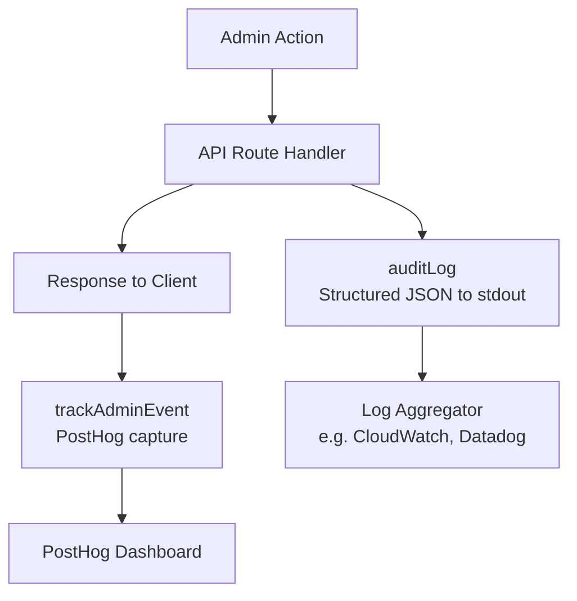

# Security Guide

## Security Architecture Overview

All requests to protected resources pass through multiple security layers before reaching the database.



**Layer summary:**

| Layer | Scope | Implementation |
|---|---|---|
| Rate Limiting | `/api/auth/login` | `lib/rate-limit.ts` -- in-memory sliding window |
| Middleware (JWT) | `/dashboard/*` routes | `middleware.ts` -- redirects unauthenticated users |
| API Route Validation | `/api/admin/*` routes | Each route handler verifies JWT from cookie |
| Audit Logging | All mutating admin actions | `lib/audit.ts` (JSON to stdout) + `lib/analytics.ts` (PostHog) |

---

## Authentication Security

### JWT Implementation

- **Library:** `jose` (lightweight, Edge-compatible)
- **Algorithm:** HS256 (HMAC-SHA256 symmetric signing)
- **Secret:** Derived from `ADMIN_JWT_SECRET` environment variable
- **Token lifetime:** 24 hours (`setExpirationTime("24h")`)
- **Payload:** `{ sub: adminId, username: adminUsername }`

### Password Hashing

- **Library:** `bcryptjs`
- **Cost factor:** 12 rounds (`bcrypt.hash(password, 12)`)
- **Verification:** Constant-time comparison via `bcrypt.compare()`

### Cookie Configuration

All session cookies are set with the following attributes:

| Attribute | Value | Purpose |
|---|---|---|
| `httpOnly` | `true` | Prevents JavaScript access (XSS mitigation) |
| `secure` | `true` in production | Requires HTTPS transport |
| `sameSite` | `strict` | Prevents cross-site request attachment (CSRF mitigation) |
| `path` | `/` | Available across the entire application |
| `maxAge` | `86400` (24h) | Matches JWT expiry; set to `0` on logout |

### Dev Bypass Mode

When `ADMIN_JWT_SECRET` is not set, two things happen:

1. The middleware skips JWT verification for `/dashboard/*` routes, allowing unauthenticated access.
2. The JWT is signed with a hardcoded fallback string (`"dev-bypass-secret"`).

This must never be used in production. See the [Production Checklist](#security-checklist-for-production).

---

## Authorization

### Route Protection

| Route Pattern | Protection Mechanism | Location |
|---|---|---|
| `/dashboard/*` | Middleware intercepts and verifies JWT cookie; redirects to `/login` on failure | `middleware.ts` |
| `/api/admin/*` | Each handler calls `authenticate()` which extracts the cookie and verifies the JWT | Individual route files |
| `/api/auth/login` | Public (protected by rate limiting) | `app/api/auth/login/route.ts` |
| `/api/auth/logout` | Public (clears cookie) | `app/api/auth/logout/route.ts` |

### Supabase Access

The admin panel uses `supabaseAdmin` (initialized with the service role key), which bypasses Row Level Security (RLS). This is intentional -- the admin panel needs unrestricted database access. The service role key is never exposed to the client.

---

## Rate Limiting

**Scope:** Login endpoint (`POST /api/auth/login`)

| Parameter | Value |
|---|---|
| Max attempts | 5 |
| Window | 15 minutes |
| Key | Client IP (`x-forwarded-for` header) |
| Storage | In-memory `Map` |

**Behavior:**

1. Each login attempt increments the counter for the requesting IP.
2. After 5 failed attempts within 15 minutes, subsequent requests receive a `429` response.
3. The response includes a `Retry-After` header with the number of seconds until the window resets.
4. The window resets automatically after 15 minutes from the first attempt.

**Implementation:** `lib/rate-limit.ts`

---

## Input Validation

### Table Name Whitelist (Content Deletion)

The content deletion endpoint (`DELETE /api/admin/content/[id]`) only allows operations on a hardcoded whitelist of tables:

```typescript
const ALLOWED_TABLES = ["generated_posts", "scheduled_posts", "templates"]
```

Any request with a `table` parameter not in this list receives a `400` response. This prevents SQL injection via dynamic table names.

### Field Validation Patterns

| Endpoint | Validation |
|---|---|
| `POST /api/auth/login` | `username` and `password` required |
| `PATCH /api/admin/users/[id]` | `action` must be `"suspend"` or `"unsuspend"` |
| `POST /api/admin/sidebar-sections` | `key` (string) and `label` (string) required |
| `PUT /api/admin/sidebar-sections/[id]` | Only accepts `enabled` (boolean), `sort_order` (number), `label` (string), `description` (string); rejects empty updates |
| `POST /api/admin/content/analyze` | `content` field required |

### Type-Safe Updates

The sidebar section PUT handler builds an update object by checking each field's type individually. Only fields with the correct type are included, preventing type confusion attacks:

```typescript
if (typeof body.enabled === "boolean") updates.enabled = body.enabled
if (typeof body.sort_order === "number") updates.sort_order = body.sort_order
```

---

## OWASP Top 10 Mitigations

### A01: Broken Access Control

- All `/dashboard/*` routes are protected by middleware JWT verification.
- All `/api/admin/*` routes independently verify the JWT in each handler.
- Table name whitelist prevents unauthorized table access on content deletion.
- Action whitelist (`suspend`/`unsuspend`) restricts user management operations.

### A02: Cryptographic Failures

- Passwords are hashed with bcrypt (12 rounds) before storage.
- JWTs are signed with HS256 using a server-side secret.
- Session cookies are `httpOnly` and `secure`, preventing client-side access.
- No sensitive data (passwords, tokens, API keys) is included in API responses.

### A03: Injection

- All database queries use the Supabase client library, which generates parameterized queries.
- Table names are validated against a hardcoded whitelist (not interpolated from user input).
- No raw SQL is executed anywhere in the codebase.

### A04: Insecure Design

- Destructive actions (user deletion, content deletion) require explicit confirmation via the `ConfirmationDialog` component, which forces users to type the exact confirmation text.
- Admin actions are audit-logged for accountability.

### A05: Security Misconfiguration

- Dev bypass mode is clearly gated behind the absence of `ADMIN_JWT_SECRET`.
- External API keys (`OPENROUTER_API_KEY`, `POSTHOG_API_KEY`, `SENTRY_API_TOKEN`) are server-only.
- No secrets are prefixed with `NEXT_PUBLIC_`.

### A06: Vulnerable and Outdated Components

- Dependencies should be regularly audited with `npm audit`.

### A07: Identification and Authentication Failures

- Rate limiting on login (5 attempts / 15 minutes per IP).
- bcrypt password hashing with cost factor 12.
- Generic error messages on failed login ("Invalid credentials") -- does not reveal whether the username or password was wrong.
- JWT tokens expire after 24 hours.

### A08: Software and Data Integrity Failures

- JWTs are cryptographically signed and verified on every request.
- Invalid or expired tokens are rejected and the cookie is cleared.

### A09: Security Logging and Monitoring Failures

- All admin actions are logged via `auditLog()` with structured JSON output.
- Client-side analytics tracked via PostHog (`trackAdminEvent()`).
- Sentry integration available for error tracking.

### A10: Server-Side Request Forgery (SSRF)

- The only outbound HTTP call is to `https://openrouter.ai/api/v1/chat/completions`, a hardcoded URL. No user-supplied URLs are fetched server-side.

---

## Audit Trail

### Server-Side Audit Log (`lib/audit.ts`)

All mutating admin actions emit a structured JSON log entry to stdout via `console.log()`.

**Format:**

```json
{
  "type": "admin_audit",
  "action": "user.delete",
  "timestamp": "2026-03-31T12:00:00.000Z",
  "adminId": "uuid",
  "targetUserId": "uuid"
}
```

**Tracked actions:**

| Action | Trigger |
|---|---|
| `login` | Successful admin login |
| `logout` | Admin logout |
| `user.delete` | User account deletion |
| `user.suspend` | User account suspension |
| `user.unsuspend` | User account reactivation |
| `content.delete` | Content record deletion |
| `prompt.update` | Prompt configuration change |
| `flag.create` | Feature flag creation |
| `flag.update` | Feature flag update |
| `flag.delete` | Feature flag deletion |
| `sidebar_section.create` | Sidebar section creation |
| `sidebar_section.update` | Sidebar section update |
| `sidebar_section.delete` | Sidebar section deletion |
| `password.change` | Admin password change |

### Client-Side Analytics (`lib/analytics.ts`)

Admin events are also sent to PostHog for analytics dashboards. The tracker silently fails if PostHog is not loaded, ensuring analytics never break application functionality.



---

## Destructive Action Protection

The `ConfirmationDialog` component (`components/confirmation-dialog.tsx`) guards irreversible operations:

1. A dialog appears describing the action.
2. The user must type an exact confirmation string (e.g., the username of the account being deleted).
3. The confirm button remains disabled until the input matches exactly.
4. The input is cleared when the dialog is closed or the action completes.

This is used for user deletion and other destructive operations.

---

## API Security Patterns

### Authentication Pattern

Every `/api/admin/*` route uses the same authentication pattern:

```typescript
async function authenticate(request: NextRequest) {
  const token = request.cookies.get(COOKIE_NAME)?.value
  if (!token) return null
  return verifySessionToken(token)
}
```

The handler checks the return value and returns `401 Unauthorized` if `null`.

### Error Response Policy

- Error messages are generic and do not leak internal details.
- Login failures return "Invalid credentials" regardless of whether the username or password was wrong.
- Database errors return the Supabase error message (which does not contain raw SQL).
- The content analysis endpoint returns "AI analysis failed" or "Failed to reach OpenRouter" rather than upstream error details.

### External API Key Isolation

| Key | Used In | Exposure |
|---|---|---|
| `OPENROUTER_API_KEY` | `app/api/admin/content/analyze/route.ts` | Server-only |
| `POSTHOG_API_KEY` | Server-side analytics | Server-only |
| `SENTRY_API_TOKEN` | Error reporting | Server-only |
| `SUPABASE_SERVICE_ROLE_KEY` | All Supabase admin queries | Server-only |

No API keys are prefixed with `NEXT_PUBLIC_`, ensuring they are never bundled into client-side JavaScript.

---

## Environment Variable Security

| Variable | Purpose | Sensitivity | Notes |
|---|---|---|---|
| `ADMIN_JWT_SECRET` | Signs and verifies admin JWTs | Critical | Must be set in production; absence enables dev bypass |
| `SUPABASE_SERVICE_ROLE_KEY` | Full database access (bypasses RLS) | Critical | Never expose to client |
| `OPENROUTER_API_KEY` | AI content analysis | High | Server-only |
| `POSTHOG_API_KEY` | Analytics event ingestion | Medium | Server-only |
| `SENTRY_API_TOKEN` | Error reporting | Medium | Server-only |

---

## Security Checklist for Production

- [ ] `ADMIN_JWT_SECRET` is set to a strong, random value (disables dev bypass)
- [ ] Application is served over HTTPS (required for `secure` cookies)
- [ ] `SUPABASE_SERVICE_ROLE_KEY` is not exposed to client-side code
- [ ] Admin user created with a strong password
- [ ] Rate limiting is active on the login endpoint
- [ ] Audit logging is enabled and logs are forwarded to a persistent store
- [ ] No `NEXT_PUBLIC_` variables contain secrets
- [ ] `npm audit` shows no critical vulnerabilities
- [ ] Error reporting (Sentry) is configured for production

---

## Known Limitations

| Limitation | Risk | Mitigation Path |
|---|---|---|
| Rate limiting is in-memory | Resets on server restart or redeployment; does not work across multiple instances | Migrate to Redis or an external store |
| No IP-based blocking beyond rate limiting | Determined attackers can retry after the window | Add IP blocklist or WAF (e.g., Cloudflare) |
| No 2FA/MFA support | Single-factor authentication only | Implement TOTP or WebAuthn |
| No password complexity requirements | Weak passwords are accepted | Add server-side validation rules |
| No session revocation | Tokens remain valid until expiry (24h) even after password change | Implement a token denylist or reduce token lifetime |
| Logout does not identify the admin | `auditLog("logout", {})` logs no admin context | Extract admin ID from token before clearing cookie |
| Dev bypass uses a static fallback secret | Tokens signed in dev could theoretically be used if the fallback string were known | Never deploy without `ADMIN_JWT_SECRET` |
