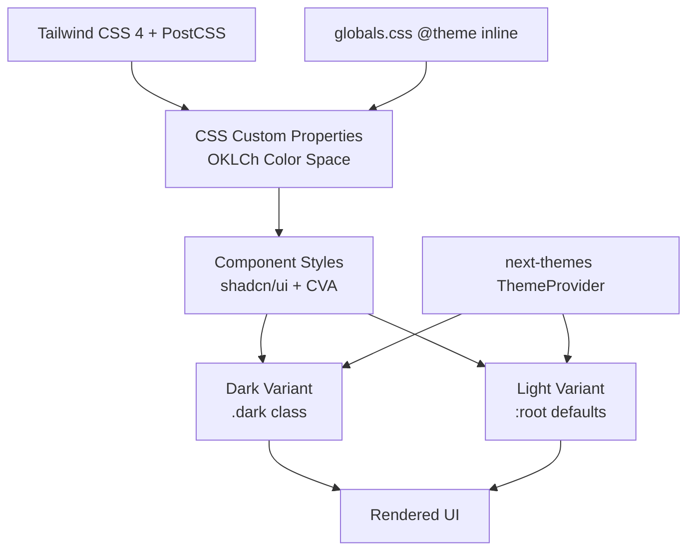

# Styling & Theming Guide

## Overview

- **Tailwind CSS 4** with PostCSS (via `@tailwindcss/postcss`)
- **shadcn/ui** component library (Radix Nova style)
- **CSS custom properties** for theming (OKLCh color space)
- **Dark/Light mode** with `next-themes` (class strategy)

## Design System Architecture



## Color System

All colors use the **OKLCh color space** (`oklch(lightness chroma hue)`) for perceptually uniform color manipulation.

### Primary Colors (LinkedIn Blue)

Hue: `230` across all shades.

| Token | Value | Usage |
|---|---|---|
| `--primary-50` | `oklch(0.97 0.02 230)` | Lightest tint, subtle backgrounds |
| `--primary-100` | `oklch(0.93 0.04 230)` | Light backgrounds |
| `--primary-200` | `oklch(0.87 0.06 230)` | Hover states, light fills |
| `--primary-300` | `oklch(0.75 0.08 230)` | Borders, lighter accents |
| `--primary-400` | `oklch(0.58 0.11 230)` | Secondary buttons, links |
| `--primary-500` | `oklch(0.47 0.13 230)` | **Default primary** (buttons, links, accents) |
| `--primary-600` | `oklch(0.40 0.12 230)` | Hover state for primary |
| `--primary-700` | `oklch(0.34 0.10 230)` | Active/pressed states |
| `--primary-800` | `oklch(0.28 0.08 230)` | Dark text on light backgrounds |
| `--primary-900` | `oklch(0.22 0.06 230)` | Darkest shade |

### Secondary Colors (Terracotta)

Hue: `45` across all shades.

| Token | Value | Usage |
|---|---|---|
| `--secondary-50` | `oklch(0.98 0.015 45)` | Lightest tint |
| `--secondary-100` | `oklch(0.95 0.03 45)` | Light backgrounds |
| `--secondary-200` | `oklch(0.90 0.06 45)` | Hover states |
| `--secondary-300` | `oklch(0.80 0.09 45)` | Borders, accents |
| `--secondary-400` | `oklch(0.72 0.11 45)` | Medium emphasis |
| `--secondary-500` | `oklch(0.65 0.12 45)` | **Default secondary** (highlights, warnings) |
| `--secondary-600` | `oklch(0.55 0.11 45)` | Hover state |
| `--secondary-700` | `oklch(0.45 0.10 45)` | Active/pressed |
| `--secondary-800` | `oklch(0.35 0.08 45)` | Dark accents |
| `--secondary-900` | `oklch(0.25 0.06 45)` | Darkest shade |

### Semantic Colors

#### Neutral / Surface Colors

| Token | Light Mode | Dark Mode | Purpose |
|---|---|---|---|
| `--background` | `oklch(0.965 0.008 90)` | `oklch(0.14 0.01 70)` | Page background |
| `--foreground` | `oklch(0.15 0.01 90)` | `oklch(0.93 0.008 70)` | Default text |
| `--card` | `oklch(0.995 0.002 90)` | `oklch(0.17 0.01 70)` | Card background |
| `--card-foreground` | `oklch(0.15 0.01 90)` | `oklch(0.91 0.008 70)` | Card text |
| `--popover` | `oklch(0.995 0.002 90)` | `oklch(0.17 0.01 70)` | Popover background |
| `--popover-foreground` | `oklch(0.15 0.01 90)` | `oklch(0.91 0.008 70)` | Popover text |
| `--muted` | `oklch(0.94 0.008 90)` | `oklch(0.21 0.01 70)` | Muted backgrounds |
| `--muted-foreground` | `oklch(0.45 0.01 90)` | `oklch(0.60 0.01 70)` | Secondary text |

#### Interactive Colors

| Token | Light Mode | Dark Mode | Purpose |
|---|---|---|---|
| `--primary` | `oklch(0.47 0.13 230)` | `oklch(0.62 0.15 230)` | Primary actions |
| `--primary-foreground` | `oklch(0.98 0.005 230)` | `oklch(0.14 0.015 70)` | Text on primary |
| `--secondary` | `oklch(0.65 0.12 45)` | `oklch(0.72 0.11 45)` | Secondary actions |
| `--secondary-foreground` | `oklch(0.98 0.01 45)` | `oklch(0.14 0.015 70)` | Text on secondary |
| `--accent` | `oklch(0.91 0.03 230)` | `oklch(0.24 0.025 230)` | Accent backgrounds |
| `--accent-foreground` | `oklch(0.20 0.04 230)` | `oklch(0.85 0.06 230)` | Text on accent |

#### Status Colors

| Token | Light Mode | Dark Mode | Purpose |
|---|---|---|---|
| `--success` | `oklch(0.45 0.1 145)` | `oklch(0.65 0.12 145)` | Success states |
| `--success-foreground` | `oklch(0.98 0.01 145)` | `oklch(0.14 0.015 70)` | Text on success |
| `--warning` | `oklch(0.65 0.15 85)` | `oklch(0.72 0.15 85)` | Warning states |
| `--warning-foreground` | `oklch(0.20 0.05 85)` | `oklch(0.14 0.015 70)` | Text on warning |
| `--destructive` | `oklch(0.55 0.18 25)` | `oklch(0.65 0.18 25)` | Error/destructive |
| `--destructive-foreground` | `oklch(0.98 0.01 25)` | `oklch(0.14 0.015 70)` | Text on destructive |

#### UI Chrome

| Token | Light Mode | Dark Mode | Purpose |
|---|---|---|---|
| `--border` | `oklch(0.87 0.012 90)` | `oklch(0.28 0.015 70)` | Borders |
| `--input` | `oklch(0.87 0.012 90)` | `oklch(0.28 0.015 70)` | Input borders |
| `--ring` | `oklch(0.47 0.13 230)` | `oklch(0.62 0.15 230)` | Focus rings |

### Chart Colors

| Token | Light Mode | Dark Mode | Description |
|---|---|---|---|
| `--chart-1` | `oklch(0.47 0.13 230)` | `oklch(0.62 0.15 230)` | LinkedIn Blue |
| `--chart-2` | `oklch(0.65 0.12 45)` | `oklch(0.72 0.14 45)` | Terracotta |
| `--chart-3` | `oklch(0.60 0.18 250)` | `oklch(0.68 0.18 250)` | Blue |
| `--chart-4` | `oklch(0.65 0.18 165)` | `oklch(0.70 0.18 165)` | Emerald |
| `--chart-5` | `oklch(0.70 0.18 70)` | `oklch(0.75 0.18 70)` | Amber |

### Dark Mode

Dark mode is activated by adding the `dark` class to `<html>`. The color transformations follow these patterns:

1. **Lightness inversion**: Light backgrounds become dark (`0.965 -> 0.14`), dark text becomes light (`0.15 -> 0.93`).
2. **Hue shift for warmth**: Light mode uses hue `90` (warm gray) for neutrals; dark mode shifts to hue `70` (warm amber-brown) for a warmer dark palette.
3. **Increased chroma on accents**: Primary bumps from `0.47` to `0.62` lightness and `0.13` to `0.15` chroma to remain vibrant against dark backgrounds.
4. **Shadow intensity increase**: Dark mode shadows use higher opacity (e.g., `0.3` to `0.5`) with darker base colors to maintain depth perception.

## Theme System

### ThemeProvider Configuration

The `ThemeProvider` wraps the app at the root layout level:

```tsx
// components/theme-provider.tsx
import { ThemeProvider as NextThemesProvider } from "next-themes"

export function ThemeProvider({ children }: { children: React.ReactNode }) {
  return (
    <NextThemesProvider
      attribute="class"       // Adds "dark" class to <html>
      defaultTheme="system"   // Respects OS preference on first visit
      enableSystem             // Watches prefers-color-scheme
      storageKey="theme"       // Persists to localStorage under "theme"
    >
      {children}
    </NextThemesProvider>
  )
}
```

Key points:
- **Class strategy** (`attribute="class"`): Tailwind's `dark:` variant and the `@custom-variant dark (&:is(.dark *))` directive both rely on the `.dark` class.
- **System preference detection** (`enableSystem`): Automatically matches OS dark/light setting.
- **localStorage persistence** (`storageKey="theme"`): User choice survives page reloads.

### Theme Toggle Animation

The toggle uses the **View Transition API** for a circular reveal animation:

```tsx
// components/theme-toggle.tsx (simplified)
const toggleTheme = useCallback(async () => {
  if (!("startViewTransition" in document)) {
    // Fallback: instant toggle
    document.documentElement.classList.toggle("dark")
    return
  }

  // Start view transition, then animate a clip-path circle from the button
  await document.startViewTransition(() => {
    flushSync(() => {
      document.documentElement.classList.toggle("dark")
    })
  }).ready

  // Calculate circle radius from button center to farthest screen corner
  const { top, left, width, height } = buttonRef.current.getBoundingClientRect()
  const x = left + width / 2
  const y = top + height / 2
  const maxRadius = Math.hypot(
    Math.max(left, window.innerWidth - left),
    Math.max(top, window.innerHeight - top)
  )

  document.documentElement.animate(
    { clipPath: [`circle(0px at ${x}px ${y}px)`, `circle(${maxRadius}px at ${x}px ${y}px)`] },
    { duration: 500, easing: "ease-in-out", pseudoElement: "::view-transition-new(root)" }
  )
}, [isDark])
```

The corresponding CSS disables the default view transition animation:

```css
::view-transition-old(root), ::view-transition-new(root) {
    animation: none;
    mix-blend-mode: normal;
}
```

Fallback behavior: browsers without View Transition API get an instant theme swap with no animation.

## Tailwind Configuration

### PostCSS Setup

```js
// postcss.config.mjs
const config = {
  plugins: {
    "@tailwindcss/postcss": {},
  },
};
export default config;
```

Tailwind CSS 4 is loaded via PostCSS. The CSS entry point imports:

```css
@import "tailwindcss";
@import "tw-animate-css";
@import "shadcn/tailwind.css";

@custom-variant dark (&:is(.dark *));
```

### Path Aliases

Defined in `components.json`:

| Alias | Path |
|---|---|
| `@/components` | `components/` |
| `@/components/ui` | `components/ui/` |
| `@/lib` | `lib/` |
| `@/lib/utils` | `lib/utils` |
| `@/hooks` | `hooks/` |

### Theme Inline Block

The `@theme inline` block maps CSS custom properties to Tailwind color utilities. This lets you write `bg-primary`, `text-muted-foreground`, etc. in Tailwind classes:

```css
@theme inline {
  --color-background: var(--background);
  --color-foreground: var(--foreground);
  --color-primary: var(--primary);
  --color-primary-foreground: var(--primary-foreground);
  /* ... all semantic tokens mapped here */
}
```

### Custom Radius Scale

```css
--radius: 0.75rem;             /* Base */
--radius-sm: calc(var(--radius) - 4px);
--radius-md: calc(var(--radius) - 2px);
--radius-lg: var(--radius);    /* 0.75rem */
--radius-xl: calc(var(--radius) + 4px);
--radius-2xl: calc(var(--radius) + 8px);
--radius-3xl: calc(var(--radius) + 12px);
--radius-4xl: calc(var(--radius) + 16px);
```

## Component Styling Patterns

### Button Variants (from CVA)

Buttons use `class-variance-authority` for variant management.

**Variants:**

| Variant | Styling |
|---|---|
| `default` | Solid primary background, white text |
| `outline` | Border + background, hover fills muted |
| `secondary` | Solid secondary background |
| `ghost` | Transparent, hover fills muted |
| `destructive` | Translucent destructive background (10-20% opacity) |
| `link` | Text-only with underline on hover |

**Sizes:**

| Size | Dimensions |
|---|---|
| `default` | `h-8`, `px-2.5` |
| `xs` | `h-6`, `px-2`, `text-xs` |
| `sm` | `h-7`, `px-2.5`, `text-[0.8rem]` |
| `lg` | `h-9`, `px-2.5` |
| `icon` | `size-8` (square) |
| `icon-xs` | `size-6` (square) |
| `icon-sm` | `size-7` (square) |
| `icon-lg` | `size-9` (square) |

**Usage example:**

```tsx
import { Button } from "@/components/ui/button"

<Button variant="default" size="default">Save</Button>
<Button variant="ghost" size="icon"><Moon className="size-4" /></Button>
<Button variant="destructive" size="sm">Delete</Button>
```

### Card System

Cards use `data-slot` attributes and **container queries** (`@container`) for responsive internal layout.

```tsx
// Size variants via data attribute
<Card size="sm">   {/* Tighter padding: py-3, px-3, gap-3 */}
<Card size="default">  {/* Standard padding: py-4, px-4, gap-4 */}
```

Key features:
- `ring-1 ring-foreground/10` for subtle border
- `group/card` for nested hover state targeting
- `has-data-[slot=card-footer]:pb-0` to remove bottom padding when footer present
- Container query support: `@container/card` allows children to respond to card width

### Metric Card Accents

The `MetricCard` component supports 5 color accent themes:

```tsx
const accentStyles: Record<AccentColor, { card: string; icon: string; iconColor: string }> = {
  primary: {
    card: "hover:border-primary/30 bg-gradient-to-br from-card via-card to-primary/5",
    icon: "bg-gradient-to-br from-primary/15 to-primary/5 ring-1 ring-primary/10",
    iconColor: "text-primary",
  },
  blue: {
    card: "hover:border-blue-500/30 bg-gradient-to-br from-card via-card to-blue-500/5",
    icon: "bg-gradient-to-br from-blue-500/15 to-blue-500/5 ring-1 ring-blue-500/10",
    iconColor: "text-blue-500",
  },
  emerald: { /* ... gradient to emerald-500/5 */ },
  amber:   { /* ... gradient to amber-500/5 */ },
  default: { card: "hover:border-primary/20", icon: "bg-muted", iconColor: "text-muted-foreground" },
}
```

Each accent provides:
- **Card**: Subtle gradient background from card base to tinted corner
- **Icon container**: Gradient background with ring border
- **Icon color**: Matching text color

Trend indicators use semantic colors:
- Positive: `border-emerald-500/30 bg-emerald-500/10 text-emerald-600`
- Negative: `border-destructive/30 bg-destructive/10 text-destructive`

**Container query usage** in MetricCard:

```tsx
<CardTitle className="text-2xl @[250px]/card:text-3xl">
```

The title scales up to `3xl` when the card container is at least 250px wide.

## CSS Patterns Used

### Container Queries

Cards declare `@container/card` and children use `@[250px]/card:` breakpoints for width-responsive styles.

### OKLCh Color Space

All colors use `oklch(lightness chroma hue)` for perceptually uniform adjustments. This means increasing lightness by `0.1` produces a visually consistent brightness change across all hues.

### Gradient Backgrounds

```css
.bg-gradient-primary {
  background: linear-gradient(135deg, oklch(0.47 0.13 230) 0%, oklch(0.40 0.12 230) 100%);
}

.bg-gradient-secondary {
  background: linear-gradient(135deg, oklch(0.65 0.12 45) 0%, oklch(0.55 0.11 45) 100%);
}

.bg-gradient-subtle {
  background: linear-gradient(180deg, oklch(0.97 0.02 230 / 0.5) 0%, transparent 100%);
}
```

### Glassmorphism

```css
.glass {
  background: oklch(1 0 0 / 0.8);
  backdrop-filter: blur(12px);
  -webkit-backdrop-filter: blur(12px);
}

.dark .glass {
  background: oklch(0.17 0.01 70 / 0.85);
}
```

### Group Hover States

Components use named groups for scoped hover targeting:

```tsx
<Card className="group/metric ...">
  {/* This overlay only shows on card hover */}
  <div className="opacity-0 group-hover/metric:opacity-100 ..." />
</Card>
```

### Ring Focus States

Buttons use a consistent focus pattern:

```
focus-visible:border-ring focus-visible:ring-3 focus-visible:ring-ring/50
```

### Shadows

Custom shadow tokens with OKLCh colors:

```css
--shadow-xs: 0 1px 2px oklch(0.15 0.01 90 / 0.05);
--shadow-sm: 0 2px 4px oklch(0.15 0.01 90 / 0.08);
--shadow-md: 0 4px 8px oklch(0.15 0.01 90 / 0.12);
--shadow-lg: 0 8px 16px oklch(0.15 0.01 90 / 0.16);
--shadow-xl: 0 16px 32px oklch(0.15 0.01 90 / 0.20);
--shadow-primary: 0 4px 14px oklch(0.45 0.1 140 / 0.25);
--shadow-secondary: 0 4px 14px oklch(0.65 0.12 45 / 0.25);
```

### Animation Timing Tokens

```css
--ease-smooth: cubic-bezier(0.16, 1, 0.3, 1);
--ease-bounce: cubic-bezier(0.34, 1.56, 0.64, 1);
--ease-in-out: cubic-bezier(0.4, 0, 0.2, 1);

--duration-fast: 150ms;
--duration-normal: 300ms;
--duration-slow: 500ms;
--duration-entrance: 600ms;
```

### Stagger Animation

Children animate in sequence using `animation-delay`:

```css
.stagger-children > *:nth-child(1) { animation-delay: 0ms; }
.stagger-children > *:nth-child(2) { animation-delay: 50ms; }
/* ... up to 8 children at 50ms intervals */
```

### Reduced Motion

All animations and transitions are disabled for users who prefer reduced motion:

```css
@media (prefers-reduced-motion: reduce) {
  *, *::before, *::after {
    animation-duration: 0.01ms !important;
    animation-iteration-count: 1 !important;
    transition-duration: 0.01ms !important;
  }
}
```

## Typography

### Font Stack

```css
--font-sans: var(--font-geist-sans);    /* Body text */
--font-mono: var(--font-geist-mono);    /* Code */
--font-heading: var(--font-geist-sans); /* Headings */
```

Geist Sans is used for both body and heading text. Geist Mono is used for code and tabular data.

### Body Rendering

```css
body {
  font-feature-settings: "rlig" 1, "calt" 1;
  -webkit-font-smoothing: antialiased;
  -moz-osx-font-smoothing: grayscale;
}
```

### Card Title Scale

- Default card: `text-base font-medium`
- Small card (`data-[size=sm]`): `text-sm`
- MetricCard default: `text-2xl font-bold`, scales to `text-3xl` at `@[250px]` container width
- MetricCard compact: `text-xl font-bold`

## Spacing & Layout

### Grid Patterns

Common grid layouts used across dashboard pages:

```tsx
{/* 1-column on mobile, 2 on sm, 4 on lg */}
<div className="grid grid-cols-1 sm:grid-cols-2 lg:grid-cols-4 gap-4">
  <MetricCard ... />
</div>
```

### Gap Utilities

- Cards: `gap-4` (default), `gap-3` (compact/sm)
- Card header grid: `gap-1`
- Button icon gap: `gap-1.5` (default), `gap-1` (xs/sm)

### Custom Scrollbar

Styled scrollbar (8px width) with theme-aware colors:
- Light: `oklch(0.80 0.01 90)` thumb, transparent track
- Dark: `oklch(0.30 0.012 70)` thumb, transparent track
- `.scrollbar-hide` utility to completely hide scrollbars

## How to Add New Colors

1. **Define the scale** in `:root` in `app/globals.css`:

```css
:root {
  --mycolor-50: oklch(0.97 0.02 160);
  --mycolor-100: oklch(0.93 0.04 160);
  /* ... through 900 */
  --mycolor-500: oklch(0.50 0.13 160);
}
```

2. **Add dark mode overrides** in `.dark`:

```css
.dark {
  --mycolor-500: oklch(0.65 0.15 160);  /* Brighter for dark mode */
}
```

3. **If it's a semantic token**, map it in the `@theme inline` block:

```css
@theme inline {
  --color-mycolor: var(--mycolor);
  --color-mycolor-foreground: var(--mycolor-foreground);
}
```

4. **Use in Tailwind classes**: `bg-mycolor`, `text-mycolor-foreground`, `border-mycolor/50`

## How to Create a New Component

Follow the shadcn/ui Radix Nova pattern used throughout the project:

1. **Create the file** in `components/ui/`:

```tsx
// components/ui/my-component.tsx
import * as React from "react"
import { cn } from "@/lib/utils"

function MyComponent({
  className,
  ...props
}: React.ComponentProps<"div">) {
  return (
    <div
      data-slot="my-component"
      className={cn(
        // Base styles using semantic tokens
        "rounded-lg bg-card text-card-foreground ring-1 ring-foreground/10",
        // Transitions
        "transition-all duration-300",
        // Allow overrides
        className
      )}
      {...props}
    />
  )
}

export { MyComponent }
```

2. **Key conventions to follow**:
   - Use `data-slot` attributes for component identification
   - Use `cn()` from `@/lib/utils` to merge class names
   - Accept `className` prop for overrides
   - Use semantic color tokens (`bg-card`, `text-foreground`) not raw colors
   - Use `group/name` for scoped hover states
   - Use `React.ComponentProps<"element">` for prop types
   - For variants, use `class-variance-authority` (CVA)

3. **For variant-based components**, use CVA:

```tsx
import { cva, type VariantProps } from "class-variance-authority"

const myComponentVariants = cva(
  "base-classes here",
  {
    variants: {
      variant: {
        default: "bg-card",
        highlighted: "bg-primary/10 border-primary/30",
      },
      size: {
        default: "p-4",
        sm: "p-3",
      },
    },
    defaultVariants: {
      variant: "default",
      size: "default",
    },
  }
)
```

4. **Export from the file** using named exports (not default exports).
