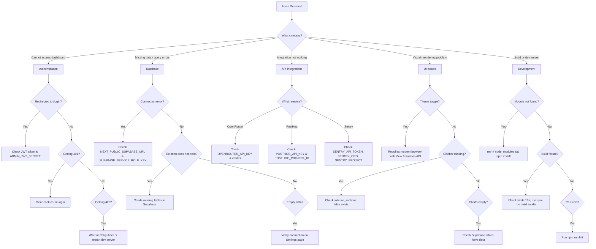

# Troubleshooting Guide

## Diagnostic Flowchart



---

## Authentication Issues

### "Redirected to /login repeatedly"

**Cause:** Invalid or expired JWT token. Tokens expire after 24 hours.

**Solution:**
1. Clear the `admin-session` cookie in your browser.
2. Log in again at `/login`.

**Check:** Is `ADMIN_JWT_SECRET` set?

```bash
echo "JWT Secret: ${ADMIN_JWT_SECRET:+SET ($(echo $ADMIN_JWT_SECRET | wc -c) chars)}"
```

If `ADMIN_JWT_SECRET` is not set, auth is bypassed entirely in dev (middleware skips token verification). If it IS set but the value changed since the token was issued, all existing sessions become invalid.

---

### "Invalid credentials" error

**Cause:** Wrong username or password, or the `admin_users` table is empty.

**Solution:** Re-seed the admin user:

```bash
npx tsx scripts/seed-admin.ts admin newpassword
```

This inserts (or updates) a row in the `admin_users` table with a bcrypt-hashed password (cost factor 12).

---

### "Too Many Requests" (429)

**Cause:** Rate limiting -- 5 login attempts per 15-minute window per IP address.

**Solution:**
- Wait for the period indicated in the `Retry-After` response header.
- Or restart the dev server (the rate limiter is in-memory, so a restart clears it):

```bash
# Kill and restart
npm run dev
```

**Note:** In production behind a load balancer, the IP is read from `x-forwarded-for`. If this header is missing, all requests appear as `"unknown"` and share one rate-limit bucket.

---

### Auth works in dev but not production

**Cause:** `ADMIN_JWT_SECRET` is not set in the production environment. Without it, the middleware falls back to `"dev-bypass-secret"`, which means tokens signed in dev won't verify in production (and vice versa).

**Solution:**

```bash
# Set in your hosting provider (e.g., Vercel)
vercel env add ADMIN_JWT_SECRET production
# Use a strong random value:
openssl rand -base64 32
```

---

### Cookie not being set

**Cause:** The `admin-session` cookie has `Secure: true` in production (`process.env.NODE_ENV === "production"`), which requires HTTPS.

**Solution:**
- Ensure your production deployment uses HTTPS.
- In local dev, cookies are set without the `Secure` flag, so `http://localhost` works fine.

**Cookie settings reference:**
| Attribute  | Value            |
|------------|------------------|
| `httpOnly` | `true`           |
| `secure`   | `true` in prod   |
| `sameSite` | `strict`         |
| `path`     | `/`              |
| `maxAge`   | `86400` (24 hrs) |

---

## Database Issues

### "Cannot connect to Supabase"

Check the following environment variables:

```bash
echo "Supabase URL: ${NEXT_PUBLIC_SUPABASE_URL:-(NOT SET)}"
echo "Supabase Key: ${SUPABASE_SERVICE_ROLE_KEY:+SET}"
```

**Common mistakes:**
- `NEXT_PUBLIC_SUPABASE_URL` must be the full URL, e.g., `https://abcdefg.supabase.co` (no trailing slash).
- `SUPABASE_SERVICE_ROLE_KEY` must be the **service role** key, not the anon key. The service role key starts with `eyJ...` and is longer.
- Verify the Supabase project is running (not paused) in the Supabase dashboard.

**Fallback values in code:** If env vars are missing, the client defaults to `http://localhost:54321` with a `"placeholder"` key, which will fail silently on most queries.

---

### "relation does not exist" error

**Cause:** Required tables have not been created in Supabase.

**Required tables:**

| Table | Used For |
|-------|----------|
| `admin_users` | Admin authentication |
| `profiles` | User profiles |
| `generated_posts` | AI-generated post content |
| `scheduled_posts` | Posts scheduled for publishing |
| `my_posts` | User-saved posts |
| `templates` | Post templates |
| `teams` | Team management |
| `team_members` | Team membership |
| `companies` | Company records |
| `company_context` | Background job: company research |
| `research_sessions` | Background job: topic research |
| `suggestion_generation_runs` | Background job: suggestion generation |
| `generated_suggestions` | AI-generated suggestions |
| `swipe_wishlist` | Swipe/wishlist feature |
| `prompt_usage_logs` | Token usage tracking |
| `system_prompts` | Configurable system prompts |
| `compose_conversations` | AI compose chat history |
| `sidebar_sections` | Admin sidebar configuration |
| `linkedin_tokens` | LinkedIn OAuth tokens |
| `post_analytics` | Post performance data |
| `post_analytics_accumulative` | Aggregated post analytics |
| `profile_analytics_accumulative` | Aggregated profile analytics |

**Solution:** Create missing tables via the Supabase SQL editor or migrations. These tables belong to the main ChainLinked application -- the admin panel reads from them.

---

### Empty dashboard / no data

1. Visit `/dashboard/settings` and check the **Environment Status** panel:
   - Green dot = env var is set.
   - Gray dot = env var is missing.
2. If Supabase shows "Connected" but data is empty, the main ChainLinked app has not populated data yet.
3. Test the connection directly:

```bash
# Quick test from the command line
curl -s "${NEXT_PUBLIC_SUPABASE_URL}/rest/v1/profiles?select=count&limit=1" \
  -H "apikey: ${SUPABASE_SERVICE_ROLE_KEY}" \
  -H "Authorization: Bearer ${SUPABASE_SERVICE_ROLE_KEY}"
```

---

## API Integration Issues

### AI Content Analysis not working

The content analysis endpoint (`/api/admin/content/analyze`) calls OpenRouter with the `openai/gpt-4.1` model.

**Checklist:**

```bash
echo "OpenRouter Key: ${OPENROUTER_API_KEY:+SET}"
```

1. **Key not set** --> Returns HTTP 500 with `"OpenRouter API key not configured"`.
2. **Key set but invalid/no credits** --> Returns HTTP 502 with `"AI analysis failed"`.
3. **API returns non-JSON** --> Returns HTTP 502 with `"Failed to parse AI response"` and includes the raw response.
4. **Network error** --> Returns HTTP 502 with `"Failed to reach OpenRouter"`.

**Verify your key has credits:**

```bash
curl -s https://openrouter.ai/api/v1/auth/key \
  -H "Authorization: Bearer ${OPENROUTER_API_KEY}" | python3 -m json.tool
```

---

### PostHog pages empty

The PostHog integration requires **2 environment variables**:

```bash
echo "PostHog API Key: ${POSTHOG_API_KEY:+SET}"
echo "PostHog Project ID: ${POSTHOG_PROJECT_ID:+SET}"
```

**Checklist:**
- Both `POSTHOG_API_KEY` and `POSTHOG_PROJECT_ID` must be set.
- The host is hardcoded to `https://us.posthog.com`. If your project is on the EU instance, this needs a code change.
- The API key needs read access to session recordings and query endpoints.
- The project ID is the numeric ID (visible in your PostHog project URL), not the project name.

**Test the connection:**

```bash
curl -s "https://us.posthog.com/api/projects/${POSTHOG_PROJECT_ID}/session_recordings?limit=1" \
  -H "Authorization: Bearer ${POSTHOG_API_KEY}"
```

**Note:** The Settings page checks 4 PostHog-related items: `posthogDashboard` and `posthogApi` (which map to the dashboard embed keys and the API key respectively).

---

### Sentry errors page empty

The Sentry integration (`/api/admin/sentry/issues`) requires **3 environment variables**:

```bash
echo "Sentry Token: ${SENTRY_API_TOKEN:+SET}"
echo "Sentry Org: ${SENTRY_ORG:-(NOT SET)}"
echo "Sentry Project: ${SENTRY_PROJECT:-(NOT SET)}"
```

**Checklist:**
- `SENTRY_ORG` is the organization **slug** (from the URL), not the display name.
- `SENTRY_PROJECT` is the project **slug** (from the URL), not the display name.
- The API token needs the `project:read` and `event:read` scopes.

**Test the connection:**

```bash
curl -s "https://sentry.io/api/0/projects/${SENTRY_ORG}/${SENTRY_PROJECT}/issues/?query=is:unresolved&limit=1" \
  -H "Authorization: Bearer ${SENTRY_API_TOKEN}"
```

**Common error:** If you see `{"detail":"You do not have permission to perform this action."}`, the token lacks the required scopes or does not have access to the specified org/project.

---

## UI Issues

### Theme toggle not working

The theme toggle uses the View Transition API for smooth animations. This API is supported in Chrome 111+, Edge 111+, and Safari 18+.

**Fallback:** The theme should still toggle (dark/light) even without the View Transition API -- only the animation is lost. If the theme does not toggle at all, check the browser console for errors related to `next-themes`.

---

### Sidebar not loading

**Cause:** The sidebar sections are loaded from the `sidebar_sections` table via `/api/admin/sidebar-sections`.

**Check:**
1. Does the `sidebar_sections` table exist in Supabase?
2. Does it have data?

```bash
curl -s "${NEXT_PUBLIC_SUPABASE_URL}/rest/v1/sidebar_sections?select=*&limit=5" \
  -H "apikey: ${SUPABASE_SERVICE_ROLE_KEY}" \
  -H "Authorization: Bearer ${SUPABASE_SERVICE_ROLE_KEY}"
```

---

### Charts not rendering

**Possible causes:**
- The underlying Supabase tables are empty (no data to chart).
- Check the browser console for JavaScript errors (Recharts rendering issues).
- Ensure the browser window is wide enough -- charts may collapse at very narrow widths.

---

## Development Issues

### "Module not found" errors

```bash
# Clean install
rm -rf node_modules && npm install
```

If the error persists, check that `tsconfig.json` path aliases match the actual directory structure (e.g., `@/` should map to the project root).

---

### TypeScript errors

```bash
# See all lint/type issues
npm run lint
```

The project uses TypeScript 5.x with strict mode. Common issues:
- Missing type imports from `@supabase/supabase-js`.
- Implicit `any` in API response handling.

---

### Build failures

```bash
# Check Node version (18+ required)
node -v

# Run build locally to see errors
npm run build
```

**Key dependencies** (from `package.json`):
- Next.js 16.2.1
- React 19.2.4
- Supabase JS 2.100.0

---

### Hot reload not working

1. Stop the dev server and restart:

```bash
npm run dev
```

2. Check for syntax errors in recently edited files.
3. If using WSL or a VM, ensure file watchers are working (try increasing `fs.inotify.max_user_watches`).

---

## Environment Verification

### Settings Page Status Indicators

Visit `/dashboard/settings` to see the **Environment Status** panel. It checks:

| Service | Env Var(s) Checked | Status |
|---------|-------------------|--------|
| Supabase | `NEXT_PUBLIC_SUPABASE_URL`, `SUPABASE_SERVICE_ROLE_KEY` | Green = configured |
| PostHog Dashboard | `NEXT_PUBLIC_POSTHOG_KEY`, `NEXT_PUBLIC_POSTHOG_HOST` | Green = configured |
| PostHog API | `POSTHOG_API_KEY`, `POSTHOG_PROJECT_ID` | Green = configured |
| OpenRouter | `OPENROUTER_API_KEY` | Green = configured |

---

### Quick Environment Check

```bash
# Verify all required environment variables
echo "=== Required ==="
echo "Supabase URL:    ${NEXT_PUBLIC_SUPABASE_URL:-(NOT SET)}"
echo "Supabase Key:    ${SUPABASE_SERVICE_ROLE_KEY:+SET}"
echo "JWT Secret:      ${ADMIN_JWT_SECRET:+SET}"

echo ""
echo "=== Optional Integrations ==="
echo "OpenRouter Key:  ${OPENROUTER_API_KEY:+SET}"
echo "PostHog Key:     ${POSTHOG_API_KEY:+SET}"
echo "PostHog Project: ${POSTHOG_PROJECT_ID:-(NOT SET)}"
echo "Sentry Token:    ${SENTRY_API_TOKEN:+SET}"
echo "Sentry Org:      ${SENTRY_ORG:-(NOT SET)}"
echo "Sentry Project:  ${SENTRY_PROJECT:-(NOT SET)}"
echo "PH Dashboard:    ${NEXT_PUBLIC_POSTHOG_KEY:+SET}"
echo "PH Host:         ${NEXT_PUBLIC_POSTHOG_HOST:-(NOT SET)}"
```

---

### Full .env Template

```bash
# Required
NEXT_PUBLIC_SUPABASE_URL=https://your-project.supabase.co
SUPABASE_SERVICE_ROLE_KEY=eyJ...
ADMIN_JWT_SECRET=your-secret-here

# OpenRouter (AI content analysis)
OPENROUTER_API_KEY=sk-or-...

# PostHog (analytics)
POSTHOG_API_KEY=phx_...
POSTHOG_PROJECT_ID=12345
NEXT_PUBLIC_POSTHOG_KEY=phc_...
NEXT_PUBLIC_POSTHOG_HOST=https://us.posthog.com

# Sentry (error tracking)
SENTRY_API_TOKEN=sntrys_...
SENTRY_ORG=your-org-slug
SENTRY_PROJECT=your-project-slug
```

---

## Getting Help

- **Platform errors:** Check the Sentry dashboard for unhandled exceptions.
- **User behavior anomalies:** Check PostHog session recordings.
- **Admin actions:** Review audit logs (logged on login events).
- **Database health:** Check the Supabase dashboard for connection pool usage, slow queries, and storage limits.

---

## Common Error Messages Reference

| Error Message | HTTP Status | Source | Cause | Solution |
|---------------|-------------|--------|-------|----------|
| `"Too many attempts. Try again later."` | 429 | `/api/auth/login` | 5+ login attempts in 15 min | Wait for `Retry-After` header duration, or restart dev server |
| `"Username and password are required."` | 400 | `/api/auth/login` | Empty login form submission | Provide both fields |
| `"Invalid credentials."` | 401 | `/api/auth/login` | Wrong username/password or user not found | Re-seed admin: `npx tsx scripts/seed-admin.ts admin newpassword` |
| `"Unauthorized"` | 401 | All `/api/admin/*` routes | Missing or invalid session token | Log in again; clear cookies if stuck |
| `"OpenRouter API key not configured"` | 500 | `/api/admin/content/analyze` | `OPENROUTER_API_KEY` not set | Add the key to `.env.local` |
| `"AI analysis failed"` | 502 | `/api/admin/content/analyze` | OpenRouter returned non-200 | Check API key credits; retry later |
| `"Failed to parse AI response"` | 502 | `/api/admin/content/analyze` | Model returned non-JSON | Retry; model may have included markdown wrapping |
| `"Failed to reach OpenRouter"` | 502 | `/api/admin/content/analyze` | Network error to OpenRouter | Check internet connection; OpenRouter may be down |
| `"Sentry configuration missing"` | 500 | `/api/admin/sentry/issues` | One or more Sentry env vars missing | Set `SENTRY_API_TOKEN`, `SENTRY_ORG`, `SENTRY_PROJECT` |
| `"Sentry API error: {status}"` | Varies | `/api/admin/sentry/issues` | Sentry returned an error | Check token permissions and org/project slugs |
| `"Failed to fetch from Sentry"` | 500 | `/api/admin/sentry/issues` | Network error to Sentry | Check internet connection |
| `"PostHog configuration missing"` | 500 | `/api/admin/posthog/recordings` | `POSTHOG_API_KEY` or `POSTHOG_PROJECT_ID` missing | Set both env vars |
| `"PostHog API error: {status}"` | Varies | `/api/admin/posthog/recordings` | PostHog returned an error | Check API key permissions and project ID |
| `"Failed to fetch from PostHog"` | 500 | `/api/admin/posthog/recordings` | Network error to PostHog | Check internet connection |
