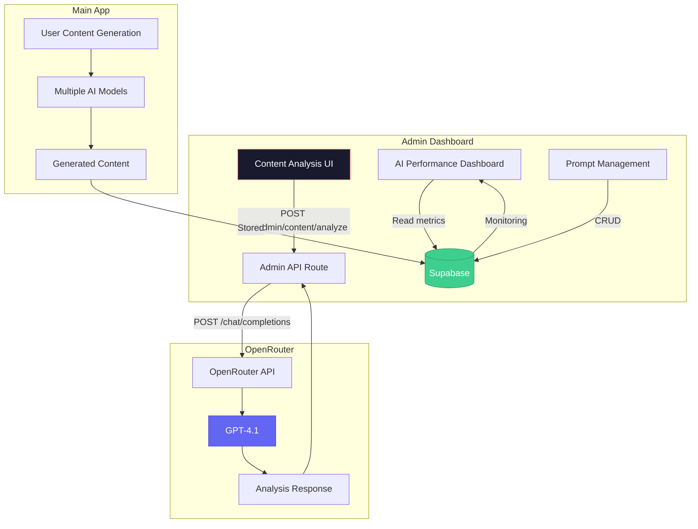
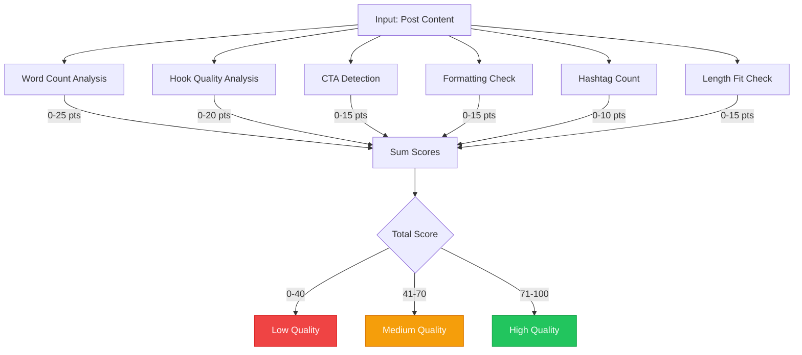
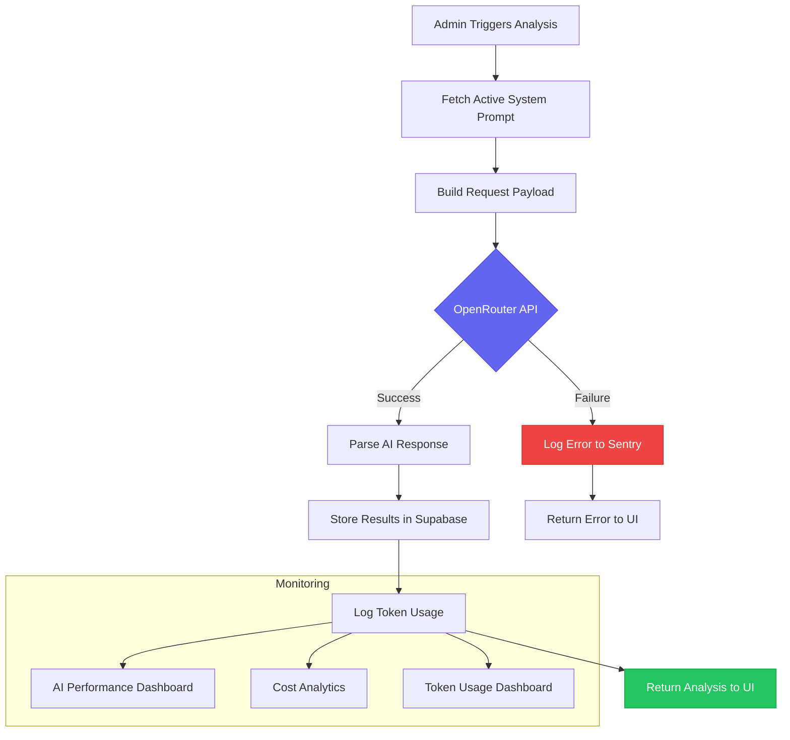

# AI Features

## AI Architecture



---

## Content Quality Analysis

- **Endpoint:** `POST /api/admin/content/analyze`
- **Model:** OpenAI GPT-4.1 (via OpenRouter)
- **Temperature:** 0.3 (deterministic)
- **Max Tokens:** 500
- **System Prompt:** Custom LinkedIn content analyst persona
- **Input:** Post content + optional post type
- **Output:**

```json
{
  "engagementScore": 1-10,
  "readabilityScore": 1-10,
  "strengths": ["2-3 positive points"],
  "suggestions": ["2-3 improvements"],
  "summary": "Overall assessment"
}
```

---

## Local Content Quality Scoring

- **File:** `lib/quality-score.ts`
- **Algorithm:** Rule-based scoring (no AI)
- **Metrics (total 0-100 scale):**

| Metric | Points | Details |
|--------|--------|---------|
| Word Count | 0-25 | Optimal 50-600 words |
| Hook Quality | 0-20 | First line analysis: length, questions, numbers, caps |
| Call-to-Action | 0-15 | Questions, action verbs detection |
| Formatting | 0-15 | Line breaks, word distribution |
| Hashtags | 0-10 | Sweet spot 1-5 hashtags |
| Length Fit | 0-15 | 30-3000 character range |

- **Grades:** Low (0-40), Medium (41-70), High (71-100)

### Scoring Algorithm Flow



---

## AI Performance Monitoring

- **Dashboard:** `/dashboard/analytics/ai-performance`
- **Metrics:**
  - Total requests, avg tokens (input/output), avg response time, avg cost/call, success rate
  - Daily cost trend (30-day line chart)
  - Cost by model (bar chart)
  - Daily token usage (line chart)
  - Usage by feature (bar chart)
  - Feature x Time heatmap (8 weeks)
- **Prompt Analytics:**
  - All system prompts listed with type, category, active status
  - Categories: Remix, Post Type, Carousel, Foundation, Other

---

## Token Usage Analytics

- **Dashboard:** `/dashboard/analytics/tokens`
- **Tracked per API call:**
  - `input_tokens`
  - `output_tokens`
  - `total_tokens`
  - `model`
  - `estimated_cost`
  - `response_time_ms`
  - `success`

---

## Cost Analytics

- **Dashboard:** `/dashboard/analytics/costs`
- **Metrics:** Total spend, MTD, WTD, daily
- **Breakdowns:** By model, by feature, by user (top 20), monthly trends

---

## AI Activity Monitoring

- **Dashboard:** `/dashboard/content/ai-activity`
- **Tabs:**
  - **Requests:** Individual API calls
  - **Conversations:** Multi-turn chat sessions with message viewer
  - **Output:** Generated content results

---

## Prompt Management

- System prompts stored in `system_prompts` table
- Admin can activate/deactivate prompts
- Admin can set default prompts
- Changes audit-logged

### AI Workflow


