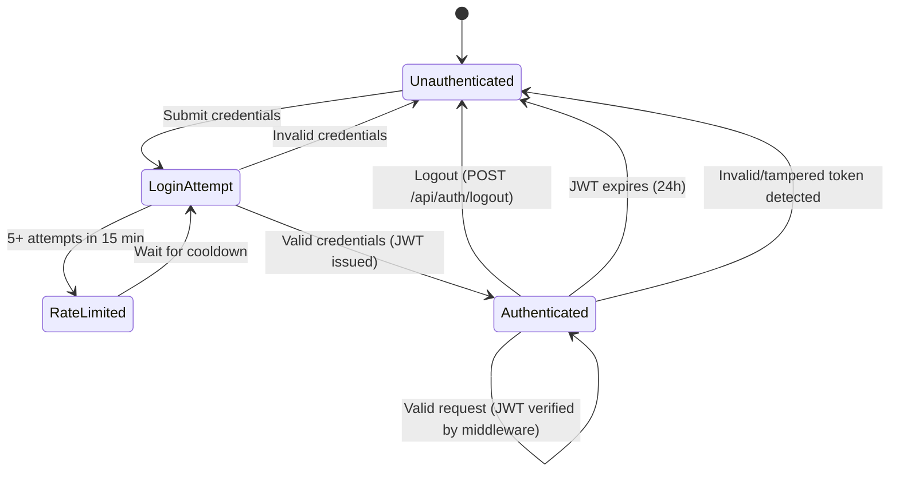

# Authentication Flow

## Architecture

```mermaid
sequenceDiagram
    participant U as User (Browser)
    participant MW as Middleware
    participant LP as Login Page
    participant API as /api/auth/login
    participant RL as Rate Limiter
    participant DB as Supabase (admin_users)
    participant JWT as JWT Service
    participant D as /dashboard

    U->>MW: GET /dashboard
    MW->>MW: Check for admin-session cookie
    alt No JWT cookie
        MW-->>U: 302 Redirect to /login
    end

    U->>LP: Opens /login
    U->>API: POST /api/auth/login {username, password}

    API->>RL: Check rate limit (IP-based)
    alt Rate limit exceeded
        RL-->>U: 429 Too Many Requests + Retry-After header
    end

    API->>DB: SELECT * FROM admin_users WHERE username = ?
    alt User not found
        API-->>U: 401 Invalid credentials
    end

    API->>API: bcrypt.compare(password, stored_hash)
    alt Password mismatch
        API-->>U: 401 Invalid credentials
    end

    API->>JWT: Sign token (HS256, 24h expiry)
    JWT-->>API: Signed JWT
    API->>API: Set HTTP-only cookie (admin-session)
    API->>DB: UPDATE admin_users SET last_login = NOW()
    API->>DB: INSERT audit_logs (login event)
    API-->>U: 200 { success: true }

    U->>MW: GET /dashboard (with cookie)
    MW->>JWT: Verify JWT from cookie
    JWT-->>MW: Valid token + payload
    MW-->>D: Allow request through
    D-->>U: Dashboard page
```



## Components

### Password Hashing

- **Library:** bcryptjs v3.0.3
- **Salt Rounds:** 12
- **Functions:** `hashPassword()`, `verifyPassword()`

### JWT Tokens

- **Library:** jose v6.2.2
- **Algorithm:** HS256
- **Expiry:** 24 hours
- **Secret:** `ADMIN_JWT_SECRET` env var
- **Dev Fallback:** `"dev-bypass-secret"` when env var not set
- **Payload:**
  ```typescript
  {
    sub: string       // Admin user ID
    username: string  // Admin username
    iat: number       // Issued at
    exp: number       // Expiration (24h)
  }
  ```

### Cookie Configuration

| Property     | Value                          |
| ------------ | ------------------------------ |
| **Name**     | `admin-session`                |
| **HTTP-Only**| Yes (not accessible via JS)    |
| **Secure**   | Yes (HTTPS only in production) |
| **SameSite** | Strict                         |
| **Path**     | `/`                            |

### Middleware (`middleware.ts`)

- **Matcher:** `/dashboard/:path*`
- **Dev Bypass:** Auth is skipped if `ADMIN_JWT_SECRET` is not set
- **Flow:** Check cookie -> Verify JWT -> Allow request or redirect to `/login`
- **Invalid Token:** Clears the cookie and redirects to `/login`

### Rate Limiting

- **Implementation:** In-memory `Map` keyed by IP address
- **Limit:** 5 attempts per 15 minutes (900 seconds)
- **Response:** HTTP 429 with `Retry-After` header
- **File:** `lib/rate-limit.ts`

### Login API Route

- **Endpoint:** `POST /api/auth/login`
- **Validation:** Username and password are required (returns 400 if missing)
- **Auth Check:** Bcrypt compare against stored hash
- **Success:** Set cookie, update `last_login`, write audit log, return `{ success: true }`
- **Failure:** 401 `"Invalid credentials"`

### Logout API Route

- **Endpoint:** `POST /api/auth/logout`
- **Action:** Clear session cookie, write audit log

### Admin User Seeding

- **Script:** `scripts/seed-admin.ts`
- **Usage:** `npx tsx scripts/seed-admin.ts <username> <password>`
- **Creates:** Record in `admin_users` table with bcrypt-hashed password

## Audit Logging

All authentication events are recorded in the audit log:

| Event    | Data Captured          |
| -------- | ---------------------- |
| `login`  | Admin ID, IP address   |
| `logout` | Admin ID               |

## Security States


