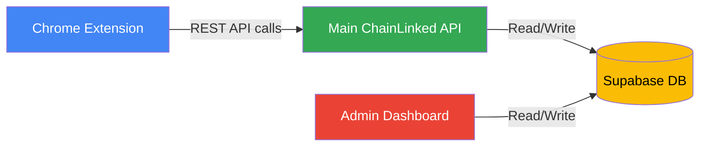

# Chrome Extension Integration

## Overview

The ChainLinked platform includes a Chrome extension as part of its broader ecosystem. This admin dashboard does **not** contain the Chrome extension code, but it monitors and manages data generated through the extension.

## Architecture

The Chrome extension communicates with the main ChainLinked API, which persists data to Supabase. The admin dashboard reads from and writes to the same Supabase database, giving administrators full visibility into extension-driven activity.

## How the Extension Connects to Admin

The Chrome extension is part of the main ChainLinked application (separate repository). The admin dashboard interacts with extension-generated data through shared database tables.

### Data Generated by Extension Users

| Table                      | Description                                              |
| -------------------------- | -------------------------------------------------------- |
| `generated_posts`          | AI-generated LinkedIn content created via the extension  |
| `scheduled_posts`          | Posts scheduled for publishing through the extension     |
| `templates`                | Content templates saved via the extension                |
| `compose_conversations`    | AI chat sessions from the extension compose feature      |
| `linkedin_tokens`          | OAuth tokens from LinkedIn authentication in extension   |

### Admin Dashboard Monitoring

The admin dashboard provides oversight of all extension activity:

- **Content Management** -- View, analyze, and delete user-generated content
- **User Management** -- Monitor user accounts, onboarding status, and LinkedIn connections
- **AI Activity** -- Track API calls made by extension users
- **Analytics** -- Token usage, costs, and feature adoption from extension interactions
- **System Health** -- Background job monitoring (company research, suggestions)

### Sidebar Sections Control

The admin can control which navigation sections appear in the Chrome extension's sidebar:

- Drag-and-drop reordering of sections
- Enable or disable individual sections
- Managed via `/dashboard/system/flags`
- Stored in the `sidebar_sections` table

## Related Tables

Key tables that bridge the Chrome extension and the admin dashboard:

| Table                   | Purpose                                        | Written By       | Read By          |
| ----------------------- | ---------------------------------------------- | ---------------- | ---------------- |
| `generated_posts`       | AI-generated LinkedIn posts                    | Extension        | Admin Dashboard  |
| `scheduled_posts`       | Queued posts awaiting publication               | Extension        | Admin Dashboard  |
| `templates`             | Reusable content templates                     | Extension        | Admin Dashboard  |
| `compose_conversations` | AI chat history from compose feature           | Extension        | Admin Dashboard  |
| `linkedin_tokens`       | LinkedIn OAuth credentials                     | Extension        | Admin Dashboard  |
| `sidebar_sections`      | Extension sidebar configuration                | Admin Dashboard  | Extension (API)  |
| `users`                 | User accounts and profiles                     | Extension (API)  | Admin Dashboard  |
| `api_calls`             | AI API usage tracking                          | Extension (API)  | Admin Dashboard  |
| `background_jobs`       | Async tasks (research, suggestions)            | Extension (API)  | Admin Dashboard  |

## Note

For Chrome extension source code, build instructions, and extension-specific documentation, refer to the main ChainLinked application repository.
