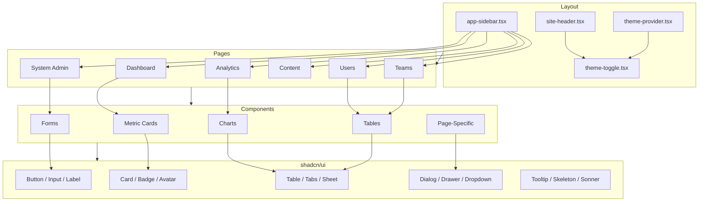

# Components

## Component Architecture

---

## Layout Components

### app-sidebar.tsx
Responsive sidebar with 6 navigation groups containing ~18 items. Supports collapsible state and mobile drawer mode.

### site-header.tsx
Top header bar displaying the current page title, sidebar trigger button, and theme toggle control.

### theme-provider.tsx
Wraps the application with the `next-themes` provider enabling dark/light mode support.

### theme-toggle.tsx
Animated theme switch button using the View Transition API to create a circular reveal animation on mode change.

---

## Form Components

### login-form.tsx
Username/password authentication form with error display and loading state handling.

### settings-client.tsx
Password change form with environment status display showing current deployment indicators.

---

## Data Display Components

### metric-card.tsx
KPI card supporting 5 accent colors, trend indicators (up/down), icons, gradient backgrounds, and a compact mode for dense layouts.

### empty-state.tsx
Placeholder component rendered when lists or tables contain no data.

### info-tooltip.tsx
Info icon that displays a tooltip with contextual help text on hover.

### confirmation-dialog.tsx
Destructive action confirmation dialog requiring text input (e.g., typing a username) before proceeding.

---

## Chart Components (`components/charts/`)

### ai-performance-charts.tsx
Line, Bar, and Pie charts for AI metrics using an 8-color palette. Covers daily cost/token trends, cost by model, and feature usage.

### cost-charts.tsx
Four chart variants: daily cost line chart, model cost bars, feature cost bars, and monthly trend line.

### feature-charts.tsx
Feature usage heatmaps showing adoption and engagement patterns across time periods.

### token-charts.tsx
Token usage analytics charts tracking consumption, cost per token, and usage trends.

### heatmap-cell.tsx
Custom heatmap cell component for rendering time-based activity grids with intensity-scaled colors.

---

## Table Components

### users-table.tsx
Full-featured user table with search, filter (onboarding status, LinkedIn connection), column sorting, and CSV export.

### teams-table.tsx
Teams table with search, sort by 5 fields (name, members, posts, tokens, cost), and CSV export.

### team-members-table.tsx
Member listing table for the team detail page showing individual member data.

### post-list.tsx
Generated posts table displaying quality score grades, word count, post type, and token/cost metrics.

### scheduled-post-list.tsx
Scheduled posts table with relative schedule time, status badges (pending/posted/failed), and error messages.

### template-list.tsx
Template listing with category badges, public/private indicators, usage counts, and copy-to-clipboard action.

### prompt-table.tsx
System prompt analytics table for tracking prompt performance metrics.

---

## Page-Specific Components

### activity-tabs.tsx
Segmented tab control for the AI Activity page switching between Requests, Conversations (with message viewer), and Output views.

### posthog-tabs.tsx
Tab navigation for PostHog analytics: Dashboard, Session Replays, and Heatmaps.

### jobs-tabs.tsx
Tab control for background jobs filtered by type: company context, research sessions, suggestion generation.

### sidebar-sections-manager.tsx
Drag-and-drop sidebar section editor built with @dnd-kit. Supports reordering, enable/disable toggles, and CRUD operations.

### sentry-errors-viewer.tsx
Error issue list fetched from Sentry displaying unresolved issues, severity levels, and affected user counts.

### user-actions.tsx
Action buttons for user management: suspend/unsuspend toggle and delete with confirmation dialog.

---

## shadcn/ui Components (`components/ui/`)

| Component | File | Notes |
|---|---|---|
| Avatar | `avatar.tsx` | User profile images with fallback |
| Badge | `badge.tsx` | Status and category labels |
| Breadcrumb | `breadcrumb.tsx` | Navigation breadcrumbs |
| Button | `button.tsx` | 6 variants (default, destructive, outline, secondary, ghost, link), 6 sizes |
| Card | `card.tsx` | Content container with container query support |
| Chart | `chart.tsx` | Recharts wrapper with theme-aware colors |
| Checkbox | `checkbox.tsx` | Form checkbox input |
| Dialog | `dialog.tsx` | Modal dialogs |
| Drawer | `drawer.tsx` | Bottom/side drawer panels |
| Dropdown Menu | `dropdown-menu.tsx` | Context and action menus |
| Input | `input.tsx` | Text input field |
| Label | `label.tsx` | Form field labels |
| Select | `select.tsx` | Dropdown select input |
| Separator | `separator.tsx` | Visual divider |
| Sheet | `sheet.tsx` | Slide-over panel |
| Sidebar | `sidebar.tsx` | Sidebar layout primitives |
| Skeleton | `skeleton.tsx` | Loading placeholder animations |
| Sonner | `sonner.tsx` | Toast notification system |
| Switch | `switch.tsx` | Toggle switch input |
| Table | `table.tsx` | Data table primitives |
| Tabs | `tabs.tsx` | Tabbed navigation |
| Toggle | `toggle.tsx` | Toggle button |
| Toggle Group | `toggle-group.tsx` | Grouped toggle buttons |
| Tooltip | `tooltip.tsx` | Hover tooltips |

---

## Analytics Provider

### posthog-provider.tsx
Initializes PostHog analytics client, implements custom pageview tracking, and captures `admin_section` events for monitoring admin navigation patterns.
