# Database Schema Reference

## Overview

| Property | Value |
|---|---|
| **Platform** | Supabase (PostgreSQL) |
| **Client** | `@supabase/supabase-js` with service role key for admin operations |
| **Schema Management** | Managed via Supabase dashboard (no local migration files) |
| **Auth Model** | Admin client uses service role key, bypassing Row Level Security |
| **Session** | `persistSession: false`, `autoRefreshToken: false` (admin auth via custom JWT cookies) |
| **Client file** | `lib/supabase/client.ts` |

---

## Complete ER Diagram

```mermaid
erDiagram
    admin_users {
        uuid id PK
        text username UK
        text password_hash
        timestamp last_login
    }

    profiles {
        uuid id PK
        text full_name
        text email
        timestamp created_at
        boolean onboarding_completed
        text linkedin_user_id
        timestamp extension_last_active_at
    }

    linkedin_tokens {
        uuid user_id FK
    }

    generated_posts {
        uuid id PK
        uuid user_id FK
        text content
        text post_type
        text source
        text status
        int word_count
        text hook
        text cta
        timestamp created_at
        uuid conversation_id FK
        text prompt_snapshot
        int prompt_tokens
        int completion_tokens
        int total_tokens
        text model
        numeric estimated_cost
    }

    scheduled_posts {
        uuid id PK
        uuid user_id FK
        text content
        timestamp scheduled_for
        text timezone
        text status
        text error_message
        timestamp posted_at
        timestamp created_at
    }

    my_posts {
        uuid id PK
        uuid user_id FK
        timestamp created_at
    }

    templates {
        uuid id PK
        uuid user_id FK
        text name
        text content
        text category
        boolean is_public
        int usage_count
        boolean is_ai_generated
        timestamp created_at
    }

    compose_conversations {
        uuid id PK
        uuid user_id FK
        text title
        text mode
        text tone
        jsonb messages
        boolean is_active
        timestamp created_at
        timestamp updated_at
    }

    system_prompts {
        uuid id PK
        text type
        text name
        text description
        boolean is_active
        boolean is_default
    }

    prompt_usage_logs {
        uuid id PK
        uuid user_id FK
        text prompt_type
        text feature
        text model
        int input_tokens
        int output_tokens
        int total_tokens
        numeric estimated_cost
        int response_time_ms
        boolean success
        text error_message
        jsonb metadata
        timestamp created_at
    }

    generated_suggestions {
        uuid id PK
        uuid user_id FK
    }

    swipe_wishlist {
        uuid id PK
        uuid user_id FK
    }

    teams {
        uuid id PK
        text name
        timestamp created_at
    }

    team_members {
        uuid user_id FK
        uuid team_id FK
    }

    companies {
        uuid id PK
    }

    company_context {
        uuid id PK
        text company_name
        text status
        text error_message
        timestamp created_at
        timestamp completed_at
        uuid user_id FK
    }

    research_sessions {
        uuid id PK
        text_array topics
        text status
        int posts_discovered
        int posts_generated
        text error_message
        timestamp created_at
        timestamp completed_at
        uuid user_id FK
    }

    suggestion_generation_runs {
        uuid id PK
        text status
        int suggestions_requested
        int suggestions_generated
        text error_message
        timestamp created_at
        timestamp completed_at
        uuid user_id FK
    }

    post_analytics {
        uuid id PK
        uuid user_id FK
        int impressions
        int reactions
        int comments
        int reposts
        int saves
        int sends
        numeric engagement_rate
        int followers_gained
        int unique_views
        text post_type
        timestamp posted_at
        timestamp captured_at
    }

    post_analytics_accumulative {
        uuid id PK
        uuid user_id FK
        uuid post_id FK
        int impressions_total
        int reactions_total
        int comments_total
        int reposts_total
        int saves_total
        int sends_total
        int engagements_total
        numeric engagements_rate
        text post_type
        timestamp post_created_at
        date analysis_date
    }

    profile_analytics_accumulative {
        uuid id PK
        uuid user_id FK
        int followers_total
        int profile_views_total
        int search_appearances_total
        int connections_total
        date analysis_date
    }

    sidebar_sections {
        uuid id PK
        text key UK
        text label
        text description
        boolean enabled
        int sort_order
        timestamp created_at
        timestamp updated_at
    }

    profiles ||--o{ generated_posts : "user_id"
    profiles ||--o{ scheduled_posts : "user_id"
    profiles ||--o{ my_posts : "user_id"
    profiles ||--o{ templates : "user_id"
    profiles ||--o{ prompt_usage_logs : "user_id"
    profiles ||--o{ compose_conversations : "user_id"
    profiles ||--o{ generated_suggestions : "user_id"
    profiles ||--o{ swipe_wishlist : "user_id"
    profiles ||--o{ post_analytics : "user_id"
    profiles ||--o{ post_analytics_accumulative : "user_id"
    profiles ||--o{ profile_analytics_accumulative : "user_id"
    profiles ||--o{ company_context : "user_id"
    profiles ||--o{ research_sessions : "user_id"
    profiles ||--o{ suggestion_generation_runs : "user_id"
    profiles ||--|| linkedin_tokens : "user_id"
    profiles ||--o{ team_members : "user_id"
    teams ||--o{ team_members : "team_id"
    compose_conversations ||--o{ generated_posts : "conversation_id"
```



---

## Table Reference

### 1. Authentication

#### `admin_users`

Stores credentials for the admin dashboard. Separate from platform users.

| Column | Type | Constraints | Description |
|---|---|---|---|
| `id` | `uuid` | PK, default `gen_random_uuid()` | Primary key |
| `username` | `text` | UNIQUE, NOT NULL | Admin login username |
| `password_hash` | `text` | NOT NULL | Bcrypt hash (12 salt rounds) |
| `last_login` | `timestamp` | | Updated on each successful login |

**Queried by:**
- `app/api/auth/login/route.ts` -- login authentication (SELECT by `username`, UPDATE `last_login`)
- `scripts/seed-admin.ts` -- seed script (INSERT)

**Example queries:**
```typescript
// Login: find admin by username
supabaseAdmin.from("admin_users")
  .select("id, username, password_hash")
  .eq("username", username)
  .single()

// Update last login timestamp
supabaseAdmin.from("admin_users")
  .update({ last_login: new Date().toISOString() })
  .eq("id", admin.id)

// Seed script: insert new admin
supabase.from("admin_users").insert({ username, password_hash: hash })
```

---

### 2. User Profiles

#### `profiles`

Linked to Supabase Auth `auth.users.id`. Represents every user of the ChainLinked platform.

| Column | Type | Constraints | Description |
|---|---|---|---|
| `id` | `uuid` | PK | Linked to `auth.users.id` |
| `full_name` | `text` | | Display name |
| `email` | `text` | | Email address |
| `created_at` | `timestamp` | | Signup date |
| `onboarding_completed` | `boolean` | default `false` | Whether onboarding flow is complete |
| `linkedin_user_id` | `text` | | LinkedIn profile identifier |
| `extension_last_active_at` | `timestamp` | | Last time the browser extension was active |

**Queried by:**
- `app/dashboard/page.tsx` -- overview metrics, onboarding funnel, top users
- `app/dashboard/users/page.tsx` -- users list
- `app/dashboard/users/[id]/page.tsx` -- user detail (includes `extension_last_active_at`)
- `app/dashboard/teams/page.tsx` -- team member `extension_last_active_at`
- `app/dashboard/teams/[id]/page.tsx` -- team detail member profiles
- `app/dashboard/content/generated/page.tsx` -- name lookup
- `app/dashboard/content/scheduled/page.tsx` -- name lookup
- `app/dashboard/content/templates/page.tsx` -- name lookup
- `app/dashboard/content/ai-activity/page.tsx` -- name lookup
- `app/dashboard/analytics/costs/page.tsx` -- name lookup
- `app/dashboard/analytics/linkedin/page.tsx` -- name lookup
- `app/dashboard/system/jobs/page.tsx` -- name lookup

**Example queries:**
```typescript
// Full user list with ordering
supabaseAdmin.from("profiles")
  .select("id, full_name, email, created_at, onboarding_completed, linkedin_user_id")
  .order("created_at", { ascending: false })

// Single user detail
supabaseAdmin.from("profiles")
  .select("id, full_name, email, created_at, onboarding_completed, linkedin_user_id, extension_last_active_at")
  .eq("id", id)
  .single()

// Count with filter (signups this week)
supabaseAdmin.from("profiles")
  .select("*", { count: "exact", head: true })
  .gte("created_at", weekAgoISO)

// Count onboarded users
supabaseAdmin.from("profiles")
  .select("*", { count: "exact", head: true })
  .eq("onboarding_completed", true)

// Name lookup (used by many pages)
supabaseAdmin.from("profiles").select("id, full_name, email")

// Team members by IDs
supabaseAdmin.from("profiles")
  .select("id, full_name, email, created_at, onboarding_completed, extension_last_active_at")
  .in("id", memberIds)
```

#### `linkedin_tokens`

Stores LinkedIn OAuth credentials. Only `user_id` is selected in admin queries.

| Column | Type | Constraints | Description |
|---|---|---|---|
| `user_id` | `uuid` | FK -> `profiles.id` | Token owner |

**Queried by:**
- `app/dashboard/page.tsx` -- onboarding funnel (count distinct user_ids with LinkedIn connected)

**Example queries:**
```typescript
// Count users with LinkedIn connected
supabaseAdmin.from("linkedin_tokens").select("user_id")
```

---

### 3. Content

#### `generated_posts`

Core content table. Each row is a post produced by the AI writing engine.

| Column | Type | Constraints | Description |
|---|---|---|---|
| `id` | `uuid` | PK | Primary key |
| `user_id` | `uuid` | FK -> `profiles.id` | Owning user |
| `content` | `text` | | Full post body |
| `post_type` | `text` | | Category (e.g., story, listicle, thought leadership) |
| `source` | `text` | | Generation source (compose, carousel, swipe, series, scheduled) |
| `status` | `text` | | draft, posted, archived |
| `word_count` | `int` | | Computed word count |
| `hook` | `text` | | Opening hook line |
| `cta` | `text` | | Call-to-action line |
| `created_at` | `timestamp` | | Creation timestamp |
| `conversation_id` | `uuid` | FK -> `compose_conversations.id`, nullable | Linked conversation |
| `prompt_snapshot` | `text` | | Frozen copy of the prompt used (may be JSON) |
| `prompt_tokens` | `int` | | Input token count |
| `completion_tokens` | `int` | | Output token count |
| `total_tokens` | `int` | | Total token count |
| `model` | `text` | | LLM model identifier |
| `estimated_cost` | `numeric` | | Estimated API cost in USD |

**Queried by:**
- `app/dashboard/page.tsx` -- total count, weekly count, active users, top users
- `app/dashboard/users/page.tsx` -- per-user post counts
- `app/dashboard/users/[id]/page.tsx` -- user's posts with detail columns
- `app/dashboard/teams/page.tsx` -- per-user post counts for team aggregation
- `app/dashboard/teams/[id]/page.tsx` -- team member post counts, source/type breakdown
- `app/dashboard/content/generated/page.tsx` -- full post listing with all columns
- `app/dashboard/content/ai-activity/page.tsx` -- output quality, linked posts by conversation_id
- `app/dashboard/analytics/ai-performance/page.tsx` -- output quality scoring (content, source)
- `app/api/admin/content/[id]/route.ts` -- DELETE by id

**Example queries:**
```typescript
// Full listing with all columns
supabaseAdmin.from("generated_posts")
  .select("id, user_id, content, post_type, source, status, word_count, hook, cta, created_at, conversation_id, prompt_snapshot, prompt_tokens, completion_tokens, total_tokens, model, estimated_cost", { count: "exact" })
  .order("created_at", { ascending: false })
  .limit(100)

// Count all posts
supabaseAdmin.from("generated_posts")
  .select("*", { count: "exact", head: true })

// Active users (distinct user_ids in date range)
supabaseAdmin.from("generated_posts")
  .select("user_id")
  .gte("created_at", weekAgoISO)

// Posts linked to conversations
supabaseAdmin.from("generated_posts")
  .select("id, conversation_id, content")
  .not("conversation_id", "is", null)

// User's posts for detail page
supabaseAdmin.from("generated_posts")
  .select("id, content, post_type, source, status, word_count, conversation_id, created_at")
  .eq("user_id", id)
  .order("created_at", { ascending: false })
```

#### `scheduled_posts`

Posts waiting to be published to LinkedIn at a scheduled time.

| Column | Type | Constraints | Description |
|---|---|---|---|
| `id` | `uuid` | PK | Primary key |
| `user_id` | `uuid` | FK -> `profiles.id` | Owning user |
| `content` | `text` | | Post body |
| `scheduled_for` | `timestamp` | | Target publish time |
| `timezone` | `text` | | User's timezone (e.g., `America/New_York`) |
| `status` | `text` | | pending, posted, failed, cancelled |
| `error_message` | `text` | | Error details if status is failed |
| `posted_at` | `timestamp` | | Actual publish time |
| `created_at` | `timestamp` | | Record creation time |

**Queried by:**
- `app/dashboard/page.tsx` -- count of `status = "posted"`, recent activity
- `app/dashboard/users/[id]/page.tsx` -- user's scheduled posts
- `app/dashboard/teams/[id]/page.tsx` -- team member published count
- `app/dashboard/content/scheduled/page.tsx` -- full listing
- `app/api/admin/content/[id]/route.ts` -- DELETE by id

**Example queries:**
```typescript
// Full listing ordered by scheduled_for
supabaseAdmin.from("scheduled_posts")
  .select("id, user_id, content, scheduled_for, timezone, status, error_message, posted_at, created_at", { count: "exact" })
  .order("scheduled_for", { ascending: false })
  .limit(50)

// Count posted
supabaseAdmin.from("scheduled_posts")
  .select("*", { count: "exact", head: true })
  .eq("status", "posted")

// Count posted for specific users
supabaseAdmin.from("scheduled_posts")
  .select("*", { count: "exact", head: true })
  .in("user_id", memberIds)
  .eq("status", "posted")
```

#### `my_posts`

Posts imported or manually added by users (not AI-generated).

| Column | Type | Constraints | Description |
|---|---|---|---|
| `id` | `uuid` | PK | Primary key |
| `user_id` | `uuid` | FK -> `profiles.id` | Owning user |
| `created_at` | `timestamp` | | Creation timestamp |

**Queried by:**
- `app/dashboard/page.tsx` -- total count (added to "Posts Published" metric)
- `app/dashboard/users/[id]/page.tsx` -- per-user count

**Example queries:**
```typescript
// Total count
supabaseAdmin.from("my_posts").select("*", { count: "exact", head: true })

// Per-user count
supabaseAdmin.from("my_posts")
  .select("*", { count: "exact", head: true })
  .eq("user_id", id)
```

#### `templates`

Reusable post structures and formats.

| Column | Type | Constraints | Description |
|---|---|---|---|
| `id` | `uuid` | PK | Primary key |
| `user_id` | `uuid` | FK -> `profiles.id` | Owning user |
| `name` | `text` | | Template name |
| `content` | `text` | | Template body |
| `category` | `text` | | Template category |
| `is_public` | `boolean` | | Whether visible to other users |
| `usage_count` | `int` | | Number of times used |
| `is_ai_generated` | `boolean` | | Whether created by AI |
| `created_at` | `timestamp` | | Creation timestamp |

**Queried by:**
- `app/dashboard/users/[id]/page.tsx` -- per-user count
- `app/dashboard/content/templates/page.tsx` -- full template listing
- `app/api/admin/content/[id]/route.ts` -- DELETE by id

**Example queries:**
```typescript
// Full listing with all known columns
supabaseAdmin.from("templates")
  .select("id, user_id, name, content, category, is_public, usage_count, is_ai_generated, created_at", { count: "exact" })
  .order("created_at", { ascending: false })
  .limit(50)

// Per-user count
supabaseAdmin.from("templates")
  .select("*", { count: "exact", head: true })
  .eq("user_id", id)
```

---

### 4. AI & Conversations

#### `compose_conversations`

Stores full conversation threads for the compose feature.

| Column | Type | Constraints | Description |
|---|---|---|---|
| `id` | `uuid` | PK | Primary key |
| `user_id` | `uuid` | FK -> `profiles.id` | Conversation owner |
| `title` | `text` | | Conversation title (may be null for "Untitled conversation") |
| `mode` | `text` | | Conversation mode |
| `tone` | `text` | | Writing tone setting |
| `messages` | `jsonb` | | Array of `{id, role, parts: [{text, type}]}` message objects |
| `is_active` | `boolean` | | Whether conversation is currently active |
| `created_at` | `timestamp` | | Conversation start time |
| `updated_at` | `timestamp` | | Last message time |

**Queried by:**
- `app/dashboard/content/ai-activity/page.tsx` -- conversation listing with detail

**Example queries:**
```typescript
// List conversations with all fields
supabaseAdmin.from("compose_conversations")
  .select("id, user_id, title, mode, tone, messages, is_active, created_at")
  .order("created_at", { ascending: false })
  .limit(50)
```

#### `system_prompts`

Admin-managed system prompts used across AI features.

| Column | Type | Constraints | Description |
|---|---|---|---|
| `id` | `uuid` | PK | Primary key |
| `type` | `text` | | Prompt category (e.g., `base_rules`, `remix_*`, `post_*`, `carousel_*`) |
| `name` | `text` | | Human-readable name |
| `description` | `text` | | Purpose description |
| `is_active` | `boolean` | | Whether currently in use |
| `is_default` | `boolean` | | Whether this is the default for its type |

**Queried by:**
- `app/dashboard/analytics/ai-performance/page.tsx` -- prompt performance analysis

**Example queries:**
```typescript
// All prompts
supabaseAdmin.from("system_prompts")
  .select("id, type, name, description, is_active")
```

#### `prompt_usage_logs`

Tracks every LLM API call for cost monitoring and usage analytics.

| Column | Type | Constraints | Description |
|---|---|---|---|
| `id` | `uuid` | PK | Primary key |
| `user_id` | `uuid` | FK -> `profiles.id` | User who triggered the call |
| `prompt_type` | `text` | | Type of prompt (maps to `system_prompts.type`) |
| `feature` | `text` | | Product feature area |
| `model` | `text` | | LLM model used (may include provider prefix like `openai/gpt-4.1`) |
| `input_tokens` | `int` | | Prompt token count |
| `output_tokens` | `int` | | Completion token count |
| `total_tokens` | `int` | | Combined token count |
| `estimated_cost` | `numeric` | | Estimated cost in USD |
| `response_time_ms` | `int` | | Latency in milliseconds |
| `success` | `boolean` | | Whether the call succeeded |
| `error_message` | `text` | | Error details if failed |
| `metadata` | `jsonb` | | Additional context (may contain `topic`, `tone`, `length`) |
| `created_at` | `timestamp` | | Call timestamp |

**Queried by:**
- `app/dashboard/page.tsx` -- total token usage and cost
- `app/dashboard/users/[id]/page.tsx` -- per-user token usage and cost
- `app/dashboard/teams/page.tsx` -- per-user usage for team aggregation
- `app/dashboard/teams/[id]/page.tsx` -- team member usage
- `app/dashboard/content/ai-activity/page.tsx` -- full request log with all columns
- `app/dashboard/analytics/ai-performance/page.tsx` -- model comparison, prompt performance, charts
- `app/dashboard/analytics/costs/page.tsx` -- cost analysis by model, feature, user, time

**Example queries:**
```typescript
// Full log for AI activity page
supabaseAdmin.from("prompt_usage_logs")
  .select("id, user_id, prompt_type, feature, model, input_tokens, output_tokens, total_tokens, estimated_cost, response_time_ms, success, error_message, metadata, created_at")
  .order("created_at", { ascending: false })
  .limit(100)

// All logs for performance analysis
supabaseAdmin.from("prompt_usage_logs").select("*")

// Cost dashboard (subset of columns)
supabaseAdmin.from("prompt_usage_logs")
  .select("user_id, estimated_cost, model, feature, created_at")

// Token overview
supabaseAdmin.from("prompt_usage_logs")
  .select("input_tokens, output_tokens, total_tokens, model, estimated_cost")

// Per-user usage
supabaseAdmin.from("prompt_usage_logs")
  .select("total_tokens, estimated_cost, feature, created_at")
  .eq("user_id", id)
  .order("created_at", { ascending: false })

// Per-user usage for team members
supabaseAdmin.from("prompt_usage_logs")
  .select("user_id, total_tokens, estimated_cost")
  .in("user_id", memberIds)
```

#### `generated_suggestions`

AI-generated content suggestions surfaced to users.

| Column | Type | Constraints | Description |
|---|---|---|---|
| `id` | `uuid` | PK | Primary key |
| `user_id` | `uuid` | FK -> `profiles.id` | Target user |

**Queried by:**
- `app/dashboard/page.tsx` -- total suggestion count (for save rate calculation)

**Example queries:**
```typescript
supabaseAdmin.from("generated_suggestions").select("*", { count: "exact", head: true })
```

#### `swipe_wishlist`

Suggestions that users have bookmarked or saved.

| Column | Type | Constraints | Description |
|---|---|---|---|
| `id` | `uuid` | PK | Primary key |
| `user_id` | `uuid` | FK -> `profiles.id` | User who saved it |

**Queried by:**
- `app/dashboard/page.tsx` -- saved suggestion count (for save rate calculation)

**Example queries:**
```typescript
supabaseAdmin.from("swipe_wishlist").select("*", { count: "exact", head: true })
```

---

### 5. Teams

#### `teams`

Top-level team entities.

| Column | Type | Constraints | Description |
|---|---|---|---|
| `id` | `uuid` | PK | Primary key |
| `name` | `text` | | Team name |
| `created_at` | `timestamp` | | Team creation timestamp |

**Queried by:**
- `app/dashboard/page.tsx` -- total team count
- `app/dashboard/teams/page.tsx` -- team listing
- `app/dashboard/teams/[id]/page.tsx` -- single team detail
- `app/dashboard/users/page.tsx` -- joined via `team_members` relation

**Example queries:**
```typescript
// All teams
supabaseAdmin.from("teams")
  .select("id, name, created_at")
  .order("created_at", { ascending: false })

// Single team
supabaseAdmin.from("teams")
  .select("id, name, created_at")
  .eq("id", id)
  .single()

// Count all
supabaseAdmin.from("teams").select("*", { count: "exact", head: true })
```

#### `team_members`

Junction table implementing the many-to-many relationship between profiles and teams.

| Column | Type | Constraints | Description |
|---|---|---|---|
| `user_id` | `uuid` | FK -> `profiles.id` | Member user |
| `team_id` | `uuid` | FK -> `teams.id` | Parent team |

**Queried by:**
- `app/dashboard/users/page.tsx` -- join with `teams(name)` to get team name per user
- `app/dashboard/teams/page.tsx` -- member counts per team
- `app/dashboard/teams/[id]/page.tsx` -- list members of a specific team

**Example queries:**
```typescript
// With joined team name (Supabase relation syntax)
supabaseAdmin.from("team_members")
  .select("user_id, team_id, teams(name)")

// Members of a team
supabaseAdmin.from("team_members")
  .select("user_id")
  .eq("team_id", id)

// All memberships
supabaseAdmin.from("team_members").select("user_id, team_id")
```

#### `companies`

Company entities referenced across the platform.

| Column | Type | Constraints | Description |
|---|---|---|---|
| `id` | `uuid` | PK | Primary key |

**Queried by:**
- `app/dashboard/page.tsx` -- total count (added to "Teams" metric alongside teams count)

**Example queries:**
```typescript
supabaseAdmin.from("companies").select("*", { count: "exact", head: true })
```

---

### 6. Background Jobs

#### `company_context`

Tracks background jobs that research company information for contextual content generation.

| Column | Type | Constraints | Description |
|---|---|---|---|
| `id` | `uuid` | PK | Primary key |
| `company_name` | `text` | | Company being researched |
| `status` | `text` | | pending, scraping, researching, analyzing, completed, failed |
| `error_message` | `text` | | Failure details |
| `created_at` | `timestamp` | | Job creation time |
| `completed_at` | `timestamp` | | Job completion time |
| `user_id` | `uuid` | FK -> `profiles.id` | Requesting user |

**Queried by:**
- `app/dashboard/page.tsx` -- system health (status counts)
- `app/dashboard/system/jobs/page.tsx` -- full job listing

**Example queries:**
```typescript
// Status only for health check
supabaseAdmin.from("company_context").select("status")

// Full listing for jobs page
supabaseAdmin.from("company_context")
  .select("id, company_name, status, error_message, created_at, completed_at, user_id")
  .order("created_at", { ascending: false })
```

#### `research_sessions`

Background jobs that discover and generate posts from topic research.

| Column | Type | Constraints | Description |
|---|---|---|---|
| `id` | `uuid` | PK | Primary key |
| `topics` | `text[]` | | Array of research topics |
| `status` | `text` | | pending, scraping, researching, analyzing, completed, failed |
| `posts_discovered` | `int` | | Number of source posts found |
| `posts_generated` | `int` | | Number of posts created |
| `error_message` | `text` | | Failure details |
| `created_at` | `timestamp` | | Job creation time |
| `completed_at` | `timestamp` | | Job completion time |
| `user_id` | `uuid` | FK -> `profiles.id` | Requesting user |

**Queried by:**
- `app/dashboard/page.tsx` -- system health (status counts)
- `app/dashboard/system/jobs/page.tsx` -- full job listing

**Example queries:**
```typescript
// Full listing
supabaseAdmin.from("research_sessions")
  .select("id, topics, status, posts_discovered, posts_generated, error_message, created_at, completed_at, user_id")
  .order("created_at", { ascending: false })
```

#### `suggestion_generation_runs`

Background jobs that batch-generate content suggestions.

| Column | Type | Constraints | Description |
|---|---|---|---|
| `id` | `uuid` | PK | Primary key |
| `status` | `text` | | pending, scraping, researching, analyzing, completed, failed |
| `suggestions_requested` | `int` | | Number requested |
| `suggestions_generated` | `int` | | Number actually produced |
| `error_message` | `text` | | Failure details |
| `created_at` | `timestamp` | | Job creation time |
| `completed_at` | `timestamp` | | Job completion time |
| `user_id` | `uuid` | FK -> `profiles.id` | Requesting user |

**Queried by:**
- `app/dashboard/page.tsx` -- system health (status counts)
- `app/dashboard/system/jobs/page.tsx` -- full job listing

**Example queries:**
```typescript
// Full listing
supabaseAdmin.from("suggestion_generation_runs")
  .select("id, status, suggestions_requested, suggestions_generated, error_message, created_at, completed_at, user_id")
  .order("created_at", { ascending: false })
```

---

### 7. Analytics

#### `post_analytics`

Point-in-time engagement metrics captured for individual LinkedIn posts.

| Column | Type | Constraints | Description |
|---|---|---|---|
| `id` | `uuid` | PK | Primary key |
| `user_id` | `uuid` | FK -> `profiles.id` | Post author |
| `impressions` | `int` | | View count |
| `reactions` | `int` | | Like/celebrate/etc. count |
| `comments` | `int` | | Comment count |
| `reposts` | `int` | | Share count |
| `saves` | `int` | | Save/bookmark count |
| `sends` | `int` | | Direct send count |
| `engagement_rate` | `numeric` | | Computed engagement percentage |
| `followers_gained` | `int` | | New followers from this post |
| `unique_views` | `int` | | Unique viewer count |
| `post_type` | `text` | | Content format |
| `posted_at` | `timestamp` | | Original publish time |
| `captured_at` | `timestamp` | | When metrics were recorded |

**Queried by:**
- `app/dashboard/analytics/linkedin/page.tsx` -- engagement metrics, top posts

**Example queries:**
```typescript
supabaseAdmin.from("post_analytics")
  .select("id, user_id, impressions, reactions, comments, reposts, saves, sends, engagement_rate, followers_gained, unique_views, post_type, posted_at")
  .order("captured_at", { ascending: false })
  .limit(200)
```

#### `post_analytics_accumulative`

Running totals of engagement metrics per post, updated over time.

| Column | Type | Constraints | Description |
|---|---|---|---|
| `id` | `uuid` | PK | Primary key |
| `user_id` | `uuid` | FK -> `profiles.id` | Post author |
| `post_id` | `uuid` | FK | LinkedIn post identifier |
| `impressions_total` | `int` | | Cumulative impressions |
| `reactions_total` | `int` | | Cumulative reactions |
| `comments_total` | `int` | | Cumulative comments |
| `reposts_total` | `int` | | Cumulative reposts |
| `saves_total` | `int` | | Cumulative saves |
| `sends_total` | `int` | | Cumulative sends |
| `engagements_total` | `int` | | Cumulative total engagements |
| `engagements_rate` | `numeric` | | Lifetime engagement rate |
| `post_type` | `text` | | Content format |
| `post_created_at` | `timestamp` | | Original publish time |
| `analysis_date` | `date` | | Date of this snapshot |

**Queried by:**
- `app/dashboard/analytics/linkedin/page.tsx` -- top performing posts (lifetime view)

**Example queries:**
```typescript
supabaseAdmin.from("post_analytics_accumulative")
  .select("id, user_id, post_id, impressions_total, reactions_total, comments_total, reposts_total, saves_total, sends_total, engagements_total, engagements_rate, post_type, post_created_at, analysis_date")
  .order("analysis_date", { ascending: false })
  .limit(200)
```

#### `profile_analytics_accumulative`

Tracks profile-level metrics over time for growth analysis.

| Column | Type | Constraints | Description |
|---|---|---|---|
| `id` | `uuid` | PK | Primary key |
| `user_id` | `uuid` | FK -> `profiles.id` | Profile owner |
| `followers_total` | `int` | | Total follower count |
| `profile_views_total` | `int` | | Total profile views |
| `search_appearances_total` | `int` | | Total search appearances |
| `connections_total` | `int` | | Total connection count |
| `analysis_date` | `date` | | Date of this snapshot |

**Queried by:**
- `app/dashboard/analytics/linkedin/page.tsx` -- user growth tracking (earliest vs latest snapshot)

**Example queries:**
```typescript
supabaseAdmin.from("profile_analytics_accumulative")
  .select("id, user_id, followers_total, profile_views_total, search_appearances_total, connections_total, analysis_date")
  .order("analysis_date", { ascending: false })
```

---

### 8. System

#### `sidebar_sections`

Controls which navigation sections are visible in the platform UI. Acts as feature flags.

| Column | Type | Constraints | Description |
|---|---|---|---|
| `id` | `uuid` | PK | Primary key |
| `key` | `text` | UNIQUE | Programmatic identifier |
| `label` | `text` | | Display label |
| `description` | `text` | | Admin description |
| `enabled` | `boolean` | | Feature flag toggle |
| `sort_order` | `int` | | Display ordering |
| `created_at` | `timestamp` | | Record creation time |
| `updated_at` | `timestamp` | | Last modification time |

**Queried by:**
- `app/api/admin/sidebar-sections/route.ts` -- GET all (ordered by `sort_order`), POST new section

**Example queries:**
```typescript
// Get all sections ordered
supabaseAdmin.from("sidebar_sections")
  .select("*")
  .order("sort_order")

// Insert new section
supabaseAdmin.from("sidebar_sections")
  .insert({ key, label, description, enabled, sort_order })
  .select()
  .single()
```

---

## Relationships Summary

| Parent | Child | Cardinality | Join Column | Notes |
|---|---|---|---|---|
| `profiles` | `generated_posts` | One-to-many | `user_id` | |
| `profiles` | `scheduled_posts` | One-to-many | `user_id` | |
| `profiles` | `my_posts` | One-to-many | `user_id` | |
| `profiles` | `templates` | One-to-many | `user_id` | |
| `profiles` | `prompt_usage_logs` | One-to-many | `user_id` | |
| `profiles` | `compose_conversations` | One-to-many | `user_id` | |
| `profiles` | `generated_suggestions` | One-to-many | `user_id` | |
| `profiles` | `swipe_wishlist` | One-to-many | `user_id` | |
| `profiles` | `post_analytics` | One-to-many | `user_id` | |
| `profiles` | `post_analytics_accumulative` | One-to-many | `user_id` | |
| `profiles` | `profile_analytics_accumulative` | One-to-many | `user_id` | |
| `profiles` | `company_context` | One-to-many | `user_id` | |
| `profiles` | `research_sessions` | One-to-many | `user_id` | |
| `profiles` | `suggestion_generation_runs` | One-to-many | `user_id` | |
| `profiles` | `linkedin_tokens` | One-to-one | `user_id` | |
| `profiles` | `team_members` | Many-to-many | `user_id` (via junction) | |
| `teams` | `team_members` | Many-to-many | `team_id` (via junction) | |
| `compose_conversations` | `generated_posts` | One-to-many | `conversation_id` | Nullable FK |

---

## Query Patterns

### Aggregation Queries (count, sum)

Used heavily for dashboard metrics cards.

```typescript
// Head-only count (no data transferred)
supabaseAdmin.from("profiles").select("*", { count: "exact", head: true })

// Filtered count
supabaseAdmin.from("scheduled_posts")
  .select("*", { count: "exact", head: true })
  .eq("status", "posted")

// Client-side sum (all rows fetched, reduced in JS)
const totalTokens = data.reduce((sum, r) => sum + (r.total_tokens || 0), 0)
const totalCost = data.reduce((sum, r) => sum + (r.estimated_cost || 0), 0)
```

### Filtered Selects with Ordering

```typescript
// Date-range filter with ordering
supabaseAdmin.from("profiles")
  .select("id, full_name, email, created_at, onboarding_completed, linkedin_user_id")
  .order("created_at", { ascending: false })

// Date range (gte + lt)
supabaseAdmin.from("profiles")
  .select("*", { count: "exact", head: true })
  .gte("created_at", twoWeeksAgoISO)
  .lt("created_at", weekAgoISO)

// Equality filter
supabaseAdmin.from("scheduled_posts")
  .select("*", { count: "exact", head: true })
  .eq("status", "posted")

// IN filter
supabaseAdmin.from("profiles")
  .select("id, full_name, email, created_at, onboarding_completed, extension_last_active_at")
  .in("id", memberIds)

// NOT NULL filter
supabaseAdmin.from("generated_posts")
  .select("id, conversation_id, content")
  .not("conversation_id", "is", null)
```

### Joined Queries (Supabase relation syntax)

```typescript
// team_members with teams relation (PostgREST embedded resource)
supabaseAdmin.from("team_members")
  .select("user_id, team_id, teams(name)")
```

### Date-Range Filters

Commonly used patterns for time-series analytics:

```typescript
// Last 7 days
const weekAgo = new Date(now.getTime() - 7 * 24 * 60 * 60 * 1000)
supabaseAdmin.from("table").select("...").gte("created_at", weekAgo.toISOString())

// Previous week (between two-weeks-ago and one-week-ago)
supabaseAdmin.from("table").select("...")
  .gte("created_at", twoWeeksAgoISO)
  .lt("created_at", weekAgoISO)

// Today only
const todayStr = now.toISOString().split("T")[0]
allLogs.filter((l) => l.created_at.startsWith(todayStr))
```

### Single-Record Lookups

```typescript
// User detail
supabaseAdmin.from("profiles")
  .select("id, full_name, email, created_at, onboarding_completed, linkedin_user_id, extension_last_active_at")
  .eq("id", id)
  .single()

// Admin login
supabaseAdmin.from("admin_users")
  .select("id, username, password_hash")
  .eq("username", username)
  .single()
```

### Write Operations

The admin dashboard is read-heavy. Write operations are limited to:

| Table | Operation | Endpoint |
|---|---|---|
| `admin_users` | INSERT | `scripts/seed-admin.ts` |
| `admin_users` | UPDATE `last_login` | `app/api/auth/login/route.ts` |
| `sidebar_sections` | INSERT | `app/api/admin/sidebar-sections/route.ts` |
| `generated_posts` | DELETE | `app/api/admin/content/[id]/route.ts` |
| `scheduled_posts` | DELETE | `app/api/admin/content/[id]/route.ts` |
| `templates` | DELETE | `app/api/admin/content/[id]/route.ts` |
| Supabase Auth | DELETE user | `app/api/admin/users/[id]/route.ts` |
| Supabase Auth | UPDATE ban_duration | `app/api/admin/users/[id]/route.ts` |

---

## Indexes & Performance Notes

### Columns Commonly Filtered On

These columns appear in `.eq()`, `.gte()`, `.lt()`, `.in()`, or `.not()` filters and would benefit from indexes:

| Table | Column(s) | Filter Type | Usage Frequency |
|---|---|---|---|
| `profiles` | `created_at` | Range (gte, lt) | Very High -- dashboard metrics, user lists |
| `profiles` | `id` | Equality, IN | Very High -- lookups, team member resolution |
| `profiles` | `onboarding_completed` | Equality | Medium -- onboarding funnel |
| `generated_posts` | `created_at` | Range (gte, lt) | Very High -- weekly counts, active users |
| `generated_posts` | `user_id` | Equality, IN | Very High -- per-user posts, team aggregation |
| `generated_posts` | `conversation_id` | NOT NULL | Medium -- linked posts lookup |
| `scheduled_posts` | `status` | Equality | High -- count posted |
| `scheduled_posts` | `user_id` | Equality, IN | High -- per-user, team aggregation |
| `scheduled_posts` | `scheduled_for` | Ordering | Medium -- listing page |
| `prompt_usage_logs` | `user_id` | Equality, IN | High -- per-user costs, team aggregation |
| `prompt_usage_logs` | `created_at` | Range, ordering | High -- time-series analysis, date grouping |
| `prompt_usage_logs` | `prompt_type` | Grouping (in JS) | Medium -- prompt performance |
| `prompt_usage_logs` | `model` | Grouping (in JS) | Medium -- model comparison |
| `prompt_usage_logs` | `feature` | Grouping (in JS) | Medium -- feature usage |
| `team_members` | `user_id` | Equality | High -- team member lookups |
| `team_members` | `team_id` | Equality | High -- team detail |
| `admin_users` | `username` | Equality (UNIQUE) | Medium -- login |
| `sidebar_sections` | `sort_order` | Ordering | Low |
| `sidebar_sections` | `key` | Equality (UNIQUE) | Low |
| `post_analytics` | `captured_at` | Ordering | Medium -- LinkedIn page |
| `post_analytics_accumulative` | `analysis_date` | Ordering | Medium -- LinkedIn page |
| `profile_analytics_accumulative` | `analysis_date` | Ordering, comparison | Medium -- growth tracking |
| `profile_analytics_accumulative` | `user_id` | Grouping | Medium -- per-user growth |
| `company_context` | `created_at` | Ordering | Low -- jobs page |
| `research_sessions` | `created_at` | Ordering | Low -- jobs page |
| `suggestion_generation_runs` | `created_at` | Ordering | Low -- jobs page |
| `templates` | `created_at` | Ordering | Low -- templates page |
| `my_posts` | `user_id` | Equality | Low -- per-user count |

### Performance Observations

1. **Client-side aggregation**: Sums, averages, and distinct counts are computed in JavaScript after fetching rows. Tables like `prompt_usage_logs` and `generated_posts` fetch all rows for aggregation. As these tables grow, consider database-level aggregation (views, RPC functions).

2. **N+1-like patterns**: The dashboard overview and team pages issue multiple parallel queries to different tables, then join results client-side using Maps. This is intentional to avoid complex SQL joins but means multiple round-trips.

3. **Unbounded selects**: Several queries (e.g., `generated_posts.select("user_id")` for active user counts, `prompt_usage_logs.select("*")` for performance page) fetch all rows. Consider adding date range filters or pagination as data grows.

4. **Composite indexes**: The combination `(user_id, created_at)` on `generated_posts` and `prompt_usage_logs` would optimize the most common filtered+ordered queries.
