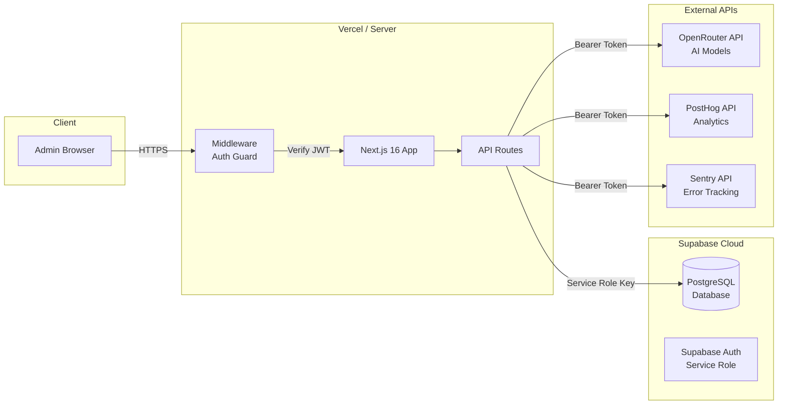
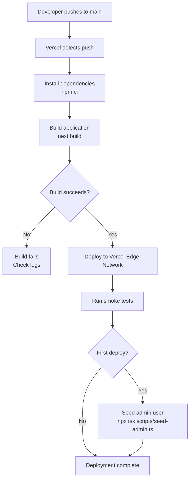

# Deployment Guide

This document covers deploying the ChainLinked Admin Dashboard to production. The application is a Next.js 16 admin panel backed by Supabase, with optional integrations for OpenRouter, PostHog, and Sentry.

---

## Prerequisites

- **Node.js 20+** (LTS recommended; Next.js 16 requires Node 18.18 minimum)
- **npm** (included with Node.js)
- **Supabase project** with the required tables created (see [Database Setup](#database-setup))
- **Domain name** (optional, but required for production HTTPS cookies)
- **OpenRouter account** (optional -- enables AI content analysis and cost tracking)
- **PostHog account** (optional -- enables usage analytics and session recordings)
- **Sentry account** (optional -- enables error monitoring)

---

## Deployment Architecture



---

## Environment Configuration

All environment variables used by the application:

| Variable | Required | Description | Example |
|---|---|---|---|
| `NEXT_PUBLIC_SUPABASE_URL` | **Yes** | Supabase project URL | `https://abcdefgh.supabase.co` |
| `SUPABASE_SERVICE_ROLE_KEY` | **Yes** | Supabase service role key (full access, keep secret) | `eyJhbGciOi...` |
| `ADMIN_JWT_SECRET` | **Yes (prod)** | Secret for signing admin session JWTs. If unset, auth is bypassed (dev only). | `a-random-64-char-string` |
| `OPENROUTER_API_KEY` | No | OpenRouter API key for AI content analysis and cost dashboards | `sk-or-v1-...` |
| `POSTHOG_API_KEY` | No | PostHog personal API key (server-side queries) | `phx_...` |
| `POSTHOG_PROJECT_ID` | No | PostHog project ID for server-side queries | `12345` |
| `POSTHOG_DASHBOARD_URL` | No | URL to external PostHog dashboard (linked from admin UI) | `https://us.posthog.com/project/12345/dashboard` |
| `NEXT_PUBLIC_POSTHOG_KEY` | No | PostHog project API key (client-side analytics) | `phc_...` |
| `NEXT_PUBLIC_POSTHOG_HOST` | No | PostHog ingest host (defaults to `https://us.i.posthog.com`) | `https://us.i.posthog.com` |
| `SENTRY_API_TOKEN` | No | Sentry API bearer token for fetching issues | `sntrys_...` |
| `SENTRY_ORG` | No | Sentry organization slug | `my-org` |
| `SENTRY_PROJECT` | No | Sentry project slug | `chainlinked` |
| `NODE_ENV` | Auto | Set automatically by platform; affects cookie security and debug output | `production` |

> **Security note:** `ADMIN_JWT_SECRET` **must** be set in production. When it is unset, the middleware bypasses authentication entirely -- this is intentional for local development only.

---

## Deploying to Vercel (Recommended)

Vercel is the recommended platform for Next.js applications.

### Step 1: Push to GitHub

```bash
git remote add origin https://github.com/your-org/chainlinked-admin.git
git push -u origin main
```

### Step 2: Connect repo to Vercel

1. Go to [vercel.com/new](https://vercel.com/new)
2. Import your GitHub repository
3. Select the repository and click **Import**

### Step 3: Configure environment variables

In the Vercel project settings (**Settings > Environment Variables**), add:

- `NEXT_PUBLIC_SUPABASE_URL` -- your Supabase project URL
- `SUPABASE_SERVICE_ROLE_KEY` -- your Supabase service role key
- `ADMIN_JWT_SECRET` -- generate with `openssl rand -base64 48`

Add optional integrations as needed (OpenRouter, PostHog, Sentry keys).

> Mark `SUPABASE_SERVICE_ROLE_KEY`, `ADMIN_JWT_SECRET`, and all API tokens as **Sensitive** in Vercel to prevent them from appearing in build logs.

### Step 4: Set Node.js version

In **Settings > General**, set the Node.js version to **20.x** (or 18.x minimum).

### Step 5: Deploy

Vercel will build and deploy automatically on push. The build command is:

```bash
npm run build    # runs: next build
```

The start command for the production server (handled by Vercel automatically):

```bash
npm run start    # runs: next start
```

### Step 6: Post-deployment -- seed admin user

After the first deploy, create your admin login. Run this locally with your production environment variables:

```bash
NEXT_PUBLIC_SUPABASE_URL="https://abcdefgh.supabase.co" \
SUPABASE_SERVICE_ROLE_KEY="your-service-role-key" \
npx tsx scripts/seed-admin.ts admin yourpassword
```

This inserts a row into the `admin_users` table with a bcrypt-hashed password.

---

## Deploying to Other Platforms

### Docker

Sample `Dockerfile`:

```dockerfile
FROM node:20-alpine AS base

# Install dependencies
FROM base AS deps
WORKDIR /app
COPY package.json package-lock.json* ./
RUN npm ci --ignore-scripts

# Build the application
FROM base AS builder
WORKDIR /app
COPY --from=deps /app/node_modules ./node_modules
COPY . .
RUN npm run build

# Production image
FROM base AS runner
WORKDIR /app
ENV NODE_ENV=production

RUN addgroup --system --gid 1001 nodejs
RUN adduser --system --uid 1001 nextjs

COPY --from=builder /app/public ./public
COPY --from=builder --chown=nextjs:nodejs /app/.next/standalone ./
COPY --from=builder --chown=nextjs:nodejs /app/.next/static ./.next/static

USER nextjs
EXPOSE 3000
ENV PORT=3000
ENV HOSTNAME="0.0.0.0"

CMD ["node", "server.js"]
```

> **Note:** To use standalone output, add `output: "standalone"` to `next.config.ts`:
>
> ```ts
> const nextConfig: NextConfig = {
>   output: "standalone",
> };
> ```

Build and run:

```bash
docker build -t chainlinked-admin .
docker run -p 3000:3000 \
  -e NEXT_PUBLIC_SUPABASE_URL="https://abcdefgh.supabase.co" \
  -e SUPABASE_SERVICE_ROLE_KEY="your-key" \
  -e ADMIN_JWT_SECRET="your-secret" \
  chainlinked-admin
```

### Self-Hosted (Node.js)

```bash
# Clone and install
git clone https://github.com/your-org/chainlinked-admin.git
cd chainlinked-admin
npm ci

# Create .env.local with your variables
cat > .env.local << 'EOF'
NEXT_PUBLIC_SUPABASE_URL=https://abcdefgh.supabase.co
SUPABASE_SERVICE_ROLE_KEY=your-service-role-key
ADMIN_JWT_SECRET=your-jwt-secret
EOF

# Build and start
npm run build
npm run start
```

For production, use a process manager like **pm2**:

```bash
npm install -g pm2
pm2 start npm --name "chainlinked-admin" -- start
pm2 save
pm2 startup
```

### Railway

1. Connect your GitHub repo at [railway.app](https://railway.app)
2. Add environment variables in the Railway dashboard
3. Railway auto-detects Next.js and deploys with `npm run build` and `npm run start`
4. Set the `PORT` variable if Railway does not assign one automatically

### Render

1. Create a new **Web Service** at [render.com](https://render.com)
2. Connect your GitHub repo
3. Set **Build Command** to `npm ci && npm run build`
4. Set **Start Command** to `npm run start`
5. Add environment variables in the Render dashboard
6. Select Node.js 20 runtime

### Fly.io

1. Install the Fly CLI: `curl -L https://fly.io/install.sh | sh`
2. Initialize: `fly launch` (select region, configure settings)
3. Set secrets:

```bash
fly secrets set NEXT_PUBLIC_SUPABASE_URL="https://abcdefgh.supabase.co"
fly secrets set SUPABASE_SERVICE_ROLE_KEY="your-key"
fly secrets set ADMIN_JWT_SECRET="your-secret"
```

4. Deploy: `fly deploy`

---

## Database Setup

### 1. Create a Supabase project

Go to [supabase.com](https://supabase.com) and create a new project. Note the project URL and service role key from **Settings > API**.

### 2. Required tables

The admin dashboard reads from the following Supabase tables. These are typically created by the main ChainLinked application, not the admin dashboard itself.

| Table | Purpose |
|---|---|
| `admin_users` | Admin login credentials (username, password_hash) |
| `profiles` | User profiles (full_name, email, onboarding_completed, etc.) |
| `generated_posts` | AI-generated LinkedIn posts |
| `scheduled_posts` | Posts scheduled for publishing |
| `my_posts` | User-saved posts |
| `templates` | Post templates |
| `teams` | Team records |
| `team_members` | Team membership associations |
| `companies` | Company records |
| `compose_conversations` | AI compose chat conversations |
| `prompt_usage_logs` | Token usage and cost tracking per AI call |
| `system_prompts` | Configurable system prompts |
| `sidebar_sections` | Feature flags / sidebar section configuration |
| `linkedin_tokens` | LinkedIn OAuth tokens |
| `generated_suggestions` | AI-generated content suggestions |
| `swipe_wishlist` | Swipe-saved content |
| `post_analytics` | LinkedIn post performance metrics |
| `post_analytics_accumulative` | Accumulated post analytics |
| `profile_analytics_accumulative` | Accumulated profile analytics |
| `company_context` | Company context generation jobs |
| `research_sessions` | Research session job records |
| `suggestion_generation_runs` | Suggestion generation job records |

#### Minimal SQL for the admin_users table

If you are setting up the admin dashboard independently:

```sql
CREATE TABLE admin_users (
  id UUID DEFAULT gen_random_uuid() PRIMARY KEY,
  username TEXT UNIQUE NOT NULL,
  password_hash TEXT NOT NULL,
  last_login TIMESTAMPTZ,
  created_at TIMESTAMPTZ DEFAULT now()
);

-- Enable RLS (but admin dashboard uses service role key, which bypasses RLS)
ALTER TABLE admin_users ENABLE ROW LEVEL SECURITY;
```

### 3. Row Level Security (RLS)

The admin dashboard connects using the **Supabase service role key**, which bypasses RLS entirely. This means:

- RLS policies on the above tables do not affect the admin dashboard
- The service role key grants full read/write access to all tables
- Keep the service role key strictly server-side and never expose it to the client

### 4. Seed admin user

```bash
NEXT_PUBLIC_SUPABASE_URL="https://your-project.supabase.co" \
SUPABASE_SERVICE_ROLE_KEY="your-service-role-key" \
npx tsx scripts/seed-admin.ts <username> <password>
```

---

## Deployment Pipeline Flow



---

## Post-Deployment Checklist

- [ ] All required env vars set (`NEXT_PUBLIC_SUPABASE_URL`, `SUPABASE_SERVICE_ROLE_KEY`, `ADMIN_JWT_SECRET`)
- [ ] Admin user seeded via `scripts/seed-admin.ts`
- [ ] Login works at `/login` and redirects to `/dashboard`
- [ ] Dashboard loads with real data from Supabase
- [ ] Users page lists profiles from the database
- [ ] Optional: OpenRouter integration shows AI costs (if `OPENROUTER_API_KEY` set)
- [ ] Optional: PostHog analytics page loads data (if `POSTHOG_API_KEY` and `POSTHOG_PROJECT_ID` set)
- [ ] Optional: Sentry errors page fetches issues (if `SENTRY_API_TOKEN`, `SENTRY_ORG`, `SENTRY_PROJECT` set)
- [ ] Cookie is set as `Secure` and `HttpOnly` (verify in browser DevTools)

---

## Security Considerations

### Authentication

- **`ADMIN_JWT_SECRET` must be set in production.** When unset, the middleware at `middleware.ts` bypasses authentication entirely (line 12-14). This is a development convenience that becomes a critical vulnerability if left unset in production.
- JWTs are signed with HS256 and expire after 24 hours.
- Generate a strong secret: `openssl rand -base64 48`

### Supabase Service Role Key

- The service role key bypasses all RLS policies and has full database access.
- It is used server-side only (`lib/supabase/client.ts`), never exposed to the browser.
- Never commit it to version control (`.env*` files are gitignored).

### Cookies

- Session cookies are set with `httpOnly: true`, `sameSite: "lax"`, and `path: "/"`.
- The `secure` flag is set when `NODE_ENV === "production"`, which means cookies require HTTPS.
- Custom domains on Vercel get automatic HTTPS via Let's Encrypt.

### Rate Limiting

- Rate limiting (if implemented) is in-memory and resets on every redeploy or serverless cold start.
- For persistent rate limiting, consider an external store (Redis, Upstash).

### Secrets Management

- All `.env*` files are in `.gitignore` -- never commit secrets.
- Use your platform's secrets management (Vercel Environment Variables, Railway Variables, Docker secrets).

---

## Monitoring and Maintenance

### PostHog (Usage Analytics)

- Server-side queries via `POSTHOG_API_KEY` and `POSTHOG_PROJECT_ID` power the analytics pages.
- Client-side tracking via `NEXT_PUBLIC_POSTHOG_KEY` captures page views and events in the admin UI itself.
- Dashboard URL can be linked via `POSTHOG_DASHBOARD_URL`.

### Sentry (Error Monitoring)

- The admin dashboard fetches Sentry issues via the Sentry API (`/api/admin/sentry/issues`).
- Requires `SENTRY_API_TOKEN`, `SENTRY_ORG`, and `SENTRY_PROJECT` to be configured.
- View unresolved errors directly in the admin dashboard under **System > Errors**.

### Supabase Dashboard

- Monitor database health, table sizes, and query performance at [supabase.com/dashboard](https://supabase.com/dashboard).
- Check connection pool usage if the dashboard becomes slow.

### OpenRouter

- AI cost and usage data is displayed in the admin dashboard under **Analytics > Costs**.
- Monitor credit balance and rate limits via `OPENROUTER_API_KEY`.

### CI/CD

- No CI/CD pipeline is configured in the repository yet.
- Vercel provides automatic deployments on push to the connected branch.
- Consider adding linting and type-checking to a CI pipeline: `npm run lint && npx tsc --noEmit`.

---

## Troubleshooting

### "Unauthorized" or redirect loop on login

- Verify `ADMIN_JWT_SECRET` is set and matches between build time and runtime.
- Ensure the admin user exists in the `admin_users` table (re-run the seed script).
- Check that cookies are being set (requires HTTPS in production, or `secure: false` in development).

### Dashboard shows no data

- Confirm `NEXT_PUBLIC_SUPABASE_URL` and `SUPABASE_SERVICE_ROLE_KEY` are correct.
- Test the service role key in the Supabase SQL editor or via `curl`.
- Ensure the expected tables exist and contain data.

### Build fails on Vercel

- Check the Node.js version is 20.x (or at minimum 18.18).
- Run `npm run build` locally with the same environment variables to reproduce.
- Review Vercel build logs for TypeScript or dependency errors.

### OpenRouter / PostHog / Sentry pages show "not configured"

- These integrations are optional. The dashboard gracefully handles missing API keys by returning `null` and showing appropriate messages.
- Double-check that the environment variables are set in the deployment platform (not just locally).

### Cookies not persisting (login works but next page load redirects to login)

- Ensure the domain is served over HTTPS in production (`secure` flag on cookies).
- Check for reverse proxy or CDN stripping `Set-Cookie` headers.
- Verify `sameSite` and `path` cookie attributes are compatible with your domain setup.

### Rate limiting resets on redeploy

- In-memory rate limiting does not persist across serverless function invocations or deploys.
- For durable rate limiting, integrate Redis or Upstash and replace the in-memory store.

### Seed script fails with "Failed to create admin"

- Verify `NEXT_PUBLIC_SUPABASE_URL` and `SUPABASE_SERVICE_ROLE_KEY` are exported in your shell.
- Check that the `admin_users` table exists in your Supabase project.
- If the error mentions a unique constraint, the username already exists.
