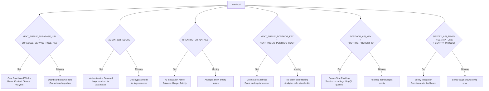

# Environment Setup Guide

This guide walks you through setting up the ChainLinked Admin Dashboard for local development. It assumes you are starting from scratch on a fresh machine.

---

## Quick Start

If you already know your way around Node.js projects, here is the condensed version:

```bash
git clone <repo>
cd chainlinked-admin1
npm install
cp .env.local.example .env.local
# Edit .env.local with your Supabase credentials and secrets
npx tsx scripts/seed-admin.ts admin password123
npm run dev
```

Then open [http://localhost:3000](http://localhost:3000) and log in.

---

## Prerequisites

Before you begin, make sure you have the following installed:

| Tool | Minimum Version | How to Check | Install Link |
|------|----------------|--------------|--------------|
| Node.js | 18+ | `node --version` | [nodejs.org](https://nodejs.org) |
| npm | Comes with Node.js | `npm --version` | Included with Node.js |
| Git | Any recent version | `git --version` | [git-scm.com](https://git-scm.com) |

You will also need:

- A **Supabase** account and project (free tier works). Sign up at [supabase.com](https://supabase.com).
- Optionally, accounts for **OpenRouter**, **PostHog**, and/or **Sentry** if you want those integrations.

---

## Step-by-Step Setup

### 1. Clone and Install

Open your terminal and run:

```bash
git clone <repo-url>
cd chainlinked-admin1
```

Install all dependencies:

```bash
npm install
```

This reads `package.json` and installs everything the project needs, including Next.js 16, React 19, Supabase client, Tailwind CSS 4, shadcn/ui components, and more. It may take a minute or two.

---

### 2. Environment Variables

Create a file called `.env.local` in the project root. This file holds secrets and configuration that should never be committed to Git (it is already listed in `.gitignore`).

If an `.env.local.example` file exists, copy it:

```bash
cp .env.local.example .env.local
```

Otherwise, create `.env.local` from scratch and add the variables below.

#### Required Variables

These three variables are needed for the application to start and authenticate:

| Variable | Description | How to Get It | Example Value |
|----------|-------------|---------------|---------------|
| `NEXT_PUBLIC_SUPABASE_URL` | The URL of your Supabase project. Used by both the browser and the server. | Go to your Supabase dashboard, click **Settings** (gear icon in the sidebar), then **API**. Copy the **Project URL** at the top. | `https://abcdefghij.supabase.co` |
| `SUPABASE_SERVICE_ROLE_KEY` | The service role key for server-side Supabase access. This key bypasses Row Level Security, so keep it secret. | Same page as above: **Settings > API**. Scroll down to **Project API keys** and copy the **service_role** key (click "Reveal" first). | `eyJhbGciOiJIUzI1NiIs...` (long JWT string) |
| `ADMIN_JWT_SECRET` | A random secret string (32+ characters) used to sign admin session tokens. | Generate one by running: `openssl rand -hex 32` in your terminal. Or use any password generator to create a random 64-character hex string. | `a1b2c3d4e5f6...` (64 hex characters) |

**Important note about `ADMIN_JWT_SECRET`:** If this variable is **not set**, the middleware skips authentication entirely. This is a deliberate dev-mode bypass so you can explore the dashboard without logging in. For any real deployment, always set this variable.

Your minimal `.env.local` file looks like this:

```env
NEXT_PUBLIC_SUPABASE_URL=https://your-project-id.supabase.co
SUPABASE_SERVICE_ROLE_KEY=eyJhbGciOiJIUzI1NiIs...your-service-role-key
ADMIN_JWT_SECRET=your-random-64-character-hex-string
```

#### Optional: AI Integration

These variables enable the OpenRouter AI cost and usage monitoring pages.

| Variable | Description | How to Get It | Example Value |
|----------|-------------|---------------|---------------|
| `OPENROUTER_API_KEY` | API key for OpenRouter. Enables the AI costs dashboard, balance monitoring, and activity tracking. | Sign up at [openrouter.ai](https://openrouter.ai), go to **Keys** in your account, and click **Create Key**. | `sk-or-v1-abc123...` |

#### Optional: Analytics (PostHog)

These variables enable the PostHog analytics integration, including session recordings and user behavior tracking.

| Variable | Description | How to Get It | Example Value |
|----------|-------------|---------------|---------------|
| `NEXT_PUBLIC_POSTHOG_KEY` | The project API key for the PostHog JavaScript SDK (client-side tracking). | Log in to PostHog, go to **Project Settings**, and copy the **Project API Key**. | `phc_abc123...` |
| `NEXT_PUBLIC_POSTHOG_HOST` | The PostHog ingestion host. Depends on your PostHog region. | Use `https://us.i.posthog.com` for US Cloud or `https://eu.i.posthog.com` for EU Cloud. | `https://us.i.posthog.com` |
| `POSTHOG_API_KEY` | A personal API key for server-side PostHog queries (HogQL queries, session recordings list). | In PostHog, go to **Settings > Personal API Keys** and create one. | `phx_abc123...` |
| `POSTHOG_PROJECT_ID` | Your PostHog project's numeric ID. Used for server-side API calls. | In PostHog, go to **Settings** and find the **Project ID** (a number). | `12345` |

#### Optional: Error Tracking (Sentry)

These variables enable the Sentry error tracking integration, which shows unresolved issues in the admin dashboard.

| Variable | Description | How to Get It | Example Value |
|----------|-------------|---------------|---------------|
| `SENTRY_API_TOKEN` | An auth token for the Sentry API. | In Sentry, go to **Settings > Auth Tokens** and create a new token with `project:read` scope. | `sntrys_eyJp...` |
| `SENTRY_ORG` | Your Sentry organization slug. | Go to **Organization Settings** in Sentry. The slug is shown in the URL and on the settings page. | `my-org` |
| `SENTRY_PROJECT` | Your Sentry project slug. | Go to **Project Settings** in Sentry. The slug appears in the URL. | `chainlinked-web` |

---

### 3. Database Setup

The admin dashboard reads from tables in your Supabase project. There are no local migration files -- the tables are managed by the main ChainLinked application.

#### Required Table

The seed script (Step 4) writes to this table, so it must exist before you can create an admin user:

| Table | Purpose |
|-------|---------|
| `admin_users` | Stores admin dashboard login credentials (username + bcrypt password hash) |

#### Tables Read by the Dashboard

The admin dashboard reads from these tables (they are created and populated by the main ChainLinked app):

| Table | Used For |
|-------|----------|
| `profiles` | User list, user details, onboarding funnel, dashboard counts |
| `generated_posts` | Content management, AI activity stats, dashboard metrics |
| `scheduled_posts` | Scheduled content list, publishing stats |
| `my_posts` | User content library counts |
| `templates` | Template management page |
| `teams` | Team list and team detail pages |
| `team_members` | Team membership and member counts |
| `companies` | Dashboard company count |
| `linkedin_tokens` | Onboarding funnel (LinkedIn connection step) |
| `prompt_usage_logs` | AI token usage, cost analytics, performance metrics |
| `compose_conversations` | AI conversation history |
| `system_prompts` | AI performance -- prompt management |
| `sidebar_sections` | Feature flags and sidebar configuration |
| `company_context` | Background job monitoring |
| `research_sessions` | Background job monitoring |
| `suggestion_generation_runs` | Background job monitoring |
| `generated_suggestions` | Dashboard suggestion counts |
| `swipe_wishlist` | Dashboard wishlist counts |
| `post_analytics` | LinkedIn analytics page |
| `post_analytics_accumulative` | LinkedIn analytics aggregations |
| `profile_analytics_accumulative` | LinkedIn profile-level analytics |

If you are setting up a fresh Supabase project just for the admin dashboard, you only need the `admin_users` table initially. Create it in the Supabase SQL Editor:

```sql
CREATE TABLE admin_users (
  id UUID DEFAULT gen_random_uuid() PRIMARY KEY,
  username TEXT UNIQUE NOT NULL,
  password_hash TEXT NOT NULL,
  created_at TIMESTAMPTZ DEFAULT now(),
  last_login TIMESTAMPTZ
);
```

The other tables will show empty states in the dashboard until the main application creates and populates them.

---

### 4. Create Admin User

Run the seed script to create your first admin account. Make sure your `.env.local` file has the Supabase variables set (the script reads them):

```bash
npx tsx scripts/seed-admin.ts <username> <password>
```

For example:

```bash
npx tsx scripts/seed-admin.ts admin password123
```

You should see:

```
Admin user "admin" created successfully.
```

If you see an error like "Failed to create admin," double-check that:
- Your `NEXT_PUBLIC_SUPABASE_URL` and `SUPABASE_SERVICE_ROLE_KEY` are correct
- The `admin_users` table exists in your Supabase project
- The username is not already taken

---

### 5. Start Development Server

```bash
npm run dev
```

The server starts on [http://localhost:3000](http://localhost:3000) by default. You should see output like:

```
  - Local:        http://localhost:3000
  - Network:      http://192.168.x.x:3000
```

---

### 6. Verify Setup

1. **Open** [http://localhost:3000](http://localhost:3000) in your browser. You should see the login page.
2. **Log in** using the admin credentials you created in Step 4 (e.g., `admin` / `password123`).
3. After logging in, you should land on the **Dashboard** page showing metric cards (users, posts, teams, etc.). If the database tables are empty, the counts will be zero -- that is expected.
4. Check the **Settings** page (gear icon in the sidebar) to see which integrations are connected. Green indicators mean the integration is configured; gray means the environment variable is missing.

---

## Development Mode Features

- **Auth bypass:** When `ADMIN_JWT_SECRET` is not set in `.env.local`, the middleware does not enforce authentication on `/dashboard/*` routes. This lets you browse the dashboard without logging in during local development.
- **Hot Module Replacement (HMR):** Next.js automatically reloads pages when you save changes to source files.
- **TypeScript type checking:** Strict mode is enabled. The editor will show type errors inline if you use a TypeScript-aware IDE.
- **Fallback Supabase URL:** If `NEXT_PUBLIC_SUPABASE_URL` is not set, the client defaults to `http://localhost:54321` (the local Supabase CLI address).

---

## IDE Setup

### VS Code (Recommended)

Install these extensions for the best experience:

| Extension | Purpose |
|-----------|---------|
| **ESLint** (`dbaeumer.vscode-eslint`) | Shows linting errors inline. The project uses ESLint 9 flat config with Next.js core-web-vitals and TypeScript rules. |
| **Tailwind CSS IntelliSense** (`bradlc.vscode-tailwindcss`) | Autocomplete for Tailwind CSS 4 classes. Hover previews for colors and spacing. |
| **TypeScript and JavaScript** (built-in) | TypeScript 5 support is built into VS Code. No extra extension needed. |

### Path Aliases

The project uses a TypeScript path alias: `@/*` maps to the project root. For example:

```typescript
import { supabaseAdmin } from "@/lib/supabase/client"
// resolves to ./lib/supabase/client.ts
```

This is configured in `tsconfig.json` under `compilerOptions.paths`.

---

## Available Scripts

All scripts are defined in `package.json` and run with `npm run <script>`:

| Script | Command | Description |
|--------|---------|-------------|
| `dev` | `next dev` | Start the development server with HMR on `http://localhost:3000` |
| `build` | `next build` | Create an optimized production build in the `.next` directory |
| `start` | `next start` | Start the production server (run `build` first) |
| `lint` | `eslint` | Run ESLint across the project to check for code quality issues |

Additionally, you can run the admin seeding script directly:

```bash
npx tsx scripts/seed-admin.ts <username> <password>
```

---

## Configuration Files

| File | Purpose |
|------|---------|
| `package.json` | Project metadata, dependencies, and npm scripts |
| `next.config.ts` | Next.js 16 configuration (currently default/empty) |
| `tsconfig.json` | TypeScript compiler options -- strict mode, path aliases (`@/*`), bundler module resolution |
| `components.json` | shadcn/ui configuration -- radix-nova style, component aliases, Tailwind CSS settings |
| `postcss.config.mjs` | PostCSS configuration -- uses `@tailwindcss/postcss` plugin for Tailwind CSS 4 |
| `eslint.config.mjs` | ESLint 9 flat config -- extends Next.js core-web-vitals and TypeScript rules |
| `.gitignore` | Files excluded from Git -- node_modules, .next, .env files, build artifacts |
| `middleware.ts` | Next.js middleware -- protects `/dashboard/*` routes with JWT authentication |
| `app/layout.tsx` | Root layout -- Geist fonts, ThemeProvider, HTML structure |
| `app/globals.css` | Global styles -- Tailwind CSS 4 imports, CSS custom properties for theming |

---

## Environment Variable Flowchart

This diagram shows which features are enabled based on which environment variables are set:



---

## Troubleshooting

### "Module not found" errors after cloning

You probably need to install dependencies:

```bash
npm install
```

If the error persists, delete `node_modules` and reinstall:

```bash
rm -rf node_modules
npm install
```

### "Cannot connect to Supabase" or data not loading

- Verify `NEXT_PUBLIC_SUPABASE_URL` is correct. It should look like `https://abcdefghij.supabase.co` (no trailing slash).
- Verify `SUPABASE_SERVICE_ROLE_KEY` is the **service_role** key (not the `anon` key). The service role key is longer and starts with `eyJ...`.
- Make sure there are no extra spaces or quotes around the values in `.env.local`.
- Restart the dev server after changing `.env.local` -- environment variables are read at startup.

### Login not working

- If you see the login page but credentials are rejected: make sure you ran the seed script (`npx tsx scripts/seed-admin.ts`) and that it completed successfully.
- If you cannot reach the login page at all: check that the dev server is running (`npm run dev`).
- **Dev bypass tip:** If `ADMIN_JWT_SECRET` is not set in `.env.local`, authentication is skipped entirely. You can navigate directly to [http://localhost:3000/dashboard](http://localhost:3000/dashboard) without logging in. This is useful for quick testing.

### PostHog or Sentry pages show "configuration missing"

These integrations require their respective environment variables to be set. See the Optional sections above. The pages will show an error message or empty state until you provide valid credentials.

### Build errors or type errors

- Check your Node.js version: `node --version`. You need Node.js 18 or later.
- Run the linter to see if there are code issues: `npm run lint`.
- Make sure TypeScript is happy: `npx tsc --noEmit`.

### Port 3000 already in use

Another process is using port 3000. Either stop that process or start the dev server on a different port:

```bash
npm run dev -- -p 3001
```

### Environment variables not taking effect

After editing `.env.local`, you must restart the development server. Press `Ctrl+C` in the terminal where the server is running, then run `npm run dev` again.

Note that variables prefixed with `NEXT_PUBLIC_` are embedded into the client-side JavaScript bundle at build time. For the `dev` server, they are re-read on each request, but for `build`/`start`, you must rebuild after changing them.
