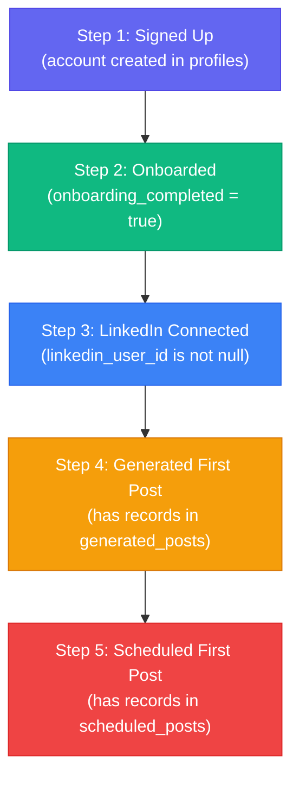
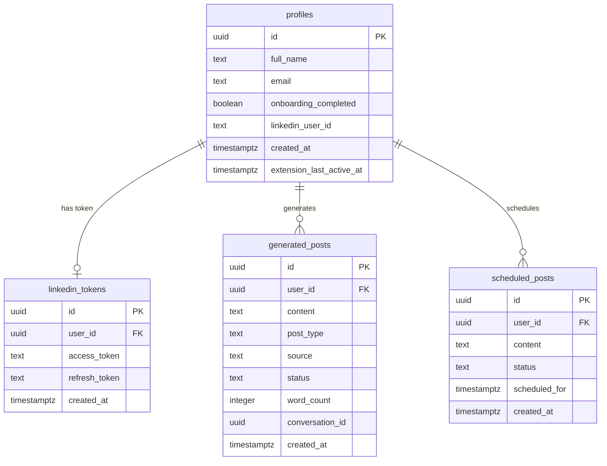
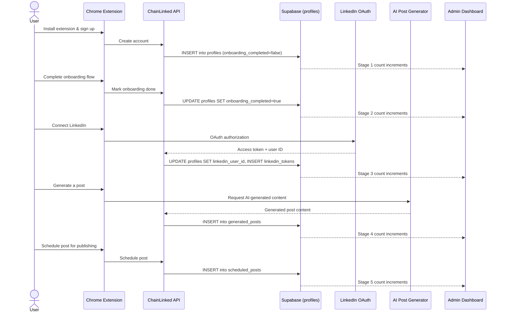

# Onboarding Flow

## Overview

The ChainLinked platform has a multi-step onboarding flow for users. The admin dashboard tracks and visualizes this flow to identify drop-off points and optimize user activation.

The funnel tracks five core stages from initial signup through first scheduled post, plus an "Active (7d)" engagement metric. Each stage is defined by concrete database state, making the funnel deterministic and auditable.

## Onboarding Funnel Diagram

## Funnel Stages

### Stage 1: User Signup

- User creates account via the Chrome extension
- A record is created in the `profiles` table
- `created_at` timestamp is recorded
- `onboarding_completed` defaults to `false`
- `linkedin_user_id` defaults to `null`

### Stage 2: Onboarding Completion

- User completes the platform onboarding flow inside the extension
- `onboarding_completed` is set to `true` on their profile
- Tracked in admin via: Users page filter (All Onboarding / Complete / Incomplete)
- The onboarding funnel page shows the count and percentage who reach this step

### Stage 3: LinkedIn Connection

- User connects their LinkedIn account via OAuth
- `linkedin_user_id` is populated on the `profiles` row
- A corresponding record is created in the `linkedin_tokens` table (stores access/refresh tokens)
- Tracked in admin via: Users page filter (All LinkedIn / Connected / Not Connected)

### Stage 4: First Post Generated

- User generates their first AI-written LinkedIn post
- A record is created in the `generated_posts` table with the user's `user_id`
- The funnel counts distinct `user_id` values, so multiple posts by the same user count once
- Tracked in admin via: Content section (Generated Posts)

### Stage 5: First Post Scheduled

- User schedules a post for LinkedIn publishing
- A record is created in the `scheduled_posts` table with the user's `user_id`
- Again counted by distinct `user_id` for funnel purposes
- Tracked in admin via: Content section (Scheduled Posts)

### Bonus Metric: Active (7d)

- The onboarding analytics page includes a sixth bar: users who generated a post in the last 7 days
- This measures ongoing engagement beyond initial activation
- Computed from `generated_posts` rows with `created_at >= 7 days ago`

## Admin Dashboard Monitoring

### Dashboard Overview Funnel Snapshot

Located on the main dashboard page (`/dashboard`), the `getOnboardingSnapshot()` function renders a mini bar chart showing:

- Count at each of the five core stages (Signed Up, Onboarded, LinkedIn, Generated, Scheduled)
- Visual bars sized proportionally to percentage of total users
- Color coding: green (>=70%), muted (>=30%), red (<30%)
- Clicking the card navigates to the full onboarding analytics page

### Onboarding Analytics Page (`/dashboard/users/onboarding`)

The dedicated funnel page provides:

- **Summary metric cards**: Overall conversion rate (signup to active), biggest drop-off step, average steps completed per user
- **Full funnel visualization**: Tapered bar chart where each step narrows based on its percentage; between each step, the step-to-step conversion rate and absolute drop count are displayed
- **Onboarding timeline**: The 10 most recent signups shown as a vertical timeline, each annotated with badges for completed steps (Signed Up, Onboarded, LinkedIn, Generated, Scheduled) and a count of remaining steps

### User List Filters (`/dashboard/users`)

The `UsersTable` component provides client-side filtering:

- **Onboarding status**: All Onboarding / Complete / Incomplete -- filters on `onboarding_completed` boolean
- **LinkedIn status**: All LinkedIn / Connected / Not Connected -- filters on `linkedin_user_id` presence
- **Search**: Filter by name or email
- **Sort**: By name, signup date, or post count
- **Export**: CSV download of the filtered user list with onboarding and LinkedIn columns

### User Detail Page (`/dashboard/users/[id]`)

Each user's detail page shows:

- **Onboarding status badge**: "Onboarding complete" (green) or "Onboarding incomplete" (gray)
- **LinkedIn connection badge**: "LinkedIn connected" (green) or "LinkedIn not connected" (outline)
- **Activity metrics**: Posts generated count, posts published count, templates count, token usage
- **Feature usage breakdown**: Posts by source (direct, chat, etc.) and by post type
- **Recent generated posts table**: Last 10 posts with content preview, source, type, status, word count, date
- **Recent scheduled posts table**: Status, scheduled date, creation date

## Data Model

## User Journey Sequence Diagram

## Metrics Tracked

| Metric | Description | Source |
|--------|-------------|--------|
| Total users at each stage | Distinct user count who reached each funnel step | `profiles`, `linkedin_tokens`, `generated_posts`, `scheduled_posts` |
| Stage-to-stage conversion rate | Percentage of users who proceed from one step to the next | Computed as `step[n].count / step[n-1].count * 100` |
| Drop-off rate per stage | Users lost between consecutive steps | `step[n-1].count - step[n].count` |
| Biggest drop-off | The step with the largest percentage drop | Calculated across all stage transitions |
| Average steps completed | Weighted average of how far users progress | Sum of all stage counts / total users |
| Overall conversion | Percentage reaching the final tracked stage | Last step count / first step count |
| Active users (7d) | Users who generated a post in the last 7 days | `generated_posts` with `created_at >= now - 7 days` |
| User retention (week over week) | Users active in both the current and previous 7-day windows | Intersection of weekly active user sets |

## Funnel Optimization

Admins can use the onboarding data to:

- **Identify bottleneck stages**: The "Biggest Drop-off" metric card immediately highlights where users are getting stuck. Low conversion between "Onboarded" and "LinkedIn Connected" might indicate OAuth friction; low conversion from "LinkedIn Connected" to "Generated" might indicate the AI features are not discoverable enough.
- **Target users stuck at specific steps**: Use the Users page filters to isolate, for example, all users who completed onboarding but have not connected LinkedIn. The CSV export allows sending targeted outreach to these cohorts.
- **Measure impact of platform changes**: After shipping improvements to a specific step (e.g., simplifying LinkedIn OAuth), monitor the conversion rate between the relevant stages over subsequent days.
- **Track cohort progression over time**: The onboarding timeline shows the most recent signups and how far each has progressed, providing a real-time view of whether new users are activating faster than older cohorts.
- **Monitor retention alongside activation**: The dashboard tracks week-over-week retention (users active in both the current and prior 7-day windows), connecting onboarding completion to sustained engagement.
