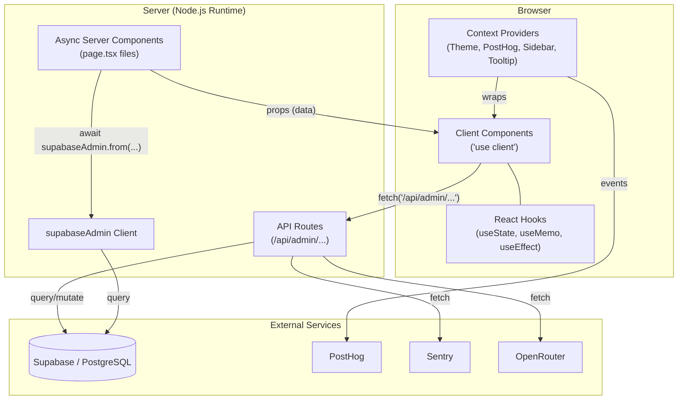
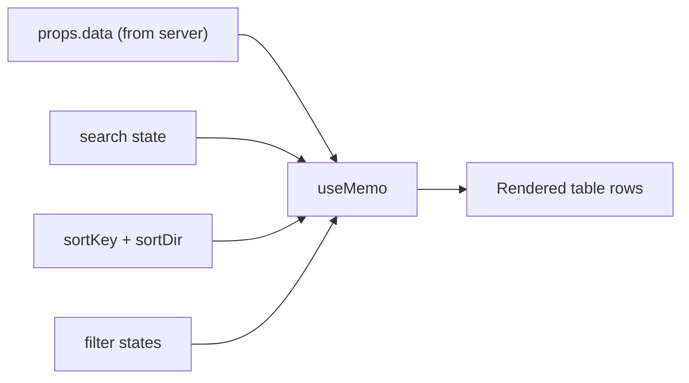
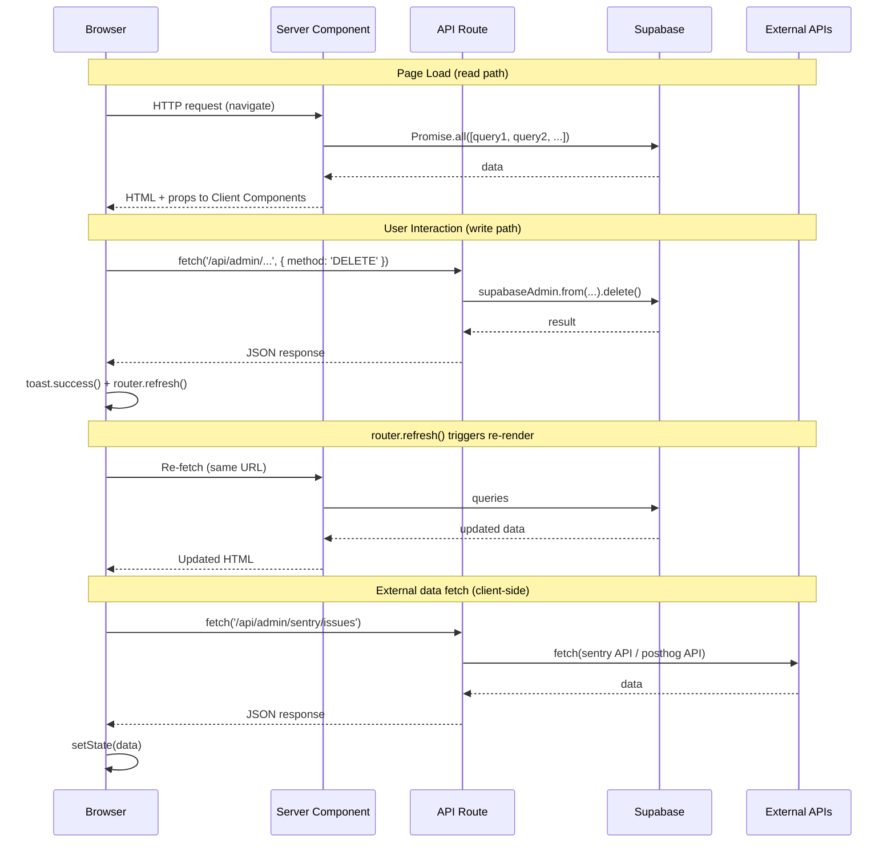
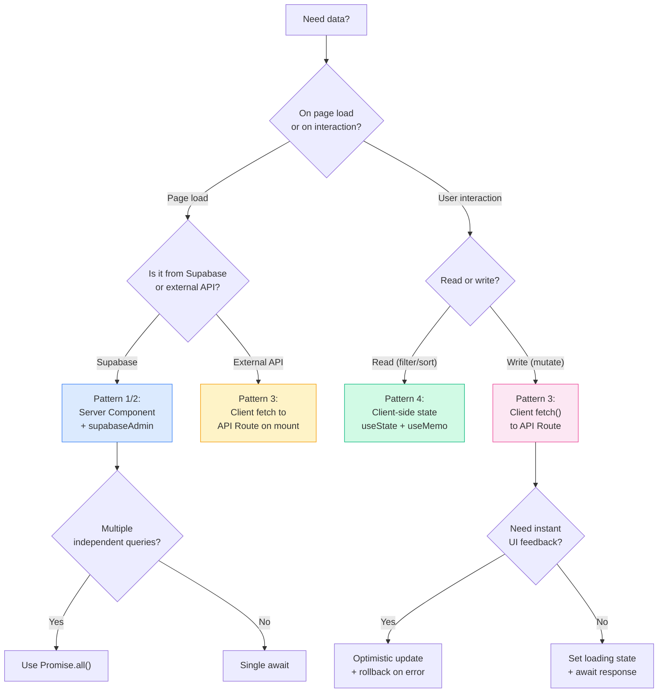

# State Management & Data Fetching

## Overview

- **No external state management library** -- no Redux, Zustand, Jotai, or similar
- **React hooks** (`useState`, `useMemo`, `useEffect`, `useCallback`) for all local component state
- **Server Components** (async functions) for data fetching at the page level
- **Context providers** for global cross-cutting concerns (theme, analytics, sidebar, tooltips)
- **API Routes** (`/api/admin/...`) for all mutations from client components
- **Supabase Admin Client** (`supabaseAdmin`) as the single data access layer on the server

## Architecture Diagram



## Data Fetching Patterns

### Pattern 1: Server Component Direct Query

Most dashboard pages are **async Server Components** that query Supabase directly at the top level, then pass results as props to client components for interactivity.

```tsx
// app/dashboard/users/page.tsx
import { supabaseAdmin } from "@/lib/supabase/client"

async function getUsers() {
  const { data: profiles, error } = await supabaseAdmin
    .from("profiles")
    .select("id, full_name, email, created_at, onboarding_completed, linkedin_user_id")
    .order("created_at", { ascending: false })

  if (error || !profiles) return []

  // Enrich with post counts from a second query
  const { data: postCounts } = await supabaseAdmin
    .from("generated_posts")
    .select("user_id")

  const postCountMap = new Map<string, number>()
  postCounts?.forEach((p) => {
    postCountMap.set(p.user_id, (postCountMap.get(p.user_id) ?? 0) + 1)
  })

  return profiles.map((profile) => ({
    ...profile,
    postCount: postCountMap.get(profile.id) ?? 0,
  }))
}

export default async function UsersPage() {
  const users = await getUsers()
  return <UsersTable users={users} />  // Client component receives pre-fetched data
}
```

**Where used:** `app/dashboard/users/page.tsx`, `app/dashboard/users/[id]/page.tsx`, `app/dashboard/analytics/ai-performance/page.tsx`

### Pattern 2: Parallel Queries with Promise.all

The dashboard overview page and user detail page fetch many tables simultaneously using `Promise.all` to minimize total load time.

```tsx
// app/dashboard/page.tsx -- getOverviewMetrics()
const [
  { count: totalUsers },
  { count: usersLastWeek },
  { count: usersPrevWeek },
  { count: postsGenerated },
  { count: postsGeneratedThisWeek },
  { count: postsPublished },
  { count: myPostsCount },
  { count: teams },
  { count: companies },
  tokenData,
  activeUsersData,
  { count: totalSuggestions },
  { count: savedSuggestions },
  { data: prevWeekActiveData },
] = await Promise.all([
  supabaseAdmin.from("profiles").select("*", { count: "exact", head: true }),
  supabaseAdmin.from("profiles").select("*", { count: "exact", head: true }).gte("created_at", weekAgoISO),
  supabaseAdmin.from("profiles").select("*", { count: "exact", head: true }).gte("created_at", twoWeeksAgoISO).lt("created_at", weekAgoISO),
  supabaseAdmin.from("generated_posts").select("*", { count: "exact", head: true }),
  supabaseAdmin.from("generated_posts").select("*", { count: "exact", head: true }).gte("created_at", weekAgoISO),
  supabaseAdmin.from("scheduled_posts").select("*", { count: "exact", head: true }).eq("status", "posted"),
  supabaseAdmin.from("my_posts").select("*", { count: "exact", head: true }),
  supabaseAdmin.from("teams").select("*", { count: "exact", head: true }),
  supabaseAdmin.from("companies").select("*", { count: "exact", head: true }),
  supabaseAdmin.from("prompt_usage_logs").select("input_tokens, output_tokens, total_tokens, model, estimated_cost"),
  supabaseAdmin.from("generated_posts").select("user_id").gte("created_at", weekAgoISO),
  supabaseAdmin.from("generated_suggestions").select("*", { count: "exact", head: true }),
  supabaseAdmin.from("swipe_wishlist").select("*", { count: "exact", head: true }),
  supabaseAdmin.from("generated_posts").select("user_id").gte("created_at", twoWeeksAgoISO).lt("created_at", weekAgoISO),
])
```

The main dashboard page runs **five** parallel top-level data fetchers:

```tsx
// app/dashboard/page.tsx -- DashboardPage()
const [metrics, activity, health, funnelSteps, topUsers] = await Promise.all([
  getOverviewMetrics(),
  getRecentActivity(),
  getSystemHealth(),
  getOnboardingSnapshot(),
  getTopUsers(),
])
```

**Where used:** `app/dashboard/page.tsx` (14 parallel queries in `getOverviewMetrics`, 3 in `getRecentActivity`, 3 in `getSystemHealth`, 5 in `getOnboardingSnapshot`), `app/dashboard/users/[id]/page.tsx` (6 parallel queries in `getUserDetail`), `app/dashboard/analytics/ai-performance/page.tsx` (3 parallel queries)

### Pattern 3: Client-Side Fetch to API Routes

For **mutations** (delete, suspend, update) and **external API data** (Sentry, PostHog recordings), client components use `fetch()` to internal API routes.

```tsx
// app/dashboard/users/[id]/user-actions.tsx
async function handleDelete() {
  setDeleteLoading(true)
  try {
    const res = await fetch(`/api/admin/users/${userId}`, {
      method: "DELETE",
    })
    const data = await res.json()
    if (!res.ok) {
      toast.error(data.error || "Failed to delete user")
      return
    }
    toast.success("User deleted successfully")
    router.push("/dashboard/users")
    router.refresh()
  } catch {
    toast.error("Failed to delete user")
  } finally {
    setDeleteLoading(false)
    setDeleteOpen(false)
  }
}
```

```tsx
// app/dashboard/analytics/posthog/posthog-tabs.tsx
async function fetchRecordings() {
  setLoadingRecordings(true)
  setRecordingsError(null)
  try {
    const res = await fetch(`/api/admin/posthog/recordings`)
    if (!res.ok) {
      const data = await res.json()
      throw new Error(data.error || `HTTP ${res.status}`)
    }
    const data = await res.json()
    setRecordings(data.results || [])
  } catch (err) {
    setRecordingsError(err instanceof Error ? err.message : "Failed to fetch")
  } finally {
    setLoadingRecordings(false)
  }
}
```

**Where used:** `user-actions.tsx` (DELETE, PATCH), `sidebar-sections-manager.tsx` (PUT, POST, DELETE), `sentry-errors-viewer.tsx` (GET `/api/admin/sentry/issues`), `posthog-tabs.tsx` (GET `/api/admin/posthog/recordings`)

### Pattern 4: Client-Side State for UI

Table and list components use local `useState` for all interactive UI state. Data is **never re-fetched** -- it arrives as props from the server component and is filtered/sorted in-browser.

```tsx
// app/dashboard/users/users-table.tsx
export function UsersTable({ users }: { users: User[] }) {
  const [search, setSearch] = useState("")
  const [onboardingFilter, setOnboardingFilter] = useState<string>("all")
  const [linkedinFilter, setLinkedinFilter] = useState<string>("all")
  const [sortKey, setSortKey] = useState<SortKey>("created_at")
  const [sortDir, setSortDir] = useState<SortDir>("desc")

  const filtered = useMemo(() => {
    let result = users

    if (search) {
      const q = search.toLowerCase()
      result = result.filter(
        (u) =>
          (u.full_name?.toLowerCase().includes(q)) ||
          u.email.toLowerCase().includes(q)
      )
    }

    // ... more filters, then sort
    return result
  }, [users, search, onboardingFilter, linkedinFilter, sortKey, sortDir])

  // render filtered results...
}
```

**Where used:** `users-table.tsx`, `post-list.tsx`, `activity-tabs.tsx`, `sentry-errors-viewer.tsx`

## Context Providers

### ThemeProvider

- **Source:** `components/theme-provider.tsx`
- Wraps the **entire app** in the root layout
- Uses `next-themes` with `attribute="class"`, `defaultTheme="system"`, `enableSystem`
- Stores preference in `localStorage` under key `"theme"`

### PostHogProvider

- **Source:** `components/posthog-provider.tsx`
- Wraps dashboard and public pages
- Initializes `posthog-js` client-side only (SSR-safe with `mounted` state guard)
- Custom `PostHogPageview` component captures `$pageview` events on route change with `admin_section` metadata
- Config: `autocapture: true`, `capture_pageview: false` (manual), `capture_pageleave: true`

### TooltipProvider

- **Source:** Radix UI `@/components/ui/tooltip`
- Wraps the **dashboard layout** (`app/dashboard/layout.tsx`)
- Required context for all Radix tooltip components used in the dashboard

### SidebarProvider

- **Source:** `@/components/ui/sidebar`
- Wraps the **dashboard layout** (`app/dashboard/layout.tsx`)
- Manages sidebar open/closed state and CSS custom properties (`--sidebar-width`, `--header-height`)

```tsx
// app/dashboard/layout.tsx
export default function DashboardLayout({ children }: { children: React.ReactNode }) {
  return (
    <TooltipProvider>
      <SidebarProvider
        style={{
          "--sidebar-width": "calc(var(--spacing) * 72)",
          "--header-height": "calc(var(--spacing) * 12)",
        } as React.CSSProperties}
      >
        <AppSidebar variant="inset" />
        <SidebarInset>
          <SiteHeader />
          <div className="flex flex-1 flex-col">
            <div className="@container/main flex flex-1 flex-col gap-2">
              <div className="flex flex-col gap-4 py-4 md:gap-6 md:py-6">
                {children}
              </div>
            </div>
          </div>
        </SidebarInset>
      </SidebarProvider>
    </TooltipProvider>
  )
}
```

## Component State Patterns

### Table Components (users-table, post-list, etc.)

All table components follow a consistent pattern:

| State Variable | Type | Purpose |
|---|---|---|
| `search` | `string` | Text filter for name/email/content |
| `sortKey` | union type | Which column to sort by |
| `sortDir` | `"asc" \| "desc"` | Sort direction |
| filter values | `string` | Dropdown filters (e.g., `onboardingFilter`, `linkedinFilter`) |
| `expandedId` | `string \| null` | Row expansion for detail view |

Derived/filtered data is computed with `useMemo` from the original props array plus all filter/sort state:



### Form Components (settings-client, user-actions)

- `useState` for each field value (`currentPassword`, `newPassword`)
- `useState` for `loading` boolean
- `fetch()` for form submission to API routes
- `toast()` (from `sonner`) for success/error feedback
- `router.refresh()` to re-run server components after mutations

### Complex Client State (sidebar-sections-manager)

The sidebar sections manager combines several patterns:

1. **@dnd-kit integration** -- `DndContext`, `SortableContext`, `useSortable` for drag-and-drop reordering
2. **Optimistic updates** -- local state is updated immediately, then synced to server:
   ```tsx
   async function handleToggle(id: string, enabled: boolean) {
     // 1. Optimistic update
     setSections((prev) =>
       prev.map((s) => (s.id === id ? { ...s, enabled } : s))
     )

     try {
       // 2. Server sync
       const res = await fetch(`/api/admin/sidebar-sections/${id}`, {
         method: "PUT",
         headers: { "Content-Type": "application/json" },
         body: JSON.stringify({ enabled }),
       })

       if (!res.ok) {
         // 3. Rollback on failure
         setSections((prev) =>
           prev.map((s) => (s.id === id ? { ...s, enabled: !enabled } : s))
         )
         return
       }

       toast.success(`Section ${enabled ? "enabled" : "disabled"}`)
       router.refresh()
     } catch {
       // 3. Rollback on failure
       setSections((prev) =>
         prev.map((s) => (s.id === id ? { ...s, enabled: !enabled } : s))
       )
     }
   }
   ```
3. **Server sync via API** -- `PUT` for updates, `POST` for adds, `DELETE` for removals
4. **Rollback on failure** -- reverts local state to `initialSections` on error

## Custom Hooks

### useIsMobile()

- **Source:** `hooks/use-mobile.ts`
- Media query: `(max-width: 767px)` (breakpoint at 768px)
- Returns `boolean`
- Uses `window.matchMedia` with a `change` event listener
- Initial state is `undefined` (returns `false` via `!!`) until the effect runs client-side

```tsx
const MOBILE_BREAKPOINT = 768

export function useIsMobile() {
  const [isMobile, setIsMobile] = React.useState<boolean | undefined>(undefined)

  React.useEffect(() => {
    const mql = window.matchMedia(`(max-width: ${MOBILE_BREAKPOINT - 1}px)`)
    const onChange = () => {
      setIsMobile(window.innerWidth < MOBILE_BREAKPOINT)
    }
    mql.addEventListener("change", onChange)
    setIsMobile(window.innerWidth < MOBILE_BREAKPOINT)
    return () => mql.removeEventListener("change", onChange)
  }, [])

  return !!isMobile
}
```

## Supabase Client

A single **admin client** is used for all server-side queries:

```tsx
// lib/supabase/client.ts
import { createClient } from "@supabase/supabase-js"

const supabaseUrl = process.env.NEXT_PUBLIC_SUPABASE_URL || "http://localhost:54321"
const supabaseServiceKey = process.env.SUPABASE_SERVICE_ROLE_KEY || "placeholder"

export const supabaseAdmin = createClient(supabaseUrl, supabaseServiceKey, {
  auth: {
    autoRefreshToken: false,
    persistSession: false,
  },
})
```

- Uses the **service role key** (full admin access, bypasses RLS)
- No session persistence or token refresh (server-side only)
- Imported by both Server Components and API Route handlers

## Caching Strategy

| Layer | Strategy | Details |
|---|---|---|
| Server Components | **No explicit caching** | Re-fetched on every page request |
| External API routes | **revalidate options** | Sentry: 60s, OpenRouter: 300s (via Next.js route segment config) |
| Client components | **No caching library** | Data received as props or fetched on mount; manual refresh via `router.refresh()` |
| PostHog | **localStorage + cookie** | Session persistence for analytics identity |

## Data Flow Diagram



## When to Use Each Pattern



### Decision summary

| Scenario | Pattern | Example |
|---|---|---|
| Need data on page load from DB | Server Component direct query | `users/page.tsx`, `dashboard/page.tsx` |
| Need many independent queries | `Promise.all` in Server Component | `dashboard/page.tsx` (14+ parallel queries) |
| Need to mutate data | Client Component + `fetch()` to API Route | `user-actions.tsx` (delete/suspend) |
| Need real-time UI interactivity | Client Component with `useState` | `users-table.tsx` (search/sort/filter) |
| Need global state (theme, analytics) | Context Provider in layout | `ThemeProvider`, `PostHogProvider` |
| Need drag-and-drop with server sync | `@dnd-kit` + optimistic updates + API Route | `sidebar-sections-manager.tsx` |
| Need external API data in dashboard | Client `useEffect` + fetch to proxy API Route | `sentry-errors-viewer.tsx`, `posthog-tabs.tsx` |
